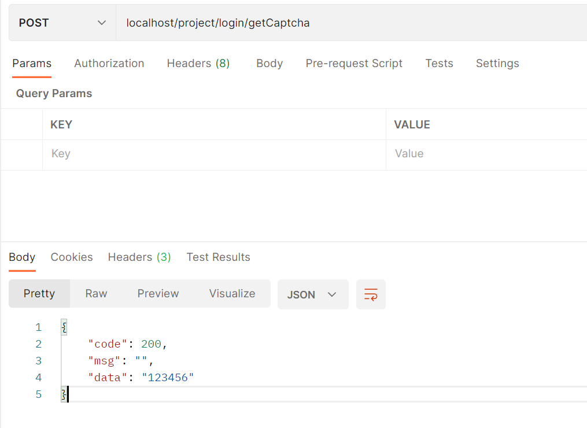
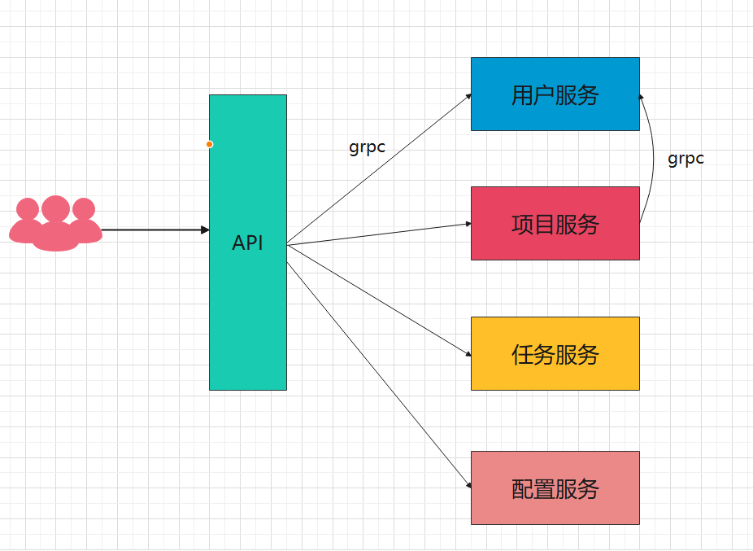
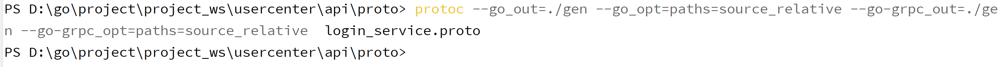
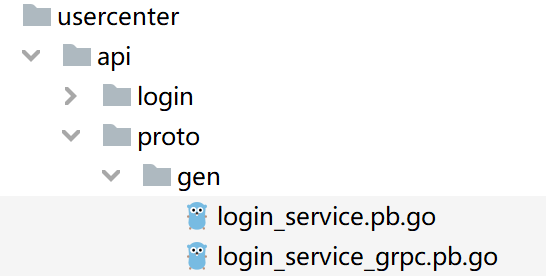
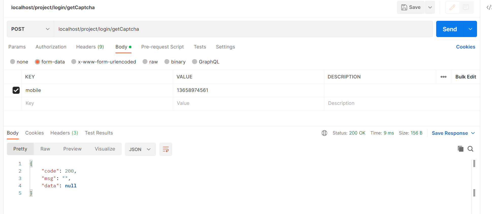

# 项目搭建

要进入系统，必须首先有账号，这就涉及到用户。

高内聚，低耦合，更适合大团队协同开发

公认的工程目录：

* cmd：可执行文件，可能有多个main文件
* internal：内部代码，不希望外部访问
* pkg：公开代码，外部可以访问
* config/configs/etc: 配置文件
* scripts：脚本
* docs：文档
* third_party: 三方辅助工具
* bin：编译的二进制文件
* build：持续集成相关
* deploy：部署相关
* test：测试文件
* api：开放的api接口
* init：初始化函数

这是参考地址：https://github.com/golang-standards/project-layout

## 1. 表设计

公司员工表：

~~~sql
CREATE TABLE `vex_member`  (
  `id` bigint(0) NOT NULL AUTO_INCREMENT COMMENT '系统前台用户表',
  `account` varchar(20) CHARACTER SET utf8 COLLATE utf8_general_ci NOT NULL DEFAULT '' COMMENT '用户登陆账号',
  `password` varchar(64) CHARACTER SET utf8 COLLATE utf8_general_ci NULL DEFAULT '' COMMENT '登陆密码',
  `name` varchar(255) CHARACTER SET utf8 COLLATE utf8_general_ci NULL DEFAULT '' COMMENT '用户昵称',
  `mobile` varchar(255) CHARACTER SET utf8mb4 COLLATE utf8mb4_general_ci NULL DEFAULT NULL COMMENT '手机',
  `realname` varchar(255) CHARACTER SET utf8mb4 COLLATE utf8mb4_general_ci NULL DEFAULT NULL COMMENT '真实姓名',
  `create_time` varchar(30) CHARACTER SET utf8 COLLATE utf8_general_ci NULL DEFAULT NULL COMMENT '创建时间',
  `status` tinyint(1) NULL DEFAULT 0 COMMENT '状态',
  `last_login_time` varchar(30) CHARACTER SET utf8 COLLATE utf8_general_ci NULL DEFAULT NULL COMMENT '上次登录时间',
  `sex` tinyint(0) NULL DEFAULT 0 COMMENT '性别',
  `avatar` varchar(255) CHARACTER SET utf8 COLLATE utf8_general_ci NULL DEFAULT '' COMMENT '头像',
  `idcard` varchar(255) CHARACTER SET utf8 COLLATE utf8_general_ci NULL DEFAULT NULL COMMENT '身份证',
  `province` int(0) NULL DEFAULT 0 COMMENT '省',
  `city` int(0) NULL DEFAULT 0 COMMENT '市',
  `area` int(0) NULL DEFAULT 0 COMMENT '区',
  `address` varchar(255) CHARACTER SET utf8 COLLATE utf8_general_ci NULL DEFAULT NULL COMMENT '所在地址',
  `description` text CHARACTER SET utf8mb4 COLLATE utf8mb4_general_ci NULL COMMENT '备注',
  `email` varchar(255) CHARACTER SET utf8 COLLATE utf8_general_ci NULL DEFAULT NULL COMMENT '邮箱',
  `dingtalk_openid` varchar(50) CHARACTER SET utf8 COLLATE utf8_general_ci NULL DEFAULT NULL COMMENT '钉钉openid',
  `dingtalk_unionid` varchar(50) CHARACTER SET utf8 COLLATE utf8_general_ci NULL DEFAULT NULL COMMENT '钉钉unionid',
  `dingtalk_userid` varchar(50) CHARACTER SET utf8 COLLATE utf8_general_ci NULL DEFAULT NULL COMMENT '钉钉用户id',
  PRIMARY KEY (`id`) USING BTREE
) ENGINE = InnoDB AUTO_INCREMENT = 1000 CHARACTER SET = utf8 COLLATE = utf8_general_ci COMMENT = '用户表' ROW_FORMAT = COMPACT;
~~~

## 2. 搭建项目

* 创建workspace

* 创建模块project-user

* 在project-user中导入gin

  ~~~go
  go get -u github.com/gin-gonic/gin
  ~~~

  启动项目并配置优雅的启停：

  ~~~go
  package main
  
  import (
  	"context"
  	"github.com/gin-gonic/gin"
  	"log"
  	"net/http"
  	"os"
  	"os/signal"
  	"syscall"
  	"time"
  )
  
  func main() {
  	r := gin.Default()
  	srv := &http.Server{
  		Addr:    ":80",
  		Handler: r,
  	}
  	//保证下面的优雅启停
  	go func() {
  		log.Printf("web server running in %s \n", srv.Addr)
  		if err := srv.ListenAndServe(); err != nil && err != http.ErrServerClosed {
  			log.Fatalln(err)
  		}
  	}()
  
  	quit := make(chan os.Signal)
  	//SIGINT 用户发送INTR字符(Ctrl+C)触发
  	//SIGTERM 结束程序(可以被捕获、阻塞或忽略)
  	signal.Notify(quit, syscall.SIGINT, syscall.SIGTERM)
  	<-quit
  	log.Println("Shutting Down project web server...")
  	ctx, cancel := context.WithTimeout(context.Background(), 5*time.Second)
  	defer cancel()
  	if err := srv.Shutdown(ctx); err != nil {
  		log.Fatalln("web server Shutdown, cause by : ", err)
  	}
  	select {
  	case <-ctx.Done():
  		log.Println("关闭超时")
  	}
  	log.Println("web server stop success...")
  }
  
  ~~~

  由于有其他模块都需要用到启停，将其抽取到公共模块common

  ~~~go
  package common
  
  import (
  	"context"
  	"github.com/gin-gonic/gin"
  	"log"
  	"net/http"
  	"os"
  	"os/signal"
  	"syscall"
  	"time"
  )
  
  func Run(r *gin.Engine, serverName string, addr string) {
  	srv := &http.Server{
  		Addr:    addr,
  		Handler: r,
  	}
  	//保证下面的优雅启停
  	go func() {
  		log.Printf("%s running in %s \n", serverName, srv.Addr)
  		if err := srv.ListenAndServe(); err != nil && err != http.ErrServerClosed {
  			log.Fatalln(err)
  		}
  	}()
  
  	quit := make(chan os.Signal)
  	//SIGINT 用户发送INTR字符(Ctrl+C)触发
  	//SIGTERM 结束程序(可以被捕获、阻塞或忽略)
  	signal.Notify(quit, syscall.SIGINT, syscall.SIGTERM)
  	<-quit
  	log.Printf("Shutting Down project %s... \n", serverName)
  	ctx, cancel := context.WithTimeout(context.Background(), 5*time.Second)
  	defer cancel()
  	if err := srv.Shutdown(ctx); err != nil {
  		log.Fatalf("%s Shutdown, cause by : %v \n", serverName, err)
  	}
  	select {
  	case <-ctx.Done():
  		log.Println("关闭超时")
  	}
  	log.Printf("%s stop success...", serverName)
  }
  
  ~~~

  ~~~go
  package main
  
  import (
  	"github.com/gin-gonic/gin"
  	srv "test.com/common"
  )
  
  func main() {
  	r := gin.Default()
  	srv.Run(r, "webcenter", ":80")
  }
  
  ~~~

## 3. 路由

  做项目的时候，接口定义会很多，如果都写到main中，显然是不太合适的，所以我们将路由的注册交由各个模块。

~~~go
package main

import (
	"github.com/gin-gonic/gin"
	srv "test.com/common"
	"test.com/webcenter/router"
)

func main() {
	r := gin.Default()
	router.InitRouter(r)
	srv.Run(r, "webcenter", ":80")
}

~~~

  ~~~go
  package router
  
  import (
  	"github.com/gin-gonic/gin"
  	"test.com/webcenter/api/login"
  )
  
  type Router interface {
  	Register(r *gin.Engine)
  }
  type RegisterRouter struct {
  }
  
  func New() RegisterRouter {
  	return RegisterRouter{}
  }
  func (RegisterRouter) Route(router Router, r *gin.Engine) {
  	router.Register(r)
  }
  
  func InitRouter(r *gin.Engine) {
  	router := New()
      //以后的模块路由在这进行注册
  	router.Route(&login.RouterLogin{}, r)
  }
  ~~~

~~~go
package login

import "github.com/gin-gonic/gin"

type RouterLogin struct {
}

func (*RouterLogin) Register(r *gin.Engine) {
	g := r.Group("/project/login")
	h := HandlerLogin{}
	g.POST("/getCaptcha", h.GetCaptcha)
}

~~~

~~~go
package login

import (
	"github.com/gin-gonic/gin"
	"test.com/common"
)

type HandlerLogin struct {
}

// GetCaptcha 获取手机验证码
func (HandlerLogin) GetCaptcha(ctx *gin.Context) {
	result := &common.Result{}
	ctx.JSON(200, result.Success("123456"))
}

~~~

打开postman测试一下接口：

> 在注册页面点击发送验证码，会正确获取，证明接口流程没问题

## 4. 验证码接口

接口请求uri: `/projcet/login/getCaptcha`

请求方式: `POST`

参数：form表单

| 名字   | 类型   | 描述   |
| ------ | ------ | ------ |
| mobile | string | 手机号 |

思考流程：

* 接收参数
* 验证参数合法
* 生成验证码（随机4位数或者6位数）
* 调用短信平台发送短信（go协程执行，调用第三方平台防止超时）
* 调用成功，将手机号和验证码存入redis

~~~go
package common

import "regexp"

//VerifyMobile 验证手机合法性
func VerifyMobile(mobile string) bool {
	if mobile == "" {
		return false
	}
	regular := "^((13[0-9])|(14[5,7])|(15[0-3,5-9])|(17[0,3,5-8])|(18[0-9])|166|198|199|(147))\\d{8}$"
	reg := regexp.MustCompile(regular)
	return reg.MatchString(mobile)
}

~~~

~~~go
package login

import (
	"fmt"
	"github.com/gin-gonic/gin"
	"log"
	"test.com/common"
	"test.com/webcenter/pkg/model"
	"time"
)

type HandlerLogin struct {
}

// GetCaptcha 获取手机验证码
func (HandlerLogin) GetCaptcha(ctx *gin.Context) {
	result := &common.Result{}
	//1. 获取参数
	mobile := ctx.PostForm("mobile")
	//2. 验证手机合法性
	if !common.VerifyMobile(mobile) {
		ctx.JSON(200, result.Fail(model.LoginMobileNotLegal, "不合法"))
		return
	}
	//3.生成验证码
	code := "123456"
	//4. 发送验证码
	go func() {
		time.Sleep(2 * time.Second)
		log.Println("调用短信平台发送短信")
		//发送成功 存入redis
		fmt.Println(mobile, code)
	}()
	ctx.JSON(200, result.Success("123456"))
}

~~~

~~~go
package model

import "test.com/common"

const (
	Success             common.BusinessCode = 200
	LoginMobileNotLegal common.BusinessCode = 2001 //手机号不合法
)

~~~

### 4.1 导入redis支持

先启动一个redis

导入go-redis

~~~go
go get github.com/go-redis/redis/v8
~~~

~~~go
package login

import (
	"github.com/gin-gonic/gin"
	"log"
	"test.com/common"
	"test.com/webcenter/pkg/dao"
	"test.com/webcenter/pkg/model"
	"test.com/webcenter/pkg/repo"
	"time"
)

type HandlerLogin struct {
	cache repo.Cache
}

func New() *HandlerLogin {
	return &HandlerLogin{
		cache: dao.Rc,
	}
}

// GetCaptcha 获取手机验证码
func (hl *HandlerLogin) GetCaptcha(ctx *gin.Context) {
	result := &common.Result{}
	//1. 获取参数
	mobile := ctx.PostForm("mobile")
	//2. 验证手机合法性
	if !common.VerifyMobile(mobile) {
		ctx.JSON(200, result.Fail(model.LoginMobileNotLegal, "不合法"))
		return
	}
	//3.生成验证码
	code := "123456"
	//4. 发送验证码
	go func() {
		time.Sleep(2 * time.Second)
		log.Println("调用短信平台发送短信")
		//发送成功 存入redis
		err := hl.cache.Put("REGISTER_"+mobile, code, 15*time.Minute)
		if err != nil {
			log.Println("验证码存入redis发生错误，cause by :", err)
		}
		log.Println("发送短信成功")
	}()
	ctx.JSON(200, result.Success("123456"))
}

~~~

定义缓存接口：

> 面向接口编程，保持低耦合，高内聚

~~~go
package repo

import "time"

type Cache interface {
	Put(key string, value string, expire time.Duration) error
	Get(key string) (string, error)
}

~~~

~~~go
package dao

import (
	"context"
	"github.com/go-redis/redis/v8"
	"time"
)

var Rc *RedisCache

func init() {
	rdb := redis.NewClient(&redis.Options{
		Addr:     "localhost:6379",
		Password: "", // no password set
		DB:       0,  // use default DB
	})
	Rc = &RedisCache{
		rdb: rdb,
	}
}

type RedisCache struct {
	rdb *redis.Client
}

func (rc *RedisCache) Put(key, value string, expire time.Duration) error {
	ctx, cancel := context.WithTimeout(context.Background(), 2*time.Second)
	defer cancel()
	err := rc.rdb.Set(ctx, key, value, expire).Err()
	if err != nil {
		return err
	}
	return nil
}

func (rc *RedisCache) Get(key string) (string, error) {
	ctx, cancel := context.WithTimeout(context.Background(), 2*time.Second)
	defer cancel()
	result, err := rc.rdb.Get(ctx, key).Result()
	if err != nil {
		return result, err
	}
	return result, nil
}

~~~

## 5. 日志

原生的日志，并不能很好的区分日志级别，我们可以集成一个流行的日志库进来。

我们选用uber开源的zap日志库：https://github.com/uber-go/zap

安装zap库：

~~~go
go get -u go.uber.org/zap
~~~

日志是公用的，所以将其放入common中是一个好的选择，这样别的模块也可以复用

安装日志分割库：

~~~go
go get -u github.com/natefinch/lumberjack
~~~

> 日志的存储有几种方式，比如按照日志级别将日志记录到不同的文件，按照业务来分别记录不同级别的日志，按照包结构划分记录不同级别日志

当然日志记录的越细分越好，在项目规模庞大时，能更加便捷的定位问题。

**这里我们按照日志级别记录即可，debug级别以上记录一个，info以上记录一个，warn以上记录一个**

~~~go
package logs

import (
	"github.com/gin-gonic/gin"
	"github.com/natefinch/lumberjack"
	"go.uber.org/zap"
	"go.uber.org/zap/zapcore"
	"net"
	"net/http"
	"net/http/httputil"
	"os"
	"runtime/debug"
	"strings"
	"time"
)

var lg *zap.Logger

type LogConfig struct {
	DebugFileName string `json:"debugFileName"`
	InfoFileName  string `json:"infoFileName"`
	WarnFileName  string `json:"warnFileName"`
	MaxSize       int    `json:"maxsize"`
	MaxAge        int    `json:"max_age"`
	MaxBackups    int    `json:"max_backups"`
}

// InitLogger 初始化Logger
func InitLogger(cfg *LogConfig) (err error) {
	writeSyncerDebug := getLogWriter(cfg.DebugFileName, cfg.MaxSize, cfg.MaxBackups, cfg.MaxAge)
	writeSyncerInfo := getLogWriter(cfg.InfoFileName, cfg.MaxSize, cfg.MaxBackups, cfg.MaxAge)
	writeSyncerWarn := getLogWriter(cfg.WarnFileName, cfg.MaxSize, cfg.MaxBackups, cfg.MaxAge)
	encoder := getEncoder()
	//文件输出
	debugCore := zapcore.NewCore(encoder, writeSyncerDebug, zapcore.DebugLevel)
	infoCore := zapcore.NewCore(encoder, writeSyncerInfo, zapcore.InfoLevel)
	warnCore := zapcore.NewCore(encoder, writeSyncerWarn, zapcore.WarnLevel)
	//标准输出
	consoleEncoder := zapcore.NewConsoleEncoder(zap.NewDevelopmentEncoderConfig())
	std := zapcore.NewCore(consoleEncoder, zapcore.Lock(os.Stdout), zapcore.DebugLevel)
	core := zapcore.NewTee(debugCore, infoCore, warnCore, std)
	lg = zap.New(core, zap.AddCaller())
	zap.ReplaceGlobals(lg) // 替换zap包中全局的logger实例，后续在其他包中只需使用zap.L()调用即可
	return
}

func getEncoder() zapcore.Encoder {
	encoderConfig := zap.NewProductionEncoderConfig()
	encoderConfig.EncodeTime = zapcore.ISO8601TimeEncoder
	encoderConfig.TimeKey = "time"
	encoderConfig.EncodeLevel = zapcore.CapitalLevelEncoder
	encoderConfig.EncodeDuration = zapcore.SecondsDurationEncoder
	encoderConfig.EncodeCaller = zapcore.ShortCallerEncoder
	return zapcore.NewJSONEncoder(encoderConfig)
}

func getLogWriter(filename string, maxSize, maxBackup, maxAge int) zapcore.WriteSyncer {
	lumberJackLogger := &lumberjack.Logger{
		Filename:   filename,
		MaxSize:    maxSize,
		MaxBackups: maxBackup,
		MaxAge:     maxAge,
	}
	return zapcore.AddSync(lumberJackLogger)
}

// GinLogger 接收gin框架默认的日志
func GinLogger() gin.HandlerFunc {
	return func(c *gin.Context) {
		start := time.Now()
		path := c.Request.URL.Path
		query := c.Request.URL.RawQuery
		c.Next()

		cost := time.Since(start)
		lg.Info(path,
			zap.Int("status", c.Writer.Status()),
			zap.String("method", c.Request.Method),
			zap.String("path", path),
			zap.String("query", query),
			zap.String("ip", c.ClientIP()),
			zap.String("user-agent", c.Request.UserAgent()),
			zap.String("errors", c.Errors.ByType(gin.ErrorTypePrivate).String()),
			zap.Duration("cost", cost),
		)
	}
}

// GinRecovery recover掉项目可能出现的panic，并使用zap记录相关日志
func GinRecovery(stack bool) gin.HandlerFunc {
	return func(c *gin.Context) {
		defer func() {
			if err := recover(); err != nil {
				// Check for a broken connection, as it is not really a
				// condition that warrants a panic stack trace.
				var brokenPipe bool
				if ne, ok := err.(*net.OpError); ok {
					if se, ok := ne.Err.(*os.SyscallError); ok {
						if strings.Contains(strings.ToLower(se.Error()), "broken pipe") || strings.Contains(strings.ToLower(se.Error()), "connection reset by peer") {
							brokenPipe = true
						}
					}
				}

				httpRequest, _ := httputil.DumpRequest(c.Request, false)
				if brokenPipe {
					lg.Error(c.Request.URL.Path,
						zap.Any("error", err),
						zap.String("request", string(httpRequest)),
					)
					// If the connection is dead, we can't write a status to it.
					c.Error(err.(error)) // nolint: errcheck
					c.Abort()
					return
				}

				if stack {
					lg.Error("[Recovery from panic]",
						zap.Any("error", err),
						zap.String("request", string(httpRequest)),
						zap.String("stack", string(debug.Stack())),
					)
				} else {
					lg.Error("[Recovery from panic]",
						zap.Any("error", err),
						zap.String("request", string(httpRequest)),
					)
				}
				c.AbortWithStatus(http.StatusInternalServerError)
			}
		}()
		c.Next()
	}
}

~~~

~~~go
package main

import (
	"github.com/gin-gonic/gin"
	"log"
	srv "test.com/common"
	"test.com/common/logs"
	"test.com/webcenter/router"
)

func main() {
	r := gin.Default()
	//从配置中读取日志配置，初始化日志
	lc := &logs.LogConfig{
		DebugFileName: "D:\\go\\project\\project_ws\\logs\\debug\\project-debug.log",
		InfoFileName:  "D:\\go\\project\\project_ws\\logs\\info\\project-info.log",
		WarnFileName:  "D:\\go\\project\\project_ws\\logs\\error\\project-error.log",
		MaxSize:       500,
		MaxAge:        28,
		MaxBackups:    3,
	}
	err := logs.InitLogger(lc)
	if err != nil {
		log.Fatalln(err)
	}
	router.InitRouter(r)
	srv.Run(r, "webcenter", ":80")
}

~~~

经过测试，不同级别的日志打印在了不同的文件中，同时控制台仍旧有输出。

## 6. 配置

经过上面的日志，我们很明显不能将日志写在代码中，需要放在配置文件中，从配置文件中读取。

这里我们用到的库是：https://github.com/spf13/viper，支持多种配置文件的读取。

在别的语言当中，比如流行的springboot中，使用yaml文件的比例非常高，本身yaml文件的可读性也非常强，这里我们选择使用yaml做为配置文件的格式。

安装viper

~~~go
go get github.com/spf13/viper
~~~

在config目录下新建app.yaml

~~~yaml
zap:
  debugFileName: "D:\\go\\project\\project_ws\\logs\\debug\\project-debug.log"
  infoFileName: "D:\\go\\project\\project_ws\\logs\\info\\project-info.log"
  warnFileName: "D:\\go\\project\\project_ws\\logs\\error\\project-error.log"
  maxSize: 500,
  maxAge: 28,
  MaxBackups: 3
redis:
  host: "localhost"
  port: 6379
  password: ""
  db: 0

~~~

~~~go
package config

import (
	"github.com/go-redis/redis/v8"
	"github.com/spf13/viper"
	"log"
	"os"
	"test.com/common/logs"
)

var AppConf = InitConfig()

type Config struct {
	viper *viper.Viper
}

func InitConfig() *Config {
	v := viper.New()
	conf := &Config{viper: v}
	workDir, _ := os.Getwd()
	conf.viper.SetConfigName("app")
	conf.viper.SetConfigType("yml")
	conf.viper.AddConfigPath(workDir + "/config")

	err := conf.viper.ReadInConfig()
	if err != nil {
		log.Fatalln(err)
		return nil
	}
	return conf
}

func (c *Config) InitZapLog() {
	//从配置中读取日志配置，初始化日志
	lc := &logs.LogConfig{
		DebugFileName: c.viper.GetString("zap.debugFileName"),
		InfoFileName:  c.viper.GetString("zap.infoFileName"),
		WarnFileName:  c.viper.GetString("zap.warnFileName"),
		MaxSize:       c.viper.GetInt("maxSize"),
		MaxAge:        c.viper.GetInt("maxAge"),
		MaxBackups:    c.viper.GetInt("maxBackups"),
	}
	err := logs.InitLogger(lc)
	if err != nil {
		log.Fatalln(err)
	}
}

func (c *Config) InitRedisOptions() *redis.Options {
	return &redis.Options{
		Addr:     c.viper.GetString("redis.host") + ":" + c.viper.GetString("redis.port"),
		Password: c.viper.GetString("redis.password"), // no password set
		DB:       c.viper.GetInt("db"),                // use default DB
	}
}

~~~

~~~go
func main() {
	r := gin.Default()
	config.AppConf.InitZapLog()
	router.InitRouter(r)
	srv.Run(r, "webcenter", ":80")
}

~~~

~~~go
func init() {
	rdb := redis.NewClient(config.AppConf.InitRedisOptions())
	Rc = &RedisCache{
		rdb: rdb,
	}
}
~~~

## 7. 引入grpc

接下来，我们思考，我们有比如用户模块，项目模块，任务模块等等，如果这些模块都暴露一个地址出来，很明显不合适，那么就出现了以下的架构

在调用服务的时候，使用grpc来通信，这样服务就可以单独部署和维护，同时，服务和服务之间也可以通过grpc进行通信。

需要的库：grpc：https://github.com/grpc/grpc

安装grpc：

~~~go
go install google.golang.org/protobuf/cmd/protoc-gen-go@v1.28
go install google.golang.org/grpc/cmd/protoc-gen-go-grpc@v1.2
~~~

会生成两个文件：

- `protoc-gen-go`
- `protoc-gen-go-grpc`

在usercenter下的api中新建proto用于存放proto文件：

login_service.proto :

~~~protobuf
syntax = "proto3";
package login.service.v1;
option go_package = "usercenter/pkg/service/login.service.v1";

message CaptchaMessage {
  string mobile = 1;
}
message CaptchaResponse{
}
service LoginService {
  rpc GetCaptcha(CaptchaMessage) returns (CaptchaResponse) {}
}
~~~

安装库

~~~go
go get -u google.golang.org/grpc/cmd/protoc-gen-go-grpc
go get -u google.golang.org/protobuf/cmd/protoc-gen-go
go get -u google.golang.org/grpc
~~~

执行命令生成go文件：

~~~powershell
protoc --go_out=./gen --go_opt=paths=source_relative --go-grpc_out=./gen --go-grpc_opt=paths=source_relative  login_service.proto
~~~

> 这里有一个点，go_package虽然是定义生成文件的位置，但是我们还是指定了生成文件的地方，这是建议的做法，因为不希望生成的文件直接覆盖到old文件

接下来在pkg目录下新建service/login.service.v1，将生成的文件扔到这个下面

新建login_service.go，实现服务：

~~~go
package login_service_v1

import (
	"context"
	"errors"
	"go.uber.org/zap"
	"log"
	"test.com/common"
	"test.com/usercenter/pkg/repo"
	"time"
)

type LoginService struct {
	UnimplementedLoginServiceServer
	Cache repo.Cache
}

func (ls *LoginService) GetCaptcha(ctx context.Context, msg *CaptchaMessage) (*CaptchaResponse, error) {
	//1. 获取参数
	mobile := msg.Mobile
	//2. 验证手机合法性
	if !common.VerifyMobile(mobile) {
		return nil, errors.New("手机号不合法")
	}
	//3.生成验证码
	code := "123456"
	//4. 发送验证码
	go func() {
		time.Sleep(2 * time.Second)
		zap.L().Info("调用短信平台发送短信")
		zap.L().Debug("调用短信平台发送短信debug")
		zap.L().Warn("调用短信平台发送短信warn")
		zap.L().Error("调用短信平台发送短信error")
		//发送成功 存入redis
		err := ls.Cache.Put("REGISTER_"+mobile, code, 15*time.Minute)
		if err != nil {
			log.Println("验证码存入redis发生错误，cause by :", err)
		}
		log.Println("发送短信成功")
	}()
	return &CaptchaResponse{}, nil
}

~~~

注册服务并启动grpc服务：

~~~go

type gRPCConfig struct {
	Addr         string
	RegisterFunc func(*grpc.Server)
}

func RegisterGrpc() *grpc.Server {
	c := gRPCConfig{
		Addr: config.AppConf.GrpcConfig.Addr,
		RegisterFunc: func(g *grpc.Server) {
			loginServiceV1.RegisterLoginServiceServer(g, &loginServiceV1.LoginService{
                Cache: dao.Rc,
			})
		}}
	s := grpc.NewServer()
	c.RegisterFunc(s)
	lis, err := net.Listen("tcp", config.AppConf.GrpcConfig.Addr)
	if err != nil {
		log.Println("cannot listen")
	}
	go func() {
		err = s.Serve(lis)
		if err != nil {
			log.Println("server started error", err)
			return
		}
	}()
	return s
}

~~~

构建api服务：

~~~yaml
app:
  addr: ":80"
  name: "project-api-server"
zap:
  debugFileName: "D:\\go\\project\\project_ws\\logs\\debug\\project-project-api-debug.log"
  infoFileName: "D:\\go\\project\\project_ws\\logs\\info\\project-project-api-info.log"
  warnFileName: "D:\\go\\project\\project_ws\\logs\\error\\project-project-api-error.log"
  maxSize: 500,
  maxAge: 28,
  MaxBackups: 3
~~~

~~~go
package main

import (
	"github.com/gin-gonic/gin"
	srv "test.com/common"
	_ "test.com/project-api/api"
	"test.com/project-api/internal/config"
	"test.com/project-api/router"
)

func main() {
	r := gin.Default()
	router.InitRouter(r)
	srv.Run(r, config.AppConf.AppConfig.Name, config.AppConf.AppConfig.Addr, nil)
}

~~~

~~~go
package rpc

import (
	"google.golang.org/grpc"
	"google.golang.org/grpc/credentials/insecure"
	"log"
	loginServiceV1 "test.com/usercenter/pkg/service/login.service.v1"
)

var UserClient loginServiceV1.LoginServiceClient

func InitUserRpc() {
	conn, err := grpc.Dial(":8881", grpc.WithTransportCredentials(insecure.NewCredentials()))
	if err != nil {
		log.Fatalf("did not connect: %v", err)
	}
	UserClient = loginServiceV1.NewLoginServiceClient(conn)

	//c := pb.NewGreeterClient(conn)
	//
	//// Contact the server and print out its response.
	//ctx, cancel := context.WithTimeout(context.Background(), time.Second)
	//defer cancel()
	//r, err := c.SayHello(ctx, &pb.HelloRequest{Name: *name})
	//if err != nil {
	//	log.Fatalf("could not greet: %v", err)
	//}
	//log.Printf("Greeting: %s", r.GetMessage())
}

~~~

~~~go
package config

import (
	"github.com/spf13/viper"
	"log"
	"os"
	"test.com/common/logs"
)

var AppConf = InitConfig()

type Config struct {
	viper      *viper.Viper
	AppConfig  *AppConfig
	GrpcConfig *GrpcConfig
}

type AppConfig struct {
	Addr string
	Name string
}
type GrpcConfig struct {
	Services []map[string]any
}

func InitConfig() *Config {
	v := viper.New()
	conf := &Config{viper: v}
	workDir, _ := os.Getwd()
	conf.viper.SetConfigName("app")
	conf.viper.SetConfigType("yml")
	conf.viper.AddConfigPath(workDir + "/config")

	err := conf.viper.ReadInConfig()
	if err != nil {
		log.Fatalln(err)
		return nil
	}
	conf.InitZapLog()
	conf.InitAppConfig()
	conf.InitGrpcConfig()
	return conf
}

func (c *Config) InitZapLog() {
	//从配置中读取日志配置，初始化日志
	lc := &logs.LogConfig{
		DebugFileName: c.viper.GetString("zap.debugFileName"),
		InfoFileName:  c.viper.GetString("zap.infoFileName"),
		WarnFileName:  c.viper.GetString("zap.warnFileName"),
		MaxSize:       c.viper.GetInt("maxSize"),
		MaxAge:        c.viper.GetInt("maxAge"),
		MaxBackups:    c.viper.GetInt("maxBackups"),
	}
	err := logs.InitLogger(lc)
	if err != nil {
		log.Fatalln(err)
	}

}

func (c *Config) InitAppConfig() {
	gc := &AppConfig{
		Addr: c.viper.GetString("app.addr"),
		Name: c.viper.GetString("app.name"),
	}
	c.AppConfig = gc
}

func (c *Config) InitGrpcConfig() {
	gc := &GrpcConfig{}
	err := c.viper.UnmarshalKey("grpc", &gc.Services)
	if err != nil {
		log.Fatalln(err)
	}
	c.GrpcConfig = gc
}

~~~

~~~go
package login

import (
	"fmt"
	"github.com/gin-gonic/gin"
	"test.com/project-api/internal/login/rpc"
	"test.com/project-api/router"
)

func init() {
	fmt.Println("init login router")
	rl := &RouterLogin{}
	router.RegisterRouter(rl)
}

type RouterLogin struct {
}

func (*RouterLogin) Register(r *gin.Engine) {
	rpc.InitUserRpc()
	h := New()
	r.POST("/project/login/getCaptcha", h.GetCaptcha)
}

~~~

~~~go
package login

import (
	"context"
	"github.com/gin-gonic/gin"
	"test.com/common"
	"test.com/project-api/internal/login/rpc"
	login_service_v1 "test.com/usercenter/pkg/service/login.service.v1"
)

type HandlerLogin struct {
}

func New() *HandlerLogin {
	return &HandlerLogin{}
}

func (*HandlerLogin) GetCaptcha(c *gin.Context) {
	result := &common.Result{}
	mobile := c.PostForm("mobile")
	ctx := context.Background()
	_, err := rpc.UserClient.GetCaptcha(ctx, &login_service_v1.CaptchaMessage{
		Mobile: mobile,
	})
	if err != nil {
		c.JSON(200, result.Fail(2001, err.Error()))
		return
	}
	c.JSON(200, result.Success(nil))
}

~~~

~~~go
package router

import (
	"github.com/gin-gonic/gin"
)

type Router interface {
	Register(r *gin.Engine)
}

var routers []Router

func InitRouter(r *gin.Engine) {
	for _, route := range routers {
		route.Register(r)
	}
}

func RegisterRouter(r ...Router) {
	routers = append(routers, r...)
}

~~~

启动测试：

先调用api服务的接口，然后api服务通过grpc调用具体的实现，完成整个过程

## 8. 重新构建错误码

引入grpc后，返回的错误就需要携带错误码了，所以需要做一个自己的error

~~~go
package errs

type ErrorCode int

type BError struct {
	Code ErrorCode
	Msg  string
}

func (e *BError) Error() string {
	return e.Msg
}

func NewError(code ErrorCode, msg string) *BError {
	return &BError{
		Code: code,
		Msg:  msg,
	}
}

~~~

## 9. 引入etcd

在api中我们是直接调用的地址，这种方式很明显也是不合适的，我们需要引入服务发现，etcd可以帮助我们完成这个过程。

地址：https://github.com/etcd-io/etcd

安装库：

~~~go
go get go.etcd.io/etcd/client/v3
~~~

电脑上启动一个etcd，我们这里启动一个单机版即可

默认监听2379（用于客户端连接）和2380（互相通信）

所以连接地址：localhost:2379

在common中我们新建一个discovery目录，在其中写如下代码：

discovery.go

~~~go
package discovery

import (
	"context"
	"encoding/json"
	"errors"
	"net/http"
	"strconv"
	"strings"
	"time"

	clientv3 "go.etcd.io/etcd/client/v3"
	"go.uber.org/zap"
)

// Register for grpc server
type Register struct {
	EtcdAddrs   []string
	DialTimeout int

	closeCh     chan struct{}
	leasesID    clientv3.LeaseID
	keepAliveCh <-chan *clientv3.LeaseKeepAliveResponse

	srvInfo Server
	srvTTL  int64
	cli     *clientv3.Client
	logger  *zap.Logger
}

// NewRegister create a register base on etcd
func NewRegister(etcdAddrs []string, logger *zap.Logger) *Register {
	return &Register{
		EtcdAddrs:   etcdAddrs,
		DialTimeout: 3,
		logger:      logger,
	}
}

// Register a service
func (r *Register) Register(srvInfo Server, ttl int64) (chan<- struct{}, error) {
	var err error

	if strings.Split(srvInfo.Addr, ":")[0] == "" {
		return nil, errors.New("invalid ip")
	}

	if r.cli, err = clientv3.New(clientv3.Config{
		Endpoints:   r.EtcdAddrs,
		DialTimeout: time.Duration(r.DialTimeout) * time.Second,
	}); err != nil {
		return nil, err
	}

	r.srvInfo = srvInfo
	r.srvTTL = ttl

	if err = r.register(); err != nil {
		return nil, err
	}

	r.closeCh = make(chan struct{})

	go r.keepAlive()

	return r.closeCh, nil
}

// Stop stop register
func (r *Register) Stop() {
	r.closeCh <- struct{}{}
}

// register 注册节点
func (r *Register) register() error {
	leaseCtx, cancel := context.WithTimeout(context.Background(), time.Duration(r.DialTimeout)*time.Second)
	defer cancel()

	leaseResp, err := r.cli.Grant(leaseCtx, r.srvTTL)
	if err != nil {
		return err
	}
	r.leasesID = leaseResp.ID
	if r.keepAliveCh, err = r.cli.KeepAlive(context.Background(), leaseResp.ID); err != nil {
		return err
	}

	data, err := json.Marshal(r.srvInfo)
	if err != nil {
		return err
	}
	_, err = r.cli.Put(context.Background(), BuildRegPath(r.srvInfo), string(data), clientv3.WithLease(r.leasesID))
	return err
}

// unregister 删除节点
func (r *Register) unregister() error {
	_, err := r.cli.Delete(context.Background(), BuildRegPath(r.srvInfo))
	return err
}

// keepAlive
func (r *Register) keepAlive() {
	ticker := time.NewTicker(time.Duration(r.srvTTL) * time.Second)
	for {
		select {
		case <-r.closeCh:
			if err := r.unregister(); err != nil {
				r.logger.Error("unregister failed", zap.Error(err))
			}
			if _, err := r.cli.Revoke(context.Background(), r.leasesID); err != nil {
				r.logger.Error("revoke failed", zap.Error(err))
			}
			return
		case res := <-r.keepAliveCh:
			if res == nil {
				if err := r.register(); err != nil {
					r.logger.Error("register failed", zap.Error(err))
				}
			}
		case <-ticker.C:
			if r.keepAliveCh == nil {
				if err := r.register(); err != nil {
					r.logger.Error("register failed", zap.Error(err))
				}
			}
		}
	}
}

// UpdateHandler return http handler
func (r *Register) UpdateHandler() http.HandlerFunc {
	return http.HandlerFunc(func(w http.ResponseWriter, req *http.Request) {
		wi := req.URL.Query().Get("weight")
		weight, err := strconv.Atoi(wi)
		if err != nil {
			w.WriteHeader(http.StatusBadRequest)
			w.Write([]byte(err.Error()))
			return
		}

		var update = func() error {
			r.srvInfo.Weight = int64(weight)
			data, err := json.Marshal(r.srvInfo)
			if err != nil {
				return err
			}
			_, err = r.cli.Put(context.Background(), BuildRegPath(r.srvInfo), string(data), clientv3.WithLease(r.leasesID))
			return err
		}

		if err := update(); err != nil {
			w.WriteHeader(http.StatusInternalServerError)
			w.Write([]byte(err.Error()))
			return
		}
		w.Write([]byte("update server weight success"))
	})
}

func (r *Register) GetServerInfo() (Server, error) {
	resp, err := r.cli.Get(context.Background(), BuildRegPath(r.srvInfo))
	if err != nil {
		return r.srvInfo, err
	}
	info := Server{}
	if resp.Count >= 1 {
		if err := json.Unmarshal(resp.Kvs[0].Value, &info); err != nil {
			return info, err
		}
	}
	return info, nil
}

~~~

resolver.go

~~~go
package discovery

import (
	"context"
	"go.etcd.io/etcd/api/v3/mvccpb"
	clientv3 "go.etcd.io/etcd/client/v3"
	"go.uber.org/zap"
	"google.golang.org/grpc/resolver"
	"time"
)

const (
	schema = "etcd"
)

// Resolver for grpc client
type Resolver struct {
	schema      string
	EtcdAddrs   []string
	DialTimeout int

	closeCh      chan struct{}
	watchCh      clientv3.WatchChan
	cli          *clientv3.Client
	keyPrifix    string
	srvAddrsList []resolver.Address

	cc     resolver.ClientConn
	logger *zap.Logger
}

// NewResolver create a new resolver.Builder base on etcd
func NewResolver(etcdAddrs []string, logger *zap.Logger) *Resolver {
	return &Resolver{
		schema:      schema,
		EtcdAddrs:   etcdAddrs,
		DialTimeout: 3,
		logger:      logger,
	}
}

// Scheme returns the scheme supported by this resolver.
func (r *Resolver) Scheme() string {
	return r.schema
}

// Build creates a new resolver.Resolver for the given target
func (r *Resolver) Build(target resolver.Target, cc resolver.ClientConn, opts resolver.BuildOptions) (resolver.Resolver, error) {
	r.cc = cc

	r.keyPrifix = BuildPrefix(Server{Name: target.Endpoint, Version: target.Authority})
	if _, err := r.start(); err != nil {
		return nil, err
	}
	return r, nil
}

// ResolveNow resolver.Resolver interface
func (r *Resolver) ResolveNow(o resolver.ResolveNowOptions) {}

// Close resolver.Resolver interface
func (r *Resolver) Close() {
	r.closeCh <- struct{}{}
}

// start
func (r *Resolver) start() (chan<- struct{}, error) {
	var err error
	r.cli, err = clientv3.New(clientv3.Config{
		Endpoints:   r.EtcdAddrs,
		DialTimeout: time.Duration(r.DialTimeout) * time.Second,
	})
	if err != nil {
		return nil, err
	}
	resolver.Register(r)

	r.closeCh = make(chan struct{})

	if err = r.sync(); err != nil {
		return nil, err
	}

	go r.watch()

	return r.closeCh, nil
}

// watch update events
func (r *Resolver) watch() {
	ticker := time.NewTicker(time.Minute)
	r.watchCh = r.cli.Watch(context.Background(), r.keyPrifix, clientv3.WithPrefix())

	for {
		select {
		case <-r.closeCh:
			return
		case res, ok := <-r.watchCh:
			if ok {
				r.update(res.Events)
			}
		case <-ticker.C:
			if err := r.sync(); err != nil {
				r.logger.Error("sync failed", zap.Error(err))
			}
		}
	}
}

// update
func (r *Resolver) update(events []*clientv3.Event) {
	for _, ev := range events {
		var info Server
		var err error

		switch ev.Type {
		case mvccpb.PUT:
			info, err = ParseValue(ev.Kv.Value)
			if err != nil {
				continue
			}
			addr := resolver.Address{Addr: info.Addr, Metadata: info.Weight}
			if !Exist(r.srvAddrsList, addr) {
				r.srvAddrsList = append(r.srvAddrsList, addr)
				r.cc.UpdateState(resolver.State{Addresses: r.srvAddrsList})
			}
		case mvccpb.DELETE:
			info, err = SplitPath(string(ev.Kv.Key))
			if err != nil {
				continue
			}
			addr := resolver.Address{Addr: info.Addr}
			if s, ok := Remove(r.srvAddrsList, addr); ok {
				r.srvAddrsList = s
				r.cc.UpdateState(resolver.State{Addresses: r.srvAddrsList})
			}
		}
	}
}

// sync 同步获取所有地址信息
func (r *Resolver) sync() error {
	ctx, cancel := context.WithTimeout(context.Background(), 3*time.Second)
	defer cancel()
	res, err := r.cli.Get(ctx, r.keyPrifix, clientv3.WithPrefix())
	if err != nil {
		return err
	}
	r.srvAddrsList = []resolver.Address{}

	for _, v := range res.Kvs {
		info, err := ParseValue(v.Value)
		if err != nil {
			continue
		}
		addr := resolver.Address{Addr: info.Addr, Metadata: info.Weight}
		r.srvAddrsList = append(r.srvAddrsList, addr)
	}
	r.cc.UpdateState(resolver.State{Addresses: r.srvAddrsList})
	return nil
}

~~~

server.go

~~~go
package discovery

import (
	"encoding/json"
	"errors"
	"fmt"
	"strings"

	"google.golang.org/grpc/resolver"
)

type Server struct {
	Name    string `json:"name"`
	Addr    string `json:"addr"`    //服务地址
	Version string `json:"version"` //服务版本
	Weight  int64  `json:"weight"`  //服务权重
}

func BuildPrefix(info Server) string {
	if info.Version == "" {
		return fmt.Sprintf("/%s/", info.Name)
	}
	return fmt.Sprintf("/%s/%s/", info.Name, info.Version)
}

func BuildRegPath(info Server) string {
	return fmt.Sprintf("%s%s", BuildPrefix(info), info.Addr)
}

func ParseValue(value []byte) (Server, error) {
	info := Server{}
	if err := json.Unmarshal(value, &info); err != nil {
		return info, err
	}
	return info, nil
}

func SplitPath(path string) (Server, error) {
	info := Server{}
	strs := strings.Split(path, "/")
	if len(strs) == 0 {
		return info, errors.New("invalid path")
	}
	info.Addr = strs[len(strs)-1]
	return info, nil
}

// Exist helper function
func Exist(l []resolver.Address, addr resolver.Address) bool {
	for i := range l {
		if l[i].Addr == addr.Addr {
			return true
		}
	}
	return false
}

// Remove helper function
func Remove(s []resolver.Address, addr resolver.Address) ([]resolver.Address, bool) {
	for i := range s {
		if s[i].Addr == addr.Addr {
			s[i] = s[len(s)-1]
			return s[:len(s)-1], true
		}
	}
	return nil, false
}

func BuildResolverUrl(app string) string {
	return schema + ":///" + app
}

~~~

> 我们在user服务中将grpc地址注册到etcd中，在api中通过etcd进行读取

~~~go

func RegisterEtcdServer() {
	etcdRegister := discovery.NewResolver(config.AppConf.EtcdConfig.Addrs, logs.LG)
	resolver.Register(etcdRegister)
	info := discovery.Server{
		Name:    config.AppConf.GrpcConfig.Name,
		Addr:    config.AppConf.GrpcConfig.Addr,
		Version: config.AppConf.GrpcConfig.Version,
		Weight:  config.AppConf.GrpcConfig.Weight,
	}
	r := discovery.NewRegister(config.AppConf.EtcdConfig.Addrs, logs.LG)
	_, err := r.Register(info, 2)
	if err != nil {
		log.Fatalln(err)
	}
}
~~~

api中：

~~~go
package rpc

import (
	"google.golang.org/grpc"
	"google.golang.org/grpc/credentials/insecure"
	"google.golang.org/grpc/resolver"
	"log"
	"test.com/common/discovery"
	"test.com/common/logs"
	"test.com/project-api/internal/config"
	loginServiceV1 "test.com/usercenter/pkg/service/login.service.v1"
)

var UserClient loginServiceV1.LoginServiceClient

func InitUserRpc() {
	etcdRegister := discovery.NewResolver(config.AppConf.EtcdConfig.Addrs, logs.LG)
	resolver.Register(etcdRegister)

	conn, err := grpc.Dial(etcdRegister.Scheme()+":///user", grpc.WithTransportCredentials(insecure.NewCredentials()))
	if err != nil {
		log.Fatalf("did not connect: %v", err)
	}
	UserClient = loginServiceV1.NewLoginServiceClient(conn)
}

~~~

测试
