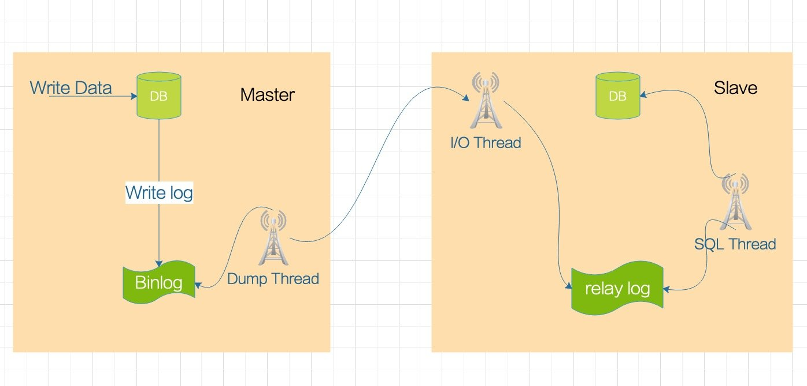
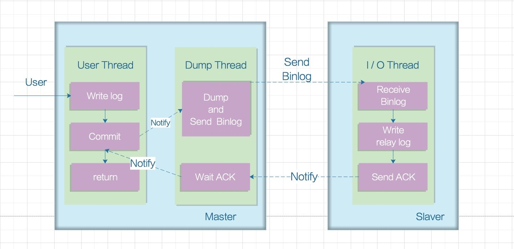

# 授权管理

## 1. 授权概念

认证是为了`保证用户身份的合法性`，授权则是为了`更细粒度的对隐私数据进行划分`，授权是在认证通过后发生的，控制不同的用户能够访问不同的资源。

授权：授权是用户认证通过根据用户的权限来控制用户访问资源的过程，`拥有资源的访问权限则正常访问，没有权限则拒绝访问`。

举个例子：

微信登录成功后用户即可使用微信的功能，比如，发红包、发朋友圈、添加好友等，没有绑定银行卡的用户是无法发送红包的，绑定银行卡的用户才可以发红包，发红包功能、发朋友圈功能都是微信的资源即功能资源，用户拥有发红包功能的权限才可以正常使用发送红包功能，拥有发朋友圈功能的权限才可以使用发朋友圈功能，这个根据用户的权限来控制用户使用资源的过程就是授权。

在授权中，有主要的三个概念：

* Subject（主体）：主体一般是指用户，也可以是程序，需要访问系统中的资源。
* Resource（资源）：如系统菜单、页面、按钮、代码方法、系统商品信息、系统订单信息等。系统菜单、页面、按钮、代码方法都属于系统功能资源，对于web系统每个功能资源通常对应一个URL。
* Permission（权限/许可）: 规定了用户对资源的操作许可，权限离开资源没有意义，如用户查询权限、用户添加权限、某个代码方法的调用权限，通过权限可知用户对哪些资源都有哪些操作许可。

> 一般在实现授权的时候，我们一般会在主体和资源之间抽象出来一个角色，比如主体代表用户，那么它们之间的关系就是，用户拥有某一个角色或者一些角色，角色对应了对哪些资源有操作权限

## 2. 菜单路由

请求uri：/project/menu/menu

参数：

| 字段          | 类型   | 描述   |
| ------------- | ------ | ------ |
| Authorization | string | header |

返回：

~~~json
{
    "code":200,
    "msg":"",
    "data":[
        {
            "id":"120",
            "pid":0,
            "title":"工作台",
            "icon":"appstore-o",
            "url":"home",
            "file_path":"home",
            "params":":org",
            "node":"#",
            "sort":0,
            "status":1,
            "create_by":0,
            "create_at":"2018-09-30 16:30:01",
            "is_inner":false,
            "values":"",
            "show_slider":false,
            "statusText":"使用中",
            "innerText":"导航",
            "fullUrl":"home"
        },
        {
            "id":"121",
            "pid":0,
            "title":"项目管理",
            "icon":"project",
            "url":"#",
            "file_path":"#",
            "params":"",
            "node":"#",
            "sort":0,
            "status":1,
            "create_by":0,
            "create_at":"0000-00-00 00:00:00",
            "is_inner":false,
            "values":"",
            "show_slider":true,
            "statusText":"使用中",
            "innerText":"导航",
            "fullUrl":"#",
            "children":[
                {
                    "id":"122",
                    "pid":121,
                    "title":"项目列表",
                    "icon":"branches",
                    "url":"#",
                    "file_path":"#",
                    "params":"",
                    "node":"#",
                    "sort":0,
                    "status":1,
                    "create_by":0,
                    "create_at":"0000-00-00 00:00:00",
                    "is_inner":false,
                    "values":"",
                    "show_slider":true,
                    "statusText":"使用中",
                    "innerText":"导航",
                    "fullUrl":"#",
                    "children":[
                        {
                            "id":"151",
                            "pid":122,
                            "title":"我的项目",
                            "icon":"",
                            "url":"project\/list",
                            "file_path":"project\/list",
                            "params":":type",
                            "node":"project\/project\/index",
                            "sort":0,
                            "status":1,
                            "create_by":0,
                            "create_at":"0000-00-00 00:00:00",
                            "is_inner":false,
                            "values":"my",
                            "show_slider":true,
                            "statusText":"使用中",
                            "innerText":"导航",
                            "fullUrl":"project\/list\/my"
                        },
                        {
                            "id":"163",
                            "pid":122,
                            "title":"项目分析",
                            "icon":"",
                            "url":"project\/analysis",
                            "file_path":"project\/analysis",
                            "params":"",
                            "node":"project\/index\/info",
                            "sort":5,
                            "status":1,
                            "create_by":0,
                            "create_at":null,
                            "is_inner":false,
                            "values":"",
                            "show_slider":true,
                            "statusText":"使用中",
                            "innerText":"导航",
                            "fullUrl":"project\/analysis"
                        },
                        {
                            "id":"155",
                            "pid":122,
                            "title":"我的收藏",
                            "icon":"",
                            "url":"project\/list",
                            "file_path":"project\/list",
                            "params":":type",
                            "node":"project\/project\/index",
                            "sort":10,
                            "status":1,
                            "create_by":0,
                            "create_at":"0000-00-00 00:00:00",
                            "is_inner":false,
                            "values":"collect",
                            "show_slider":true,
                            "statusText":"使用中",
                            "innerText":"导航",
                            "fullUrl":"project\/list\/collect"
                        },
                        {
                            "id":"159",
                            "pid":122,
                            "title":"已归档项目",
                            "icon":"",
                            "url":"project\/archive",
                            "file_path":"project\/archive",
                            "params":"",
                            "node":"project\/project\/index",
                            "sort":10,
                            "status":1,
                            "create_by":0,
                            "create_at":null,
                            "is_inner":false,
                            "values":"",
                            "show_slider":true,
                            "statusText":"使用中",
                            "innerText":"导航",
                            "fullUrl":"project\/archive"
                        },
                        {
                            "id":"152",
                            "pid":122,
                            "title":"回收站",
                            "icon":"",
                            "url":"project\/recycle",
                            "file_path":"project\/recycle",
                            "params":"",
                            "node":"project\/project\/index",
                            "sort":20,
                            "status":1,
                            "create_by":0,
                            "create_at":"0000-00-00 00:00:00",
                            "is_inner":false,
                            "values":"",
                            "show_slider":true,
                            "statusText":"使用中",
                            "innerText":"导航",
                            "fullUrl":"project\/recycle"
                        },
                        {
                            "id":"127",
                            "pid":122,
                            "title":"我的组织",
                            "icon":"",
                            "url":"organization",
                            "file_path":"organization",
                            "params":"",
                            "node":"project\/organization\/index",
                            "sort":30,
                            "status":1,
                            "create_by":0,
                            "create_at":"0000-00-00 00:00:00",
                            "is_inner":false,
                            "values":"",
                            "show_slider":true,
                            "statusText":"使用中",
                            "innerText":"导航",
                            "fullUrl":"organization"
                        }
                    ]
                },
                {
                    "id":"156",
                    "pid":121,
                    "title":"基础设置",
                    "icon":"experiment",
                    "url":"#",
                    "file_path":"#",
                    "params":"",
                    "node":"#",
                    "sort":0,
                    "status":1,
                    "create_by":0,
                    "create_at":"0000-00-00 00:00:00",
                    "is_inner":false,
                    "values":"",
                    "show_slider":true,
                    "statusText":"使用中",
                    "innerText":"导航",
                    "fullUrl":"#",
                    "children":[
                        {
                            "id":"157",
                            "pid":156,
                            "title":"项目模板",
                            "icon":"",
                            "url":"project\/template",
                            "file_path":"project\/template",
                            "params":"",
                            "node":"project\/project_template\/index",
                            "sort":0,
                            "status":1,
                            "create_by":0,
                            "create_at":"0000-00-00 00:00:00",
                            "is_inner":false,
                            "values":"",
                            "show_slider":true,
                            "statusText":"使用中",
                            "innerText":"导航",
                            "fullUrl":"project\/template"
                        },
                        {
                            "id":"158",
                            "pid":156,
                            "title":"项目列表模板",
                            "icon":"",
                            "url":"project\/template\/taskStages",
                            "file_path":"project\/template\/taskStages",
                            "params":":code",
                            "node":"project\/task_stages_template\/index",
                            "sort":0,
                            "status":1,
                            "create_by":0,
                            "create_at":"0000-00-00 00:00:00",
                            "is_inner":true,
                            "values":"",
                            "show_slider":false,
                            "statusText":"使用中",
                            "innerText":"内页",
                            "fullUrl":"project\/template\/taskStages"
                        }
                    ]
                },
                {
                    "id":"153",
                    "pid":121,
                    "title":"项目空间",
                    "icon":"heat-map",
                    "url":"project\/space\/task",
                    "file_path":"project\/space\/task",
                    "params":":code",
                    "node":"#",
                    "sort":20,
                    "status":1,
                    "create_by":0,
                    "create_at":"0000-00-00 00:00:00",
                    "is_inner":true,
                    "values":"",
                    "show_slider":true,
                    "statusText":"使用中",
                    "innerText":"内页",
                    "fullUrl":"project\/space\/task",
                    "children":[
                        {
                            "id":"154",
                            "pid":153,
                            "title":"任务详情",
                            "icon":"",
                            "url":"project\/space\/task\/:code\/detail",
                            "file_path":"project\/space\/taskdetail",
                            "params":":code",
                            "node":"project\/task\/read",
                            "sort":0,
                            "status":1,
                            "create_by":0,
                            "create_at":"0000-00-00 00:00:00",
                            "is_inner":true,
                            "values":"",
                            "show_slider":false,
                            "statusText":"使用中",
                            "innerText":"内页",
                            "fullUrl":"project\/space\/task\/:code\/detail"
                        },
                        {
                            "id":"162",
                            "pid":153,
                            "title":"项目文件",
                            "icon":"",
                            "url":"project\/space\/files",
                            "file_path":"project\/space\/files",
                            "params":":code",
                            "node":"project\/index\/info",
                            "sort":10,
                            "status":1,
                            "create_by":0,
                            "create_at":null,
                            "is_inner":true,
                            "values":"",
                            "show_slider":false,
                            "statusText":"使用中",
                            "innerText":"内页",
                            "fullUrl":"project\/space\/files"
                        },
                        {
                            "id":"161",
                            "pid":153,
                            "title":"项目概况",
                            "icon":"",
                            "url":"project\/space\/overview",
                            "file_path":"project\/space\/overview",
                            "params":":code",
                            "node":"project\/index\/info",
                            "sort":20,
                            "status":1,
                            "create_by":0,
                            "create_at":null,
                            "is_inner":true,
                            "values":"",
                            "show_slider":false,
                            "statusText":"使用中",
                            "innerText":"内页",
                            "fullUrl":"project\/space\/overview"
                        },
                        {
                            "id":"168",
                            "pid":153,
                            "title":"版本管理",
                            "icon":"",
                            "url":"project\/space\/features",
                            "file_path":"project\/space\/features",
                            "params":":code",
                            "node":"project\/index\/info",
                            "sort":20,
                            "status":1,
                            "create_by":0,
                            "create_at":null,
                            "is_inner":true,
                            "values":"",
                            "show_slider":false,
                            "statusText":"使用中",
                            "innerText":"内页",
                            "fullUrl":"project\/space\/features"
                        }
                    ]
                },
                {
                    "id":"138",
                    "pid":121,
                    "title":"消息提醒",
                    "icon":"info-circle-o",
                    "url":"#",
                    "file_path":"#",
                    "params":"",
                    "node":"#",
                    "sort":30,
                    "status":1,
                    "create_by":0,
                    "create_at":"0000-00-00 00:00:00",
                    "is_inner":false,
                    "values":"",
                    "show_slider":true,
                    "statusText":"使用中",
                    "innerText":"导航",
                    "fullUrl":"#",
                    "children":[
                        {
                            "id":"139",
                            "pid":138,
                            "title":"站内消息",
                            "icon":"",
                            "url":"notify\/notice",
                            "file_path":"notify\/notice",
                            "params":"",
                            "node":"project\/notify\/index",
                            "sort":0,
                            "status":1,
                            "create_by":0,
                            "create_at":"0000-00-00 00:00:00",
                            "is_inner":false,
                            "values":"",
                            "show_slider":true,
                            "statusText":"使用中",
                            "innerText":"导航",
                            "fullUrl":"notify\/notice"
                        },
                        {
                            "id":"140",
                            "pid":138,
                            "title":"系统公告",
                            "icon":"",
                            "url":"notify\/system",
                            "file_path":"notify\/system",
                            "params":"",
                            "node":"project\/notify\/index",
                            "sort":10,
                            "status":1,
                            "create_by":0,
                            "create_at":"0000-00-00 00:00:00",
                            "is_inner":false,
                            "values":"",
                            "show_slider":true,
                            "statusText":"使用中",
                            "innerText":"导航",
                            "fullUrl":"notify\/system"
                        }
                    ]
                }
            ]
        },
        {
            "id":"160",
            "pid":0,
            "title":"团队成员",
            "icon":"team",
            "url":"#",
            "file_path":"#",
            "params":"",
            "node":"#",
            "sort":0,
            "status":1,
            "create_by":0,
            "create_at":null,
            "is_inner":true,
            "values":"",
            "show_slider":false,
            "statusText":"使用中",
            "innerText":"内页",
            "fullUrl":"#",
            "children":[
                {
                    "id":"164",
                    "pid":160,
                    "title":"团队成员",
                    "icon":"",
                    "url":"#",
                    "file_path":"#",
                    "params":"",
                    "node":"#",
                    "sort":0,
                    "status":1,
                    "create_by":0,
                    "create_at":null,
                    "is_inner":true,
                    "values":"",
                    "show_slider":false,
                    "statusText":"使用中",
                    "innerText":"内页",
                    "fullUrl":"#",
                    "children":[
                        {
                            "id":"166",
                            "pid":164,
                            "title":"团队成员",
                            "icon":"",
                            "url":"members",
                            "file_path":"members",
                            "params":"",
                            "node":"project\/department\/index",
                            "sort":0,
                            "status":1,
                            "create_by":0,
                            "create_at":null,
                            "is_inner":true,
                            "values":"",
                            "show_slider":false,
                            "statusText":"使用中",
                            "innerText":"内页",
                            "fullUrl":"members"
                        },
                        {
                            "id":"167",
                            "pid":164,
                            "title":"成员信息",
                            "icon":"",
                            "url":"members\/profile",
                            "file_path":"members\/profile",
                            "params":":code",
                            "node":"project\/department\/read",
                            "sort":0,
                            "status":1,
                            "create_by":0,
                            "create_at":null,
                            "is_inner":true,
                            "values":"",
                            "show_slider":false,
                            "statusText":"使用中",
                            "innerText":"内页",
                            "fullUrl":"members\/profile"
                        }
                    ]
                }
            ]
        },
        {
            "id":"124",
            "pid":0,
            "title":"系统设置",
            "icon":"setting",
            "url":"#",
            "file_path":"#",
            "params":"",
            "node":"#",
            "sort":100,
            "status":1,
            "create_by":0,
            "create_at":"0000-00-00 00:00:00",
            "is_inner":false,
            "values":"",
            "show_slider":true,
            "statusText":"使用中",
            "innerText":"导航",
            "fullUrl":"#",
            "children":[
                {
                    "id":"143",
                    "pid":124,
                    "title":"系统管理",
                    "icon":"appstore",
                    "url":"#",
                    "file_path":"#",
                    "params":"",
                    "node":"#",
                    "sort":0,
                    "status":1,
                    "create_by":0,
                    "create_at":"0000-00-00 00:00:00",
                    "is_inner":false,
                    "values":"",
                    "show_slider":true,
                    "statusText":"使用中",
                    "innerText":"导航",
                    "fullUrl":"#",
                    "children":[
                        {
                            "id":"144",
                            "pid":143,
                            "title":"菜单路由",
                            "icon":"",
                            "url":"system\/config\/menu",
                            "file_path":"system\/config\/menu",
                            "params":"",
                            "node":"project\/menu\/menuadd",
                            "sort":0,
                            "status":1,
                            "create_by":0,
                            "create_at":"0000-00-00 00:00:00",
                            "is_inner":false,
                            "values":"",
                            "show_slider":true,
                            "statusText":"使用中",
                            "innerText":"导航",
                            "fullUrl":"system\/config\/menu"
                        },
                        {
                            "id":"145",
                            "pid":143,
                            "title":"访问节点",
                            "icon":"",
                            "url":"system\/config\/node",
                            "file_path":"system\/config\/node",
                            "params":"",
                            "node":"project\/node\/save",
                            "sort":0,
                            "status":1,
                            "create_by":0,
                            "create_at":"0000-00-00 00:00:00",
                            "is_inner":false,
                            "values":"",
                            "show_slider":true,
                            "statusText":"使用中",
                            "innerText":"导航",
                            "fullUrl":"system\/config\/node"
                        }
                    ]
                },
                {
                    "id":"148",
                    "pid":124,
                    "title":"个人管理",
                    "icon":"user",
                    "url":"#",
                    "file_path":"#",
                    "params":"",
                    "node":"#",
                    "sort":0,
                    "status":1,
                    "create_by":0,
                    "create_at":"0000-00-00 00:00:00",
                    "is_inner":false,
                    "values":"",
                    "show_slider":true,
                    "statusText":"使用中",
                    "innerText":"导航",
                    "fullUrl":"#",
                    "children":[
                        {
                            "id":"149",
                            "pid":148,
                            "title":"个人设置",
                            "icon":"",
                            "url":"account\/setting\/base",
                            "file_path":"account\/setting\/base",
                            "params":"",
                            "node":"project\/index\/editpersonal",
                            "sort":0,
                            "status":1,
                            "create_by":0,
                            "create_at":"0000-00-00 00:00:00",
                            "is_inner":false,
                            "values":"",
                            "show_slider":true,
                            "statusText":"使用中",
                            "innerText":"导航",
                            "fullUrl":"account\/setting\/base"
                        },
                        {
                            "id":"150",
                            "pid":148,
                            "title":"安全设置",
                            "icon":"",
                            "url":"account\/setting\/security",
                            "file_path":"account\/setting\/security",
                            "params":"",
                            "node":"project\/index\/editpersonal",
                            "sort":0,
                            "status":1,
                            "create_by":0,
                            "create_at":"0000-00-00 00:00:00",
                            "is_inner":true,
                            "values":"",
                            "show_slider":true,
                            "statusText":"使用中",
                            "innerText":"内页",
                            "fullUrl":"account\/setting\/security"
                        }
                    ]
                },
                {
                    "id":"125",
                    "pid":124,
                    "title":"成员管理",
                    "icon":"unlock",
                    "url":"#",
                    "file_path":"#",
                    "params":"",
                    "node":"#",
                    "sort":10,
                    "status":1,
                    "create_by":0,
                    "create_at":"0000-00-00 00:00:00",
                    "is_inner":false,
                    "values":"",
                    "show_slider":true,
                    "statusText":"使用中",
                    "innerText":"导航",
                    "fullUrl":"#",
                    "children":[
                        {
                            "id":"126",
                            "pid":125,
                            "title":"账号列表",
                            "icon":"",
                            "url":"system\/account",
                            "file_path":"system\/account",
                            "params":"",
                            "node":"project\/account\/index",
                            "sort":10,
                            "status":1,
                            "create_by":0,
                            "create_at":"0000-00-00 00:00:00",
                            "is_inner":false,
                            "values":"",
                            "show_slider":true,
                            "statusText":"使用中",
                            "innerText":"导航",
                            "fullUrl":"system\/account"
                        },
                        {
                            "id":"130",
                            "pid":125,
                            "title":"访问授权",
                            "icon":"",
                            "url":"system\/account\/auth",
                            "file_path":"system\/account\/auth",
                            "params":"",
                            "node":"project\/auth\/index",
                            "sort":20,
                            "status":1,
                            "create_by":0,
                            "create_at":"0000-00-00 00:00:00",
                            "is_inner":false,
                            "values":"",
                            "show_slider":true,
                            "statusText":"使用中",
                            "innerText":"导航",
                            "fullUrl":"system\/account\/auth"
                        },
                        {
                            "id":"131",
                            "pid":125,
                            "title":"授权页面",
                            "icon":"",
                            "url":"system\/account\/apply",
                            "file_path":"system\/account\/apply",
                            "params":":id",
                            "node":"project\/auth\/apply",
                            "sort":30,
                            "status":1,
                            "create_by":0,
                            "create_at":"0000-00-00 00:00:00",
                            "is_inner":true,
                            "values":"",
                            "show_slider":true,
                            "statusText":"使用中",
                            "innerText":"内页",
                            "fullUrl":"system\/account\/apply"
                        }
                    ]
                }
            ]
        }
    ]
}
~~~

### 2.1 实现

~~~go
package project

import (
	"context"
	"github.com/gin-gonic/gin"
	"github.com/jinzhu/copier"
	"net/http"
	"test.com/project-api/pkg/model"
	common "test.com/project-common"
	"test.com/project-common/errs"
	"test.com/project-grpc/menu"
	"time"
)

type HandlerMenu struct {
}

func (d *HandlerMenu) menuList(c *gin.Context) {
	result := &common.Result{}
	ctx, cancel := context.WithTimeout(context.Background(), 2*time.Second)
	defer cancel()
	res, err := MenuServiceClient.MenuList(ctx, &menu.MenuReqMessage{})
	if err != nil {
		code, msg := errs.ParseGrpcError(err)
		c.JSON(http.StatusOK, result.Fail(code, msg))
	}
	var list []*model.Menu
	copier.Copy(&list, res.List)
	if list == nil {
		list = []*model.Menu{}
	}
	c.JSON(http.StatusOK, result.Success(list))
}

func NewMenu() *HandlerMenu {
	return &HandlerMenu{}
}

~~~

~~~protobuf
syntax = "proto3";
package menu.service.v1;
option go_package = "project-project/pkg/service/menu.service.v1";

message MenuReqMessage {
}

message MenuMessage {
  int64  id = 1;
  int64 pid = 2;
  string title = 3;
  string icon = 4;
  string url = 5;
  string filePath = 6;
  string params = 7;
  string node = 8;
  int32 sort = 9;
  int32 status = 10;
  int64 createBy = 11;
  int32 isInner = 12;
  string values = 13;
  int32 showSlider = 14;
  string statusText = 15;
  string innerText  = 16;
  string fullUrl    = 17;
  repeated MenuMessage children = 18;
}

message MenuResponseMessage{
  repeated MenuMessage list = 1;
}
service MenuService {
  rpc MenuList(MenuReqMessage) returns(MenuResponseMessage){}
}
~~~

~~~go
package menu_service_v1

import (
	"context"
	"github.com/jinzhu/copier"
	"go.uber.org/zap"
	"test.com/project-common/errs"
	"test.com/project-grpc/menu"
	"test.com/project-project/internal/dao"
	"test.com/project-project/internal/database/tran"
	"test.com/project-project/internal/domain"
	"test.com/project-project/internal/repo"
)

type MenuService struct {
	menu.UnimplementedMenuServiceServer
	cache       repo.Cache
	transaction tran.Transaction
	menuDomain  *domain.MenuDomain
}

func New() *MenuService {
	return &MenuService{
		cache:       dao.Rc,
		transaction: dao.NewTransaction(),
		menuDomain:  domain.NewMenuDomain(),
	}
}

func (m *MenuService) MenuList(context.Context, *menu.MenuReqMessage) (*menu.MenuResponseMessage, error) {
	treeList, err := m.menuDomain.MenuTreeList()
	if err != nil {
		zap.L().Error("MenuList error", zap.Error(err))
		return nil, errs.GrpcError(err)
	}
	var list []*menu.MenuMessage
	copier.Copy(&list, treeList)
	return &menu.MenuResponseMessage{List: list}, nil
}

~~~

~~~go
package domain

import (
	"context"
	"test.com/project-common/errs"
	"test.com/project-project/internal/dao"
	"test.com/project-project/internal/data"
	"test.com/project-project/internal/repo"
	"test.com/project-project/pkg/model"
)

type MenuDomain struct {
	menuRepo repo.MenuRepo
}

func (d *MenuDomain) MenuTreeList() ([]*data.ProjectMenuChild, *errs.BError) {
	menus, err := d.menuRepo.FindMenus(context.Background())
	if err != nil {
		return nil, model.DBError
	}
	menuChildren := data.CovertChild(menus)
	return menuChildren, nil
}

func NewMenuDomain() *MenuDomain {
	return &MenuDomain{
		menuRepo: dao.NewMenuDao(),
	}
}

~~~

## 3. 访问节点

请求uri：/project/node

参数：

| 字段          | 类型   | 描述   |
| ------------- | ------ | ------ |
| Authorization | string | header |

返回：

~~~json
{
    "code":200,
    "msg":"",
    "data":{
        "nodes":[
            {
                "node":"project",
                "is_menu":0,
                "is_auth":1,
                "is_login":1,
                "title":"项目管理模块",
                "id":360,
                "pnode":"",
                "children":[
                    {
                        "node":"project\/account",
                        "is_menu":0,
                        "is_auth":1,
                        "is_login":1,
                        "title":"账号管理",
                        "id":370,
                        "pnode":"project",
                        "children":[
                            {
                                "node":"project\/account\/index",
                                "is_menu":0,
                                "is_auth":0,
                                "is_login":1,
                                "title":"账号列表",
                                "id":371,
                                "pnode":"project\/account"
                            },
                            {
                                "node":"project\/account\/read",
                                "is_menu":0,
                                "is_auth":1,
                                "is_login":1,
                                "title":"账号信息",
                                "id":606,
                                "pnode":"project\/account"
                            },
                            {
                                "node":"project\/account\/auth",
                                "is_menu":0,
                                "is_auth":1,
                                "is_login":1,
                                "title":"授权管理",
                                "id":434,
                                "pnode":"project\/account"
                            },
                            {
                                "node":"project\/account\/add",
                                "is_menu":0,
                                "is_auth":1,
                                "is_login":1,
                                "title":"添加账号",
                                "id":435,
                                "pnode":"project\/account"
                            },
                            {
                                "node":"project\/account\/edit",
                                "is_menu":0,
                                "is_auth":1,
                                "is_login":1,
                                "title":"编辑账号",
                                "id":436,
                                "pnode":"project\/account"
                            },
                            {
                                "node":"project\/account\/del",
                                "is_menu":0,
                                "is_auth":1,
                                "is_login":1,
                                "title":"删除账号",
                                "id":437,
                                "pnode":"project\/account"
                            },
                            {
                                "node":"project\/account\/forbid",
                                "is_menu":0,
                                "is_auth":1,
                                "is_login":1,
                                "title":"禁用账号",
                                "id":438,
                                "pnode":"project\/account"
                            },
                            {
                                "node":"project\/account\/resume",
                                "is_menu":0,
                                "is_auth":1,
                                "is_login":1,
                                "title":"启用账号",
                                "id":439,
                                "pnode":"project\/account"
                            }
                        ]
                    },
                    {
                        "node":"project\/auth",
                        "is_menu":0,
                        "is_auth":1,
                        "is_login":1,
                        "title":"访问授权",
                        "id":394,
                        "pnode":"project",
                        "children":[
                            {
                                "node":"project\/auth\/index",
                                "is_menu":0,
                                "is_auth":0,
                                "is_login":1,
                                "title":"权限列表",
                                "id":388,
                                "pnode":"project\/auth"
                            },
                            {
                                "node":"project\/auth\/apply",
                                "is_menu":0,
                                "is_auth":1,
                                "is_login":1,
                                "title":"应用权限",
                                "id":395,
                                "pnode":"project\/auth"
                            },
                            {
                                "node":"project\/auth\/add",
                                "is_menu":0,
                                "is_auth":1,
                                "is_login":1,
                                "title":"添加权限角色",
                                "id":389,
                                "pnode":"project\/auth"
                            },
                            {
                                "node":"project\/auth\/edit",
                                "is_menu":0,
                                "is_auth":1,
                                "is_login":1,
                                "title":"编辑权限",
                                "id":390,
                                "pnode":"project\/auth"
                            },
                            {
                                "node":"project\/auth\/forbid",
                                "is_menu":0,
                                "is_auth":1,
                                "is_login":1,
                                "title":"禁用权限",
                                "id":391,
                                "pnode":"project\/auth"
                            },
                            {
                                "node":"project\/auth\/resume",
                                "is_menu":0,
                                "is_auth":1,
                                "is_login":1,
                                "title":"启用权限",
                                "id":392,
                                "pnode":"project\/auth"
                            },
                            {
                                "node":"project\/auth\/setdefault",
                                "is_menu":0,
                                "is_auth":1,
                                "is_login":1,
                                "title":"设置默认权限",
                                "id":500,
                                "pnode":"project\/auth"
                            },
                            {
                                "node":"project\/auth\/del",
                                "is_menu":0,
                                "is_auth":1,
                                "is_login":1,
                                "title":"删除权限",
                                "id":393,
                                "pnode":"project\/auth"
                            }
                        ]
                    },
                    {
                        "node":"project\/department",
                        "is_menu":0,
                        "is_auth":1,
                        "is_login":1,
                        "title":"部门管理",
                        "id":501,
                        "pnode":"project",
                        "children":[
                            {
                                "node":"project\/department\/index",
                                "is_menu":0,
                                "is_auth":0,
                                "is_login":1,
                                "title":"部门列表",
                                "id":502,
                                "pnode":"project\/department"
                            },
                            {
                                "node":"project\/department\/read",
                                "is_menu":0,
                                "is_auth":0,
                                "is_login":1,
                                "title":"部门信息",
                                "id":503,
                                "pnode":"project\/department"
                            },
                            {
                                "node":"project\/department\/save",
                                "is_menu":0,
                                "is_auth":1,
                                "is_login":1,
                                "title":"创建部门",
                                "id":504,
                                "pnode":"project\/department"
                            },
                            {
                                "node":"project\/department\/edit",
                                "is_menu":0,
                                "is_auth":1,
                                "is_login":1,
                                "title":"编辑部门",
                                "id":505,
                                "pnode":"project\/department"
                            },
                            {
                                "node":"project\/department\/delete",
                                "is_menu":0,
                                "is_auth":1,
                                "is_login":1,
                                "title":"删除部门",
                                "id":506,
                                "pnode":"project\/department"
                            }
                        ]
                    },
                    {
                        "node":"project\/department_member",
                        "is_menu":0,
                        "is_auth":1,
                        "is_login":1,
                        "title":"部门成员管理",
                        "id":507,
                        "pnode":"project",
                        "children":[
                            {
                                "node":"project\/department_member\/index",
                                "is_menu":0,
                                "is_auth":0,
                                "is_login":1,
                                "title":"部门成员列表",
                                "id":508,
                                "pnode":"project\/department_member"
                            },
                            {
                                "node":"project\/department_member\/detail",
                                "is_menu":0,
                                "is_auth":1,
                                "is_login":1,
                                "title":"部门成员详情",
                                "id":635,
                                "pnode":"project\/department_member"
                            },
                            {
                                "node":"project\/department_member\/searchinvitemember",
                                "is_menu":0,
                                "is_auth":0,
                                "is_login":1,
                                "title":"搜索部门成员",
                                "id":509,
                                "pnode":"project\/department_member"
                            },
                            {
                                "node":"project\/department_member\/invitemember",
                                "is_menu":0,
                                "is_auth":1,
                                "is_login":1,
                                "title":"添加部门成员",
                                "id":510,
                                "pnode":"project\/department_member"
                            },
                            {
                                "node":"project\/department_member\/removemember",
                                "is_menu":0,
                                "is_auth":1,
                                "is_login":1,
                                "title":"移除部门成员",
                                "id":511,
                                "pnode":"project\/department_member"
                            },
                            {
                                "node":"project\/department_member\/uploadfile",
                                "is_menu":0,
                                "is_auth":1,
                                "is_login":1,
                                "title":"上传头像",
                                "id":636,
                                "pnode":"project\/department_member"
                            }
                        ]
                    },
                    {
                        "node":"project\/events",
                        "title":"",
                        "is_menu":0,
                        "is_auth":0,
                        "is_login":0,
                        "pnode":"project",
                        "children":[
                            {
                                "node":"project\/events\/index",
                                "title":"",
                                "is_menu":0,
                                "is_auth":0,
                                "is_login":0,
                                "pnode":"project\/events"
                            },
                            {
                                "node":"project\/events\/mylist",
                                "title":"",
                                "is_menu":0,
                                "is_auth":0,
                                "is_login":0,
                                "pnode":"project\/events"
                            },
                            {
                                "node":"project\/events\/confirmlist",
                                "title":"",
                                "is_menu":0,
                                "is_auth":0,
                                "is_login":0,
                                "pnode":"project\/events"
                            },
                            {
                                "node":"project\/events\/save",
                                "title":"",
                                "is_menu":0,
                                "is_auth":0,
                                "is_login":0,
                                "pnode":"project\/events"
                            },
                            {
                                "node":"project\/events\/edit",
                                "title":"",
                                "is_menu":0,
                                "is_auth":0,
                                "is_login":0,
                                "pnode":"project\/events"
                            },
                            {
                                "node":"project\/events\/read",
                                "title":"",
                                "is_menu":0,
                                "is_auth":0,
                                "is_login":0,
                                "pnode":"project\/events"
                            },
                            {
                                "node":"project\/events\/confirmjoin",
                                "title":"",
                                "is_menu":0,
                                "is_auth":0,
                                "is_login":0,
                                "pnode":"project\/events"
                            },
                            {
                                "node":"project\/events\/removemember",
                                "title":"",
                                "is_menu":0,
                                "is_auth":0,
                                "is_login":0,
                                "pnode":"project\/events"
                            },
                            {
                                "node":"project\/events\/invitemember",
                                "title":"",
                                "is_menu":0,
                                "is_auth":0,
                                "is_login":0,
                                "pnode":"project\/events"
                            },
                            {
                                "node":"project\/events\/geteventslistbycalendar",
                                "title":"",
                                "is_menu":0,
                                "is_auth":0,
                                "is_login":0,
                                "pnode":"project\/events"
                            },
                            {
                                "node":"project\/events\/delete",
                                "title":"",
                                "is_menu":0,
                                "is_auth":0,
                                "is_login":0,
                                "pnode":"project\/events"
                            }
                        ]
                    },
                    {
                        "node":"project\/file",
                        "is_menu":0,
                        "is_auth":1,
                        "is_login":1,
                        "title":"文件管理",
                        "id":590,
                        "pnode":"project",
                        "children":[
                            {
                                "node":"project\/file\/index",
                                "is_menu":0,
                                "is_auth":0,
                                "is_login":1,
                                "title":"文件列表",
                                "id":591,
                                "pnode":"project\/file"
                            },
                            {
                                "node":"project\/file\/read",
                                "is_menu":0,
                                "is_auth":0,
                                "is_login":1,
                                "title":"文件详情",
                                "id":592,
                                "pnode":"project\/file"
                            },
                            {
                                "node":"project\/file\/uploadfiles",
                                "is_menu":0,
                                "is_auth":1,
                                "is_login":1,
                                "title":"上传文件",
                                "id":593,
                                "pnode":"project\/file"
                            },
                            {
                                "node":"project\/file\/edit",
                                "is_menu":0,
                                "is_auth":1,
                                "is_login":1,
                                "title":"编辑文件",
                                "id":594,
                                "pnode":"project\/file"
                            },
                            {
                                "node":"project\/file\/recycle",
                                "is_menu":0,
                                "is_auth":1,
                                "is_login":1,
                                "title":"文件移至回收站",
                                "id":595,
                                "pnode":"project\/file"
                            },
                            {
                                "node":"project\/file\/recovery",
                                "is_menu":0,
                                "is_auth":1,
                                "is_login":1,
                                "title":"恢复文件",
                                "id":596,
                                "pnode":"project\/file"
                            },
                            {
                                "node":"project\/file\/delete",
                                "is_menu":0,
                                "is_auth":1,
                                "is_login":1,
                                "title":"删除文件",
                                "id":597,
                                "pnode":"project\/file"
                            }
                        ]
                    },
                    {
                        "node":"project\/index",
                        "is_menu":0,
                        "is_auth":1,
                        "is_login":1,
                        "title":"基础版块",
                        "id":362,
                        "pnode":"project",
                        "children":[
                            {
                                "node":"project\/index\/index",
                                "is_menu":0,
                                "is_auth":0,
                                "is_login":1,
                                "title":"框架布局",
                                "id":363,
                                "pnode":"project\/index"
                            },
                            {
                                "node":"project\/index\/changecurrentorganization",
                                "is_menu":0,
                                "is_auth":0,
                                "is_login":1,
                                "title":"切换当前组织",
                                "id":512,
                                "pnode":"project\/index"
                            },
                            {
                                "node":"project\/index\/systemconfig",
                                "is_menu":0,
                                "is_auth":0,
                                "is_login":0,
                                "title":"系统信息",
                                "id":364,
                                "pnode":"project\/index"
                            },
                            {
                                "node":"project\/index\/info",
                                "is_menu":0,
                                "is_auth":0,
                                "is_login":1,
                                "title":"详情",
                                "id":361,
                                "pnode":"project\/index"
                            },
                            {
                                "node":"project\/index\/editpersonal",
                                "is_menu":0,
                                "is_auth":0,
                                "is_login":1,
                                "title":"修改个人资料",
                                "id":365,
                                "pnode":"project\/index"
                            },
                            {
                                "node":"project\/index\/editpassword",
                                "is_menu":0,
                                "is_auth":1,
                                "is_login":1,
                                "title":"修改密码",
                                "id":513,
                                "pnode":"project\/index"
                            },
                            {
                                "node":"project\/index\/uploadimg",
                                "is_menu":0,
                                "is_auth":0,
                                "is_login":1,
                                "title":"上传图片",
                                "id":514,
                                "pnode":"project\/index"
                            },
                            {
                                "node":"project\/index\/uploadavatar",
                                "is_menu":0,
                                "is_auth":0,
                                "is_login":1,
                                "title":"上传头像",
                                "id":366,
                                "pnode":"project\/index"
                            }
                        ]
                    },
                    {
                        "node":"project\/invite_link",
                        "is_menu":0,
                        "is_auth":1,
                        "is_login":1,
                        "title":"邀请链接管理",
                        "id":603,
                        "pnode":"project",
                        "children":[
                            {
                                "node":"project\/invite_link\/save",
                                "is_menu":0,
                                "is_auth":1,
                                "is_login":1,
                                "title":"创建邀请链接",
                                "id":604,
                                "pnode":"project\/invite_link"
                            }
                        ]
                    },
                    {
                        "node":"project\/menu",
                        "is_menu":0,
                        "is_auth":1,
                        "is_login":1,
                        "title":"菜单管理",
                        "id":515,
                        "pnode":"project",
                        "children":[
                            {
                                "node":"project\/menu\/menu",
                                "is_menu":0,
                                "is_auth":0,
                                "is_login":0,
                                "title":"菜单列表",
                                "id":516,
                                "pnode":"project\/menu"
                            },
                            {
                                "node":"project\/menu\/menuadd",
                                "is_menu":0,
                                "is_auth":1,
                                "is_login":1,
                                "title":"添加菜单",
                                "id":517,
                                "pnode":"project\/menu"
                            },
                            {
                                "node":"project\/menu\/menuedit",
                                "is_menu":0,
                                "is_auth":1,
                                "is_login":1,
                                "title":"编辑菜单",
                                "id":518,
                                "pnode":"project\/menu"
                            },
                            {
                                "node":"project\/menu\/menuforbid",
                                "is_menu":0,
                                "is_auth":1,
                                "is_login":1,
                                "title":"禁用菜单",
                                "id":519,
                                "pnode":"project\/menu"
                            },
                            {
                                "node":"project\/menu\/menuresume",
                                "is_menu":0,
                                "is_auth":1,
                                "is_login":1,
                                "title":"启用菜单",
                                "id":520,
                                "pnode":"project\/menu"
                            },
                            {
                                "node":"project\/menu\/menudel",
                                "is_menu":0,
                                "is_auth":1,
                                "is_login":1,
                                "title":"删除菜单",
                                "id":521,
                                "pnode":"project\/menu"
                            }
                        ]
                    },
                    {
                        "node":"project\/node",
                        "is_menu":0,
                        "is_auth":1,
                        "is_login":1,
                        "title":"节点管理",
                        "id":522,
                        "pnode":"project",
                        "children":[
                            {
                                "node":"project\/node\/index",
                                "is_menu":0,
                                "is_auth":1,
                                "is_login":1,
                                "title":"节点列表",
                                "id":523,
                                "pnode":"project\/node"
                            },
                            {
                                "node":"project\/node\/alllist",
                                "is_menu":0,
                                "is_auth":1,
                                "is_login":1,
                                "title":"全部节点列表",
                                "id":524,
                                "pnode":"project\/node"
                            },
                            {
                                "node":"project\/node\/clear",
                                "is_menu":0,
                                "is_auth":1,
                                "is_login":1,
                                "title":"清理节点",
                                "id":525,
                                "pnode":"project\/node"
                            },
                            {
                                "node":"project\/node\/save",
                                "is_menu":0,
                                "is_auth":1,
                                "is_login":1,
                                "title":"编辑节点",
                                "id":526,
                                "pnode":"project\/node"
                            }
                        ]
                    },
                    {
                        "node":"project\/notify",
                        "is_menu":0,
                        "is_auth":1,
                        "is_login":1,
                        "title":"通知管理",
                        "id":402,
                        "pnode":"project",
                        "children":[
                            {
                                "node":"project\/notify\/index",
                                "is_menu":0,
                                "is_auth":0,
                                "is_login":1,
                                "title":"通知列表",
                                "id":396,
                                "pnode":"project\/notify"
                            },
                            {
                                "node":"project\/notify\/noreads",
                                "is_menu":0,
                                "is_auth":0,
                                "is_login":1,
                                "title":"未读通知",
                                "id":397,
                                "pnode":"project\/notify"
                            },
                            {
                                "node":"project\/notify\/setreadied",
                                "is_menu":0,
                                "is_auth":1,
                                "is_login":1,
                                "title":"设置已读",
                                "id":498,
                                "pnode":"project\/notify"
                            },
                            {
                                "node":"project\/notify\/batchdel",
                                "is_menu":0,
                                "is_auth":1,
                                "is_login":1,
                                "title":"批量删除",
                                "id":499,
                                "pnode":"project\/notify"
                            },
                            {
                                "node":"project\/notify\/read",
                                "is_menu":0,
                                "is_auth":1,
                                "is_login":1,
                                "title":"通知信息",
                                "id":399,
                                "pnode":"project\/notify"
                            },
                            {
                                "node":"project\/notify\/delete",
                                "is_menu":0,
                                "is_auth":1,
                                "is_login":1,
                                "title":"删除通知",
                                "id":401,
                                "pnode":"project\/notify"
                            }
                        ]
                    },
                    {
                        "node":"project\/organization",
                        "is_menu":0,
                        "is_auth":1,
                        "is_login":1,
                        "title":"组织管理",
                        "id":377,
                        "pnode":"project",
                        "children":[
                            {
                                "node":"project\/organization\/index",
                                "is_menu":0,
                                "is_auth":0,
                                "is_login":1,
                                "title":"组织列表",
                                "id":372,
                                "pnode":"project\/organization"
                            },
                            {
                                "node":"project\/organization\/save",
                                "is_menu":0,
                                "is_auth":0,
                                "is_login":1,
                                "title":"创建组织",
                                "id":373,
                                "pnode":"project\/organization"
                            },
                            {
                                "node":"project\/organization\/read",
                                "is_menu":0,
                                "is_auth":0,
                                "is_login":1,
                                "title":"组织信息",
                                "id":374,
                                "pnode":"project\/organization"
                            },
                            {
                                "node":"project\/organization\/edit",
                                "is_menu":0,
                                "is_auth":1,
                                "is_login":1,
                                "title":"编辑组织",
                                "id":375,
                                "pnode":"project\/organization"
                            },
                            {
                                "node":"project\/organization\/delete",
                                "is_menu":0,
                                "is_auth":1,
                                "is_login":1,
                                "title":"删除组织",
                                "id":376,
                                "pnode":"project\/organization"
                            }
                        ]
                    },
                    {
                        "node":"project\/project",
                        "is_menu":0,
                        "is_auth":1,
                        "is_login":1,
                        "title":"项目管理",
                        "id":527,
                        "pnode":"project",
                        "children":[
                            {
                                "node":"project\/project\/index",
                                "is_menu":0,
                                "is_auth":0,
                                "is_login":1,
                                "title":"项目列表",
                                "id":528,
                                "pnode":"project\/project"
                            },
                            {
                                "node":"project\/project\/analysis",
                                "title":"",
                                "is_menu":0,
                                "is_auth":0,
                                "is_login":0,
                                "pnode":"project\/project"
                            },
                            {
                                "node":"project\/project\/selflist",
                                "is_menu":0,
                                "is_auth":0,
                                "is_login":1,
                                "title":"个人项目列表",
                                "id":529,
                                "pnode":"project\/project"
                            },
                            {
                                "node":"project\/project\/save",
                                "is_menu":0,
                                "is_auth":1,
                                "is_login":1,
                                "title":"创建项目",
                                "id":530,
                                "pnode":"project\/project"
                            },
                            {
                                "node":"project\/project\/read",
                                "is_menu":0,
                                "is_auth":0,
                                "is_login":1,
                                "title":"项目信息",
                                "id":531,
                                "pnode":"project\/project"
                            },
                            {
                                "node":"project\/project\/edit",
                                "is_menu":0,
                                "is_auth":1,
                                "is_login":1,
                                "title":"编辑项目",
                                "id":532,
                                "pnode":"project\/project"
                            },
                            {
                                "node":"project\/project\/getlogbyselfproject",
                                "is_menu":0,
                                "is_auth":1,
                                "is_login":1,
                                "title":"项目概况",
                                "id":598,
                                "pnode":"project\/project"
                            },
                            {
                                "node":"project\/project\/uploadcover",
                                "is_menu":0,
                                "is_auth":0,
                                "is_login":1,
                                "title":"上传项目封面",
                                "id":533,
                                "pnode":"project\/project"
                            },
                            {
                                "node":"project\/project\/recycle",
                                "is_menu":0,
                                "is_auth":1,
                                "is_login":1,
                                "title":"项目放入回收站",
                                "id":534,
                                "pnode":"project\/project"
                            },
                            {
                                "node":"project\/project\/recovery",
                                "is_menu":0,
                                "is_auth":1,
                                "is_login":1,
                                "title":"恢复项目",
                                "id":535,
                                "pnode":"project\/project"
                            },
                            {
                                "node":"project\/project\/archive",
                                "is_menu":0,
                                "is_auth":1,
                                "is_login":1,
                                "title":"归档项目",
                                "id":536,
                                "pnode":"project\/project"
                            },
                            {
                                "node":"project\/project\/recoveryarchive",
                                "is_menu":0,
                                "is_auth":1,
                                "is_login":1,
                                "title":"取消归档项目",
                                "id":537,
                                "pnode":"project\/project"
                            },
                            {
                                "node":"project\/project\/quit",
                                "is_menu":0,
                                "is_auth":1,
                                "is_login":1,
                                "title":"退出项目",
                                "id":538,
                                "pnode":"project\/project"
                            }
                        ]
                    },
                    {
                        "node":"project\/project_collect",
                        "is_menu":0,
                        "is_auth":0,
                        "is_login":1,
                        "title":"项目收藏管理",
                        "id":539,
                        "pnode":"project",
                        "children":[
                            {
                                "node":"project\/project_collect\/collect",
                                "is_menu":0,
                                "is_auth":1,
                                "is_login":1,
                                "title":"收藏项目",
                                "id":540,
                                "pnode":"project\/project_collect"
                            }
                        ]
                    },
                    {
                        "node":"project\/project_features",
                        "is_menu":0,
                        "is_auth":1,
                        "is_login":1,
                        "title":"项目版本库管理",
                        "id":615,
                        "pnode":"project",
                        "children":[
                            {
                                "node":"project\/project_features\/index",
                                "is_menu":0,
                                "is_auth":1,
                                "is_login":1,
                                "title":"版本库列表",
                                "id":616,
                                "pnode":"project\/project_features"
                            },
                            {
                                "node":"project\/project_features\/save",
                                "is_menu":0,
                                "is_auth":1,
                                "is_login":1,
                                "title":"添加版本库",
                                "id":617,
                                "pnode":"project\/project_features"
                            },
                            {
                                "node":"project\/project_features\/edit",
                                "is_menu":0,
                                "is_auth":1,
                                "is_login":1,
                                "title":"编辑版本库",
                                "id":618,
                                "pnode":"project\/project_features"
                            },
                            {
                                "node":"project\/project_features\/delete",
                                "is_menu":0,
                                "is_auth":1,
                                "is_login":1,
                                "title":"删除版本库",
                                "id":619,
                                "pnode":"project\/project_features"
                            }
                        ]
                    },
                    {
                        "node":"project\/project_info",
                        "title":"",
                        "is_menu":0,
                        "is_auth":0,
                        "is_login":0,
                        "pnode":"project",
                        "children":[
                            {
                                "node":"project\/project_info\/index",
                                "title":"",
                                "is_menu":0,
                                "is_auth":0,
                                "is_login":0,
                                "pnode":"project\/project_info"
                            },
                            {
                                "node":"project\/project_info\/save",
                                "title":"",
                                "is_menu":0,
                                "is_auth":0,
                                "is_login":0,
                                "pnode":"project\/project_info"
                            },
                            {
                                "node":"project\/project_info\/edit",
                                "title":"",
                                "is_menu":0,
                                "is_auth":0,
                                "is_login":0,
                                "pnode":"project\/project_info"
                            },
                            {
                                "node":"project\/project_info\/delete",
                                "title":"",
                                "is_menu":0,
                                "is_auth":0,
                                "is_login":0,
                                "pnode":"project\/project_info"
                            }
                        ]
                    },
                    {
                        "node":"project\/project_member",
                        "is_menu":0,
                        "is_auth":1,
                        "is_login":1,
                        "title":"项目成员管理",
                        "id":541,
                        "pnode":"project",
                        "children":[
                            {
                                "node":"project\/project_member\/index",
                                "is_menu":0,
                                "is_auth":0,
                                "is_login":1,
                                "title":"项目成员列表",
                                "id":542,
                                "pnode":"project\/project_member"
                            },
                            {
                                "node":"project\/project_member\/searchinvitemember",
                                "is_menu":0,
                                "is_auth":0,
                                "is_login":1,
                                "title":"搜索项目成员",
                                "id":543,
                                "pnode":"project\/project_member"
                            },
                            {
                                "node":"project\/project_member\/invitemember",
                                "is_menu":0,
                                "is_auth":1,
                                "is_login":1,
                                "title":"邀请项目成员",
                                "id":544,
                                "pnode":"project\/project_member"
                            },
                            {
                                "node":"project\/project_member\/removemember",
                                "is_menu":0,
                                "is_auth":1,
                                "is_login":1,
                                "title":"移除项目成员",
                                "id":587,
                                "pnode":"project\/project_member"
                            }
                        ]
                    },
                    {
                        "node":"project\/project_template",
                        "is_menu":0,
                        "is_auth":1,
                        "is_login":1,
                        "title":"项目模板管理",
                        "id":545,
                        "pnode":"project",
                        "children":[
                            {
                                "node":"project\/project_template\/index",
                                "is_menu":0,
                                "is_auth":0,
                                "is_login":1,
                                "title":"项目模板列表",
                                "id":546,
                                "pnode":"project\/project_template"
                            },
                            {
                                "node":"project\/project_template\/save",
                                "is_menu":0,
                                "is_auth":1,
                                "is_login":1,
                                "title":"创建项目模板",
                                "id":547,
                                "pnode":"project\/project_template"
                            },
                            {
                                "node":"project\/project_template\/uploadcover",
                                "is_menu":0,
                                "is_auth":1,
                                "is_login":1,
                                "title":"上传项目模板封面",
                                "id":548,
                                "pnode":"project\/project_template"
                            },
                            {
                                "node":"project\/project_template\/edit",
                                "is_menu":0,
                                "is_auth":1,
                                "is_login":1,
                                "title":"编辑项目模板",
                                "id":549,
                                "pnode":"project\/project_template"
                            },
                            {
                                "node":"project\/project_template\/delete",
                                "is_menu":0,
                                "is_auth":1,
                                "is_login":1,
                                "title":"删除项目模板",
                                "id":550,
                                "pnode":"project\/project_template"
                            }
                        ]
                    },
                    {
                        "node":"project\/project_version",
                        "is_menu":0,
                        "is_auth":1,
                        "is_login":1,
                        "title":"项目版本管理",
                        "id":620,
                        "pnode":"project",
                        "children":[
                            {
                                "node":"project\/project_version\/index",
                                "is_menu":0,
                                "is_auth":1,
                                "is_login":1,
                                "title":"项目版本列表",
                                "id":621,
                                "pnode":"project\/project_version"
                            },
                            {
                                "node":"project\/project_version\/save",
                                "is_menu":0,
                                "is_auth":1,
                                "is_login":1,
                                "title":"添加项目版本",
                                "id":622,
                                "pnode":"project\/project_version"
                            },
                            {
                                "node":"project\/project_version\/edit",
                                "is_menu":0,
                                "is_auth":1,
                                "is_login":1,
                                "title":"编辑项目版本",
                                "id":623,
                                "pnode":"project\/project_version"
                            },
                            {
                                "node":"project\/project_version\/changestatus",
                                "is_menu":0,
                                "is_auth":1,
                                "is_login":1,
                                "title":"更改项目版本状态",
                                "id":624,
                                "pnode":"project\/project_version"
                            },
                            {
                                "node":"project\/project_version\/read",
                                "is_menu":0,
                                "is_auth":1,
                                "is_login":1,
                                "title":"项目版本详情",
                                "id":625,
                                "pnode":"project\/project_version"
                            },
                            {
                                "node":"project\/project_version\/addversiontask",
                                "is_menu":0,
                                "is_auth":1,
                                "is_login":1,
                                "title":"关联项目版本任务",
                                "id":626,
                                "pnode":"project\/project_version"
                            },
                            {
                                "node":"project\/project_version\/removeversiontask",
                                "is_menu":0,
                                "is_auth":1,
                                "is_login":1,
                                "title":"移除项目版本任务",
                                "id":627,
                                "pnode":"project\/project_version"
                            },
                            {
                                "node":"project\/project_version\/delete",
                                "is_menu":0,
                                "is_auth":1,
                                "is_login":1,
                                "title":"删除项目版本",
                                "id":628,
                                "pnode":"project\/project_version"
                            }
                        ]
                    },
                    {
                        "node":"project\/source_link",
                        "is_menu":0,
                        "is_auth":1,
                        "is_login":1,
                        "title":"资源关联管理",
                        "id":599,
                        "pnode":"project",
                        "children":[
                            {
                                "node":"project\/source_link\/delete",
                                "is_menu":0,
                                "is_auth":1,
                                "is_login":1,
                                "title":"取消关联",
                                "id":600,
                                "pnode":"project\/source_link"
                            }
                        ]
                    },
                    {
                        "node":"project\/task",
                        "is_menu":0,
                        "is_auth":1,
                        "is_login":1,
                        "title":"任务管理",
                        "id":565,
                        "pnode":"project",
                        "children":[
                            {
                                "node":"project\/task\/index",
                                "is_menu":0,
                                "is_auth":0,
                                "is_login":1,
                                "title":"任务列表",
                                "id":551,
                                "pnode":"project\/task"
                            },
                            {
                                "node":"project\/task\/datetotalforproject",
                                "is_menu":0,
                                "is_auth":0,
                                "is_login":1,
                                "title":"任务统计",
                                "id":588,
                                "pnode":"project\/task"
                            },
                            {
                                "node":"project\/task\/selflist",
                                "is_menu":0,
                                "is_auth":0,
                                "is_login":1,
                                "title":"个人任务列表",
                                "id":552,
                                "pnode":"project\/task"
                            },
                            {
                                "node":"project\/task\/tasksources",
                                "is_menu":0,
                                "is_auth":0,
                                "is_login":1,
                                "title":"任务资源列表",
                                "id":589,
                                "pnode":"project\/task"
                            },
                            {
                                "node":"project\/task\/getlistbytasktag",
                                "is_menu":0,
                                "is_auth":1,
                                "is_login":1,
                                "title":"标签任务列表",
                                "id":629,
                                "pnode":"project\/task"
                            },
                            {
                                "node":"project\/task\/read",
                                "is_menu":0,
                                "is_auth":0,
                                "is_login":1,
                                "title":"任务信息",
                                "id":553,
                                "pnode":"project\/task"
                            },
                            {
                                "node":"project\/task\/save",
                                "is_menu":0,
                                "is_auth":1,
                                "is_login":1,
                                "title":"创建任务",
                                "id":554,
                                "pnode":"project\/task"
                            },
                            {
                                "node":"project\/task\/taskdone",
                                "is_menu":0,
                                "is_auth":0,
                                "is_login":1,
                                "title":"更改任务状态",
                                "id":555,
                                "pnode":"project\/task"
                            },
                            {
                                "node":"project\/task\/assigntask",
                                "is_menu":0,
                                "is_auth":1,
                                "is_login":1,
                                "title":"指派任务执行者",
                                "id":556,
                                "pnode":"project\/task"
                            },
                            {
                                "node":"project\/task\/batchassigntask",
                                "is_menu":0,
                                "is_auth":1,
                                "is_login":1,
                                "title":"批量指派任务",
                                "id":607,
                                "pnode":"project\/task"
                            },
                            {
                                "node":"project\/task\/sort",
                                "is_menu":0,
                                "is_auth":1,
                                "is_login":1,
                                "title":"任务排序",
                                "id":557,
                                "pnode":"project\/task"
                            },
                            {
                                "node":"project\/task\/createcomment",
                                "is_menu":0,
                                "is_auth":1,
                                "is_login":1,
                                "title":"发表任务评论",
                                "id":558,
                                "pnode":"project\/task"
                            },
                            {
                                "node":"project\/task\/edit",
                                "is_menu":0,
                                "is_auth":1,
                                "is_login":1,
                                "title":"编辑任务",
                                "id":559,
                                "pnode":"project\/task"
                            },
                            {
                                "node":"project\/task\/setprivate",
                                "is_menu":0,
                                "is_auth":1,
                                "is_login":1,
                                "title":"设置任务隐私模式",
                                "id":605,
                                "pnode":"project\/task"
                            },
                            {
                                "node":"project\/task\/like",
                                "is_menu":0,
                                "is_auth":0,
                                "is_login":1,
                                "title":"点赞任务",
                                "id":560,
                                "pnode":"project\/task"
                            },
                            {
                                "node":"project\/task\/tasktotags",
                                "is_menu":0,
                                "is_auth":1,
                                "is_login":1,
                                "title":"任务标签",
                                "id":608,
                                "pnode":"project\/task"
                            },
                            {
                                "node":"project\/task\/settag",
                                "is_menu":0,
                                "is_auth":1,
                                "is_login":1,
                                "title":"设置任务标签",
                                "id":609,
                                "pnode":"project\/task"
                            },
                            {
                                "node":"project\/task\/star",
                                "is_menu":0,
                                "is_auth":0,
                                "is_login":1,
                                "title":"收藏任务",
                                "id":561,
                                "pnode":"project\/task"
                            },
                            {
                                "node":"project\/task\/tasklog",
                                "is_menu":0,
                                "is_auth":1,
                                "is_login":1,
                                "title":"任务动态",
                                "id":601,
                                "pnode":"project\/task"
                            },
                            {
                                "node":"project\/task\/savetaskworktime",
                                "is_menu":0,
                                "is_auth":1,
                                "is_login":1,
                                "title":"保存任务流转",
                                "id":637,
                                "pnode":"project\/task"
                            },
                            {
                                "node":"project\/task\/edittaskworktime",
                                "is_menu":0,
                                "is_auth":1,
                                "is_login":1,
                                "title":"编辑任务流转",
                                "id":638,
                                "pnode":"project\/task"
                            },
                            {
                                "node":"project\/task\/deltaskworktime",
                                "is_menu":0,
                                "is_auth":1,
                                "is_login":1,
                                "title":"删除任务流转",
                                "id":639,
                                "pnode":"project\/task"
                            },
                            {
                                "node":"project\/task\/uploadfile",
                                "is_menu":0,
                                "is_auth":1,
                                "is_login":1,
                                "title":"上传文件",
                                "id":640,
                                "pnode":"project\/task"
                            },
                            {
                                "node":"project\/task\/recyclebatch",
                                "is_menu":0,
                                "is_auth":1,
                                "is_login":1,
                                "title":"批量移动任务到回收站",
                                "id":602,
                                "pnode":"project\/task"
                            },
                            {
                                "node":"project\/task\/recycle",
                                "is_menu":0,
                                "is_auth":1,
                                "is_login":1,
                                "title":"移动任务到回收站",
                                "id":562,
                                "pnode":"project\/task"
                            },
                            {
                                "node":"project\/task\/recovery",
                                "is_menu":0,
                                "is_auth":1,
                                "is_login":1,
                                "title":"恢复任务",
                                "id":563,
                                "pnode":"project\/task"
                            },
                            {
                                "node":"project\/task\/delete",
                                "is_menu":0,
                                "is_auth":1,
                                "is_login":1,
                                "title":"删除任务",
                                "id":564,
                                "pnode":"project\/task"
                            }
                        ]
                    },
                    {
                        "node":"project\/task_member",
                        "is_menu":0,
                        "is_auth":1,
                        "is_login":1,
                        "title":"任务成员管理",
                        "id":573,
                        "pnode":"project",
                        "children":[
                            {
                                "node":"project\/task_member\/index",
                                "is_menu":0,
                                "is_auth":0,
                                "is_login":1,
                                "title":"任务成员列表",
                                "id":569,
                                "pnode":"project\/task_member"
                            },
                            {
                                "node":"project\/task_member\/searchinvitemember",
                                "is_menu":0,
                                "is_auth":0,
                                "is_login":1,
                                "title":"搜索任务成员",
                                "id":570,
                                "pnode":"project\/task_member"
                            },
                            {
                                "node":"project\/task_member\/invitemember",
                                "is_menu":0,
                                "is_auth":1,
                                "is_login":1,
                                "title":"添加任务成员",
                                "id":571,
                                "pnode":"project\/task_member"
                            },
                            {
                                "node":"project\/task_member\/invitememberbatch",
                                "is_menu":0,
                                "is_auth":1,
                                "is_login":1,
                                "title":"批量添加任务成员",
                                "id":572,
                                "pnode":"project\/task_member"
                            }
                        ]
                    },
                    {
                        "node":"project\/task_stages",
                        "is_menu":0,
                        "is_auth":1,
                        "is_login":1,
                        "title":"任务分组管理",
                        "id":574,
                        "pnode":"project",
                        "children":[
                            {
                                "node":"project\/task_stages\/index",
                                "is_menu":0,
                                "is_auth":0,
                                "is_login":1,
                                "title":"任务分组列表",
                                "id":575,
                                "pnode":"project\/task_stages"
                            },
                            {
                                "node":"project\/task_stages\/tasks",
                                "is_menu":0,
                                "is_auth":0,
                                "is_login":1,
                                "title":"任务分组任务列表",
                                "id":576,
                                "pnode":"project\/task_stages"
                            },
                            {
                                "node":"project\/task_stages\/tasktree",
                                "title":"",
                                "is_menu":0,
                                "is_auth":0,
                                "is_login":0,
                                "pnode":"project\/task_stages"
                            },
                            {
                                "node":"project\/task_stages\/sort",
                                "is_menu":0,
                                "is_auth":1,
                                "is_login":1,
                                "title":"任务分组排序",
                                "id":577,
                                "pnode":"project\/task_stages"
                            },
                            {
                                "node":"project\/task_stages\/save",
                                "is_menu":0,
                                "is_auth":1,
                                "is_login":1,
                                "title":"添加任务分组",
                                "id":578,
                                "pnode":"project\/task_stages"
                            },
                            {
                                "node":"project\/task_stages\/edit",
                                "is_menu":0,
                                "is_auth":1,
                                "is_login":1,
                                "title":"编辑任务分组",
                                "id":579,
                                "pnode":"project\/task_stages"
                            },
                            {
                                "node":"project\/task_stages\/delete",
                                "is_menu":0,
                                "is_auth":1,
                                "is_login":1,
                                "title":"删除任务分组",
                                "id":580,
                                "pnode":"project\/task_stages"
                            }
                        ]
                    },
                    {
                        "node":"project\/task_stages_template",
                        "is_menu":0,
                        "is_auth":1,
                        "is_login":1,
                        "title":"任务分组模板管理",
                        "id":585,
                        "pnode":"project",
                        "children":[
                            {
                                "node":"project\/task_stages_template\/index",
                                "is_menu":0,
                                "is_auth":0,
                                "is_login":1,
                                "title":"任务分组模板列表",
                                "id":581,
                                "pnode":"project\/task_stages_template"
                            },
                            {
                                "node":"project\/task_stages_template\/save",
                                "is_menu":0,
                                "is_auth":1,
                                "is_login":1,
                                "title":"创建任务分组模板",
                                "id":582,
                                "pnode":"project\/task_stages_template"
                            },
                            {
                                "node":"project\/task_stages_template\/edit",
                                "is_menu":0,
                                "is_auth":1,
                                "is_login":1,
                                "title":"编辑任务分组模板",
                                "id":583,
                                "pnode":"project\/task_stages_template"
                            },
                            {
                                "node":"project\/task_stages_template\/delete",
                                "is_menu":0,
                                "is_auth":1,
                                "is_login":1,
                                "title":"删除任务分组模板",
                                "id":584,
                                "pnode":"project\/task_stages_template"
                            }
                        ]
                    },
                    {
                        "node":"project\/task_tag",
                        "is_menu":0,
                        "is_auth":1,
                        "is_login":1,
                        "title":"任务标签管理",
                        "id":610,
                        "pnode":"project",
                        "children":[
                            {
                                "node":"project\/task_tag\/index",
                                "is_menu":0,
                                "is_auth":1,
                                "is_login":1,
                                "title":"任务标签列表",
                                "id":611,
                                "pnode":"project\/task_tag"
                            },
                            {
                                "node":"project\/task_tag\/save",
                                "is_menu":0,
                                "is_auth":1,
                                "is_login":1,
                                "title":"创建任务标签",
                                "id":612,
                                "pnode":"project\/task_tag"
                            },
                            {
                                "node":"project\/task_tag\/edit",
                                "is_menu":0,
                                "is_auth":1,
                                "is_login":1,
                                "title":"编辑任务标签",
                                "id":613,
                                "pnode":"project\/task_tag"
                            },
                            {
                                "node":"project\/task_tag\/delete",
                                "is_menu":0,
                                "is_auth":1,
                                "is_login":1,
                                "title":"删除任务标签",
                                "id":614,
                                "pnode":"project\/task_tag"
                            }
                        ]
                    },
                    {
                        "node":"project\/task_workflow",
                        "is_menu":0,
                        "is_auth":1,
                        "is_login":1,
                        "title":"任务流转管理",
                        "id":630,
                        "pnode":"project",
                        "children":[
                            {
                                "node":"project\/task_workflow\/index",
                                "is_menu":0,
                                "is_auth":1,
                                "is_login":1,
                                "title":"任务流转列表",
                                "id":631,
                                "pnode":"project\/task_workflow"
                            },
                            {
                                "node":"project\/task_workflow\/save",
                                "is_menu":0,
                                "is_auth":1,
                                "is_login":1,
                                "title":"添加任务流转",
                                "id":632,
                                "pnode":"project\/task_workflow"
                            },
                            {
                                "node":"project\/task_workflow\/edit",
                                "is_menu":0,
                                "is_auth":1,
                                "is_login":1,
                                "title":"编辑任务流转",
                                "id":633,
                                "pnode":"project\/task_workflow"
                            },
                            {
                                "node":"project\/task_workflow\/delete",
                                "is_menu":0,
                                "is_auth":1,
                                "is_login":1,
                                "title":"删除任务流转",
                                "id":634,
                                "pnode":"project\/task_workflow"
                            }
                        ]
                    }
                ],
                "path":"-project",
                "spt":0,
                "spl":""
            }
        ],
        "groups":{
            "project":{
                "node":{
                    "node":"project",
                    "is_menu":0,
                    "is_auth":1,
                    "is_login":1,
                    "title":"项目管理模块",
                    "id":360,
                    "pnode":"",
                    "children":[
                        {
                            "node":"project\/account",
                            "is_menu":0,
                            "is_auth":1,
                            "is_login":1,
                            "title":"账号管理",
                            "id":370,
                            "pnode":"project",
                            "children":[
                                {
                                    "node":"project\/account\/index",
                                    "is_menu":0,
                                    "is_auth":0,
                                    "is_login":1,
                                    "title":"账号列表",
                                    "id":371,
                                    "pnode":"project\/account"
                                },
                                {
                                    "node":"project\/account\/read",
                                    "is_menu":0,
                                    "is_auth":1,
                                    "is_login":1,
                                    "title":"账号信息",
                                    "id":606,
                                    "pnode":"project\/account"
                                },
                                {
                                    "node":"project\/account\/auth",
                                    "is_menu":0,
                                    "is_auth":1,
                                    "is_login":1,
                                    "title":"授权管理",
                                    "id":434,
                                    "pnode":"project\/account"
                                },
                                {
                                    "node":"project\/account\/add",
                                    "is_menu":0,
                                    "is_auth":1,
                                    "is_login":1,
                                    "title":"添加账号",
                                    "id":435,
                                    "pnode":"project\/account"
                                },
                                {
                                    "node":"project\/account\/edit",
                                    "is_menu":0,
                                    "is_auth":1,
                                    "is_login":1,
                                    "title":"编辑账号",
                                    "id":436,
                                    "pnode":"project\/account"
                                },
                                {
                                    "node":"project\/account\/del",
                                    "is_menu":0,
                                    "is_auth":1,
                                    "is_login":1,
                                    "title":"删除账号",
                                    "id":437,
                                    "pnode":"project\/account"
                                },
                                {
                                    "node":"project\/account\/forbid",
                                    "is_menu":0,
                                    "is_auth":1,
                                    "is_login":1,
                                    "title":"禁用账号",
                                    "id":438,
                                    "pnode":"project\/account"
                                },
                                {
                                    "node":"project\/account\/resume",
                                    "is_menu":0,
                                    "is_auth":1,
                                    "is_login":1,
                                    "title":"启用账号",
                                    "id":439,
                                    "pnode":"project\/account"
                                }
                            ]
                        },
                        {
                            "node":"project\/auth",
                            "is_menu":0,
                            "is_auth":1,
                            "is_login":1,
                            "title":"访问授权",
                            "id":394,
                            "pnode":"project",
                            "children":[
                                {
                                    "node":"project\/auth\/index",
                                    "is_menu":0,
                                    "is_auth":0,
                                    "is_login":1,
                                    "title":"权限列表",
                                    "id":388,
                                    "pnode":"project\/auth"
                                },
                                {
                                    "node":"project\/auth\/apply",
                                    "is_menu":0,
                                    "is_auth":1,
                                    "is_login":1,
                                    "title":"应用权限",
                                    "id":395,
                                    "pnode":"project\/auth"
                                },
                                {
                                    "node":"project\/auth\/add",
                                    "is_menu":0,
                                    "is_auth":1,
                                    "is_login":1,
                                    "title":"添加权限角色",
                                    "id":389,
                                    "pnode":"project\/auth"
                                },
                                {
                                    "node":"project\/auth\/edit",
                                    "is_menu":0,
                                    "is_auth":1,
                                    "is_login":1,
                                    "title":"编辑权限",
                                    "id":390,
                                    "pnode":"project\/auth"
                                },
                                {
                                    "node":"project\/auth\/forbid",
                                    "is_menu":0,
                                    "is_auth":1,
                                    "is_login":1,
                                    "title":"禁用权限",
                                    "id":391,
                                    "pnode":"project\/auth"
                                },
                                {
                                    "node":"project\/auth\/resume",
                                    "is_menu":0,
                                    "is_auth":1,
                                    "is_login":1,
                                    "title":"启用权限",
                                    "id":392,
                                    "pnode":"project\/auth"
                                },
                                {
                                    "node":"project\/auth\/setdefault",
                                    "is_menu":0,
                                    "is_auth":1,
                                    "is_login":1,
                                    "title":"设置默认权限",
                                    "id":500,
                                    "pnode":"project\/auth"
                                },
                                {
                                    "node":"project\/auth\/del",
                                    "is_menu":0,
                                    "is_auth":1,
                                    "is_login":1,
                                    "title":"删除权限",
                                    "id":393,
                                    "pnode":"project\/auth"
                                }
                            ]
                        },
                        {
                            "node":"project\/department",
                            "is_menu":0,
                            "is_auth":1,
                            "is_login":1,
                            "title":"部门管理",
                            "id":501,
                            "pnode":"project",
                            "children":[
                                {
                                    "node":"project\/department\/index",
                                    "is_menu":0,
                                    "is_auth":0,
                                    "is_login":1,
                                    "title":"部门列表",
                                    "id":502,
                                    "pnode":"project\/department"
                                },
                                {
                                    "node":"project\/department\/read",
                                    "is_menu":0,
                                    "is_auth":0,
                                    "is_login":1,
                                    "title":"部门信息",
                                    "id":503,
                                    "pnode":"project\/department"
                                },
                                {
                                    "node":"project\/department\/save",
                                    "is_menu":0,
                                    "is_auth":1,
                                    "is_login":1,
                                    "title":"创建部门",
                                    "id":504,
                                    "pnode":"project\/department"
                                },
                                {
                                    "node":"project\/department\/edit",
                                    "is_menu":0,
                                    "is_auth":1,
                                    "is_login":1,
                                    "title":"编辑部门",
                                    "id":505,
                                    "pnode":"project\/department"
                                },
                                {
                                    "node":"project\/department\/delete",
                                    "is_menu":0,
                                    "is_auth":1,
                                    "is_login":1,
                                    "title":"删除部门",
                                    "id":506,
                                    "pnode":"project\/department"
                                }
                            ]
                        },
                        {
                            "node":"project\/department_member",
                            "is_menu":0,
                            "is_auth":1,
                            "is_login":1,
                            "title":"部门成员管理",
                            "id":507,
                            "pnode":"project",
                            "children":[
                                {
                                    "node":"project\/department_member\/index",
                                    "is_menu":0,
                                    "is_auth":0,
                                    "is_login":1,
                                    "title":"部门成员列表",
                                    "id":508,
                                    "pnode":"project\/department_member"
                                },
                                {
                                    "node":"project\/department_member\/detail",
                                    "is_menu":0,
                                    "is_auth":1,
                                    "is_login":1,
                                    "title":"部门成员详情",
                                    "id":635,
                                    "pnode":"project\/department_member"
                                },
                                {
                                    "node":"project\/department_member\/searchinvitemember",
                                    "is_menu":0,
                                    "is_auth":0,
                                    "is_login":1,
                                    "title":"搜索部门成员",
                                    "id":509,
                                    "pnode":"project\/department_member"
                                },
                                {
                                    "node":"project\/department_member\/invitemember",
                                    "is_menu":0,
                                    "is_auth":1,
                                    "is_login":1,
                                    "title":"添加部门成员",
                                    "id":510,
                                    "pnode":"project\/department_member"
                                },
                                {
                                    "node":"project\/department_member\/removemember",
                                    "is_menu":0,
                                    "is_auth":1,
                                    "is_login":1,
                                    "title":"移除部门成员",
                                    "id":511,
                                    "pnode":"project\/department_member"
                                },
                                {
                                    "node":"project\/department_member\/uploadfile",
                                    "is_menu":0,
                                    "is_auth":1,
                                    "is_login":1,
                                    "title":"上传头像",
                                    "id":636,
                                    "pnode":"project\/department_member"
                                }
                            ]
                        },
                        {
                            "node":"project\/events",
                            "title":"",
                            "is_menu":0,
                            "is_auth":0,
                            "is_login":0,
                            "pnode":"project",
                            "children":[
                                {
                                    "node":"project\/events\/index",
                                    "title":"",
                                    "is_menu":0,
                                    "is_auth":0,
                                    "is_login":0,
                                    "pnode":"project\/events"
                                },
                                {
                                    "node":"project\/events\/mylist",
                                    "title":"",
                                    "is_menu":0,
                                    "is_auth":0,
                                    "is_login":0,
                                    "pnode":"project\/events"
                                },
                                {
                                    "node":"project\/events\/confirmlist",
                                    "title":"",
                                    "is_menu":0,
                                    "is_auth":0,
                                    "is_login":0,
                                    "pnode":"project\/events"
                                },
                                {
                                    "node":"project\/events\/save",
                                    "title":"",
                                    "is_menu":0,
                                    "is_auth":0,
                                    "is_login":0,
                                    "pnode":"project\/events"
                                },
                                {
                                    "node":"project\/events\/edit",
                                    "title":"",
                                    "is_menu":0,
                                    "is_auth":0,
                                    "is_login":0,
                                    "pnode":"project\/events"
                                },
                                {
                                    "node":"project\/events\/read",
                                    "title":"",
                                    "is_menu":0,
                                    "is_auth":0,
                                    "is_login":0,
                                    "pnode":"project\/events"
                                },
                                {
                                    "node":"project\/events\/confirmjoin",
                                    "title":"",
                                    "is_menu":0,
                                    "is_auth":0,
                                    "is_login":0,
                                    "pnode":"project\/events"
                                },
                                {
                                    "node":"project\/events\/removemember",
                                    "title":"",
                                    "is_menu":0,
                                    "is_auth":0,
                                    "is_login":0,
                                    "pnode":"project\/events"
                                },
                                {
                                    "node":"project\/events\/invitemember",
                                    "title":"",
                                    "is_menu":0,
                                    "is_auth":0,
                                    "is_login":0,
                                    "pnode":"project\/events"
                                },
                                {
                                    "node":"project\/events\/geteventslistbycalendar",
                                    "title":"",
                                    "is_menu":0,
                                    "is_auth":0,
                                    "is_login":0,
                                    "pnode":"project\/events"
                                },
                                {
                                    "node":"project\/events\/delete",
                                    "title":"",
                                    "is_menu":0,
                                    "is_auth":0,
                                    "is_login":0,
                                    "pnode":"project\/events"
                                }
                            ]
                        },
                        {
                            "node":"project\/file",
                            "is_menu":0,
                            "is_auth":1,
                            "is_login":1,
                            "title":"文件管理",
                            "id":590,
                            "pnode":"project",
                            "children":[
                                {
                                    "node":"project\/file\/index",
                                    "is_menu":0,
                                    "is_auth":0,
                                    "is_login":1,
                                    "title":"文件列表",
                                    "id":591,
                                    "pnode":"project\/file"
                                },
                                {
                                    "node":"project\/file\/read",
                                    "is_menu":0,
                                    "is_auth":0,
                                    "is_login":1,
                                    "title":"文件详情",
                                    "id":592,
                                    "pnode":"project\/file"
                                },
                                {
                                    "node":"project\/file\/uploadfiles",
                                    "is_menu":0,
                                    "is_auth":1,
                                    "is_login":1,
                                    "title":"上传文件",
                                    "id":593,
                                    "pnode":"project\/file"
                                },
                                {
                                    "node":"project\/file\/edit",
                                    "is_menu":0,
                                    "is_auth":1,
                                    "is_login":1,
                                    "title":"编辑文件",
                                    "id":594,
                                    "pnode":"project\/file"
                                },
                                {
                                    "node":"project\/file\/recycle",
                                    "is_menu":0,
                                    "is_auth":1,
                                    "is_login":1,
                                    "title":"文件移至回收站",
                                    "id":595,
                                    "pnode":"project\/file"
                                },
                                {
                                    "node":"project\/file\/recovery",
                                    "is_menu":0,
                                    "is_auth":1,
                                    "is_login":1,
                                    "title":"恢复文件",
                                    "id":596,
                                    "pnode":"project\/file"
                                },
                                {
                                    "node":"project\/file\/delete",
                                    "is_menu":0,
                                    "is_auth":1,
                                    "is_login":1,
                                    "title":"删除文件",
                                    "id":597,
                                    "pnode":"project\/file"
                                }
                            ]
                        },
                        {
                            "node":"project\/index",
                            "is_menu":0,
                            "is_auth":1,
                            "is_login":1,
                            "title":"基础版块",
                            "id":362,
                            "pnode":"project",
                            "children":[
                                {
                                    "node":"project\/index\/index",
                                    "is_menu":0,
                                    "is_auth":0,
                                    "is_login":1,
                                    "title":"框架布局",
                                    "id":363,
                                    "pnode":"project\/index"
                                },
                                {
                                    "node":"project\/index\/changecurrentorganization",
                                    "is_menu":0,
                                    "is_auth":0,
                                    "is_login":1,
                                    "title":"切换当前组织",
                                    "id":512,
                                    "pnode":"project\/index"
                                },
                                {
                                    "node":"project\/index\/systemconfig",
                                    "is_menu":0,
                                    "is_auth":0,
                                    "is_login":0,
                                    "title":"系统信息",
                                    "id":364,
                                    "pnode":"project\/index"
                                },
                                {
                                    "node":"project\/index\/info",
                                    "is_menu":0,
                                    "is_auth":0,
                                    "is_login":1,
                                    "title":"详情",
                                    "id":361,
                                    "pnode":"project\/index"
                                },
                                {
                                    "node":"project\/index\/editpersonal",
                                    "is_menu":0,
                                    "is_auth":0,
                                    "is_login":1,
                                    "title":"修改个人资料",
                                    "id":365,
                                    "pnode":"project\/index"
                                },
                                {
                                    "node":"project\/index\/editpassword",
                                    "is_menu":0,
                                    "is_auth":1,
                                    "is_login":1,
                                    "title":"修改密码",
                                    "id":513,
                                    "pnode":"project\/index"
                                },
                                {
                                    "node":"project\/index\/uploadimg",
                                    "is_menu":0,
                                    "is_auth":0,
                                    "is_login":1,
                                    "title":"上传图片",
                                    "id":514,
                                    "pnode":"project\/index"
                                },
                                {
                                    "node":"project\/index\/uploadavatar",
                                    "is_menu":0,
                                    "is_auth":0,
                                    "is_login":1,
                                    "title":"上传头像",
                                    "id":366,
                                    "pnode":"project\/index"
                                }
                            ]
                        },
                        {
                            "node":"project\/invite_link",
                            "is_menu":0,
                            "is_auth":1,
                            "is_login":1,
                            "title":"邀请链接管理",
                            "id":603,
                            "pnode":"project",
                            "children":[
                                {
                                    "node":"project\/invite_link\/save",
                                    "is_menu":0,
                                    "is_auth":1,
                                    "is_login":1,
                                    "title":"创建邀请链接",
                                    "id":604,
                                    "pnode":"project\/invite_link"
                                }
                            ]
                        },
                        {
                            "node":"project\/menu",
                            "is_menu":0,
                            "is_auth":1,
                            "is_login":1,
                            "title":"菜单管理",
                            "id":515,
                            "pnode":"project",
                            "children":[
                                {
                                    "node":"project\/menu\/menu",
                                    "is_menu":0,
                                    "is_auth":0,
                                    "is_login":0,
                                    "title":"菜单列表",
                                    "id":516,
                                    "pnode":"project\/menu"
                                },
                                {
                                    "node":"project\/menu\/menuadd",
                                    "is_menu":0,
                                    "is_auth":1,
                                    "is_login":1,
                                    "title":"添加菜单",
                                    "id":517,
                                    "pnode":"project\/menu"
                                },
                                {
                                    "node":"project\/menu\/menuedit",
                                    "is_menu":0,
                                    "is_auth":1,
                                    "is_login":1,
                                    "title":"编辑菜单",
                                    "id":518,
                                    "pnode":"project\/menu"
                                },
                                {
                                    "node":"project\/menu\/menuforbid",
                                    "is_menu":0,
                                    "is_auth":1,
                                    "is_login":1,
                                    "title":"禁用菜单",
                                    "id":519,
                                    "pnode":"project\/menu"
                                },
                                {
                                    "node":"project\/menu\/menuresume",
                                    "is_menu":0,
                                    "is_auth":1,
                                    "is_login":1,
                                    "title":"启用菜单",
                                    "id":520,
                                    "pnode":"project\/menu"
                                },
                                {
                                    "node":"project\/menu\/menudel",
                                    "is_menu":0,
                                    "is_auth":1,
                                    "is_login":1,
                                    "title":"删除菜单",
                                    "id":521,
                                    "pnode":"project\/menu"
                                }
                            ]
                        },
                        {
                            "node":"project\/node",
                            "is_menu":0,
                            "is_auth":1,
                            "is_login":1,
                            "title":"节点管理",
                            "id":522,
                            "pnode":"project",
                            "children":[
                                {
                                    "node":"project\/node\/index",
                                    "is_menu":0,
                                    "is_auth":1,
                                    "is_login":1,
                                    "title":"节点列表",
                                    "id":523,
                                    "pnode":"project\/node"
                                },
                                {
                                    "node":"project\/node\/alllist",
                                    "is_menu":0,
                                    "is_auth":1,
                                    "is_login":1,
                                    "title":"全部节点列表",
                                    "id":524,
                                    "pnode":"project\/node"
                                },
                                {
                                    "node":"project\/node\/clear",
                                    "is_menu":0,
                                    "is_auth":1,
                                    "is_login":1,
                                    "title":"清理节点",
                                    "id":525,
                                    "pnode":"project\/node"
                                },
                                {
                                    "node":"project\/node\/save",
                                    "is_menu":0,
                                    "is_auth":1,
                                    "is_login":1,
                                    "title":"编辑节点",
                                    "id":526,
                                    "pnode":"project\/node"
                                }
                            ]
                        },
                        {
                            "node":"project\/notify",
                            "is_menu":0,
                            "is_auth":1,
                            "is_login":1,
                            "title":"通知管理",
                            "id":402,
                            "pnode":"project",
                            "children":[
                                {
                                    "node":"project\/notify\/index",
                                    "is_menu":0,
                                    "is_auth":0,
                                    "is_login":1,
                                    "title":"通知列表",
                                    "id":396,
                                    "pnode":"project\/notify"
                                },
                                {
                                    "node":"project\/notify\/noreads",
                                    "is_menu":0,
                                    "is_auth":0,
                                    "is_login":1,
                                    "title":"未读通知",
                                    "id":397,
                                    "pnode":"project\/notify"
                                },
                                {
                                    "node":"project\/notify\/setreadied",
                                    "is_menu":0,
                                    "is_auth":1,
                                    "is_login":1,
                                    "title":"设置已读",
                                    "id":498,
                                    "pnode":"project\/notify"
                                },
                                {
                                    "node":"project\/notify\/batchdel",
                                    "is_menu":0,
                                    "is_auth":1,
                                    "is_login":1,
                                    "title":"批量删除",
                                    "id":499,
                                    "pnode":"project\/notify"
                                },
                                {
                                    "node":"project\/notify\/read",
                                    "is_menu":0,
                                    "is_auth":1,
                                    "is_login":1,
                                    "title":"通知信息",
                                    "id":399,
                                    "pnode":"project\/notify"
                                },
                                {
                                    "node":"project\/notify\/delete",
                                    "is_menu":0,
                                    "is_auth":1,
                                    "is_login":1,
                                    "title":"删除通知",
                                    "id":401,
                                    "pnode":"project\/notify"
                                }
                            ]
                        },
                        {
                            "node":"project\/organization",
                            "is_menu":0,
                            "is_auth":1,
                            "is_login":1,
                            "title":"组织管理",
                            "id":377,
                            "pnode":"project",
                            "children":[
                                {
                                    "node":"project\/organization\/index",
                                    "is_menu":0,
                                    "is_auth":0,
                                    "is_login":1,
                                    "title":"组织列表",
                                    "id":372,
                                    "pnode":"project\/organization"
                                },
                                {
                                    "node":"project\/organization\/save",
                                    "is_menu":0,
                                    "is_auth":0,
                                    "is_login":1,
                                    "title":"创建组织",
                                    "id":373,
                                    "pnode":"project\/organization"
                                },
                                {
                                    "node":"project\/organization\/read",
                                    "is_menu":0,
                                    "is_auth":0,
                                    "is_login":1,
                                    "title":"组织信息",
                                    "id":374,
                                    "pnode":"project\/organization"
                                },
                                {
                                    "node":"project\/organization\/edit",
                                    "is_menu":0,
                                    "is_auth":1,
                                    "is_login":1,
                                    "title":"编辑组织",
                                    "id":375,
                                    "pnode":"project\/organization"
                                },
                                {
                                    "node":"project\/organization\/delete",
                                    "is_menu":0,
                                    "is_auth":1,
                                    "is_login":1,
                                    "title":"删除组织",
                                    "id":376,
                                    "pnode":"project\/organization"
                                }
                            ]
                        },
                        {
                            "node":"project\/project",
                            "is_menu":0,
                            "is_auth":1,
                            "is_login":1,
                            "title":"项目管理",
                            "id":527,
                            "pnode":"project",
                            "children":[
                                {
                                    "node":"project\/project\/index",
                                    "is_menu":0,
                                    "is_auth":0,
                                    "is_login":1,
                                    "title":"项目列表",
                                    "id":528,
                                    "pnode":"project\/project"
                                },
                                {
                                    "node":"project\/project\/analysis",
                                    "title":"",
                                    "is_menu":0,
                                    "is_auth":0,
                                    "is_login":0,
                                    "pnode":"project\/project"
                                },
                                {
                                    "node":"project\/project\/selflist",
                                    "is_menu":0,
                                    "is_auth":0,
                                    "is_login":1,
                                    "title":"个人项目列表",
                                    "id":529,
                                    "pnode":"project\/project"
                                },
                                {
                                    "node":"project\/project\/save",
                                    "is_menu":0,
                                    "is_auth":1,
                                    "is_login":1,
                                    "title":"创建项目",
                                    "id":530,
                                    "pnode":"project\/project"
                                },
                                {
                                    "node":"project\/project\/read",
                                    "is_menu":0,
                                    "is_auth":0,
                                    "is_login":1,
                                    "title":"项目信息",
                                    "id":531,
                                    "pnode":"project\/project"
                                },
                                {
                                    "node":"project\/project\/edit",
                                    "is_menu":0,
                                    "is_auth":1,
                                    "is_login":1,
                                    "title":"编辑项目",
                                    "id":532,
                                    "pnode":"project\/project"
                                },
                                {
                                    "node":"project\/project\/getlogbyselfproject",
                                    "is_menu":0,
                                    "is_auth":1,
                                    "is_login":1,
                                    "title":"项目概况",
                                    "id":598,
                                    "pnode":"project\/project"
                                },
                                {
                                    "node":"project\/project\/uploadcover",
                                    "is_menu":0,
                                    "is_auth":0,
                                    "is_login":1,
                                    "title":"上传项目封面",
                                    "id":533,
                                    "pnode":"project\/project"
                                },
                                {
                                    "node":"project\/project\/recycle",
                                    "is_menu":0,
                                    "is_auth":1,
                                    "is_login":1,
                                    "title":"项目放入回收站",
                                    "id":534,
                                    "pnode":"project\/project"
                                },
                                {
                                    "node":"project\/project\/recovery",
                                    "is_menu":0,
                                    "is_auth":1,
                                    "is_login":1,
                                    "title":"恢复项目",
                                    "id":535,
                                    "pnode":"project\/project"
                                },
                                {
                                    "node":"project\/project\/archive",
                                    "is_menu":0,
                                    "is_auth":1,
                                    "is_login":1,
                                    "title":"归档项目",
                                    "id":536,
                                    "pnode":"project\/project"
                                },
                                {
                                    "node":"project\/project\/recoveryarchive",
                                    "is_menu":0,
                                    "is_auth":1,
                                    "is_login":1,
                                    "title":"取消归档项目",
                                    "id":537,
                                    "pnode":"project\/project"
                                },
                                {
                                    "node":"project\/project\/quit",
                                    "is_menu":0,
                                    "is_auth":1,
                                    "is_login":1,
                                    "title":"退出项目",
                                    "id":538,
                                    "pnode":"project\/project"
                                }
                            ]
                        },
                        {
                            "node":"project\/project_collect",
                            "is_menu":0,
                            "is_auth":0,
                            "is_login":1,
                            "title":"项目收藏管理",
                            "id":539,
                            "pnode":"project",
                            "children":[
                                {
                                    "node":"project\/project_collect\/collect",
                                    "is_menu":0,
                                    "is_auth":1,
                                    "is_login":1,
                                    "title":"收藏项目",
                                    "id":540,
                                    "pnode":"project\/project_collect"
                                }
                            ]
                        },
                        {
                            "node":"project\/project_features",
                            "is_menu":0,
                            "is_auth":1,
                            "is_login":1,
                            "title":"项目版本库管理",
                            "id":615,
                            "pnode":"project",
                            "children":[
                                {
                                    "node":"project\/project_features\/index",
                                    "is_menu":0,
                                    "is_auth":1,
                                    "is_login":1,
                                    "title":"版本库列表",
                                    "id":616,
                                    "pnode":"project\/project_features"
                                },
                                {
                                    "node":"project\/project_features\/save",
                                    "is_menu":0,
                                    "is_auth":1,
                                    "is_login":1,
                                    "title":"添加版本库",
                                    "id":617,
                                    "pnode":"project\/project_features"
                                },
                                {
                                    "node":"project\/project_features\/edit",
                                    "is_menu":0,
                                    "is_auth":1,
                                    "is_login":1,
                                    "title":"编辑版本库",
                                    "id":618,
                                    "pnode":"project\/project_features"
                                },
                                {
                                    "node":"project\/project_features\/delete",
                                    "is_menu":0,
                                    "is_auth":1,
                                    "is_login":1,
                                    "title":"删除版本库",
                                    "id":619,
                                    "pnode":"project\/project_features"
                                }
                            ]
                        },
                        {
                            "node":"project\/project_info",
                            "title":"",
                            "is_menu":0,
                            "is_auth":0,
                            "is_login":0,
                            "pnode":"project",
                            "children":[
                                {
                                    "node":"project\/project_info\/index",
                                    "title":"",
                                    "is_menu":0,
                                    "is_auth":0,
                                    "is_login":0,
                                    "pnode":"project\/project_info"
                                },
                                {
                                    "node":"project\/project_info\/save",
                                    "title":"",
                                    "is_menu":0,
                                    "is_auth":0,
                                    "is_login":0,
                                    "pnode":"project\/project_info"
                                },
                                {
                                    "node":"project\/project_info\/edit",
                                    "title":"",
                                    "is_menu":0,
                                    "is_auth":0,
                                    "is_login":0,
                                    "pnode":"project\/project_info"
                                },
                                {
                                    "node":"project\/project_info\/delete",
                                    "title":"",
                                    "is_menu":0,
                                    "is_auth":0,
                                    "is_login":0,
                                    "pnode":"project\/project_info"
                                }
                            ]
                        },
                        {
                            "node":"project\/project_member",
                            "is_menu":0,
                            "is_auth":1,
                            "is_login":1,
                            "title":"项目成员管理",
                            "id":541,
                            "pnode":"project",
                            "children":[
                                {
                                    "node":"project\/project_member\/index",
                                    "is_menu":0,
                                    "is_auth":0,
                                    "is_login":1,
                                    "title":"项目成员列表",
                                    "id":542,
                                    "pnode":"project\/project_member"
                                },
                                {
                                    "node":"project\/project_member\/searchinvitemember",
                                    "is_menu":0,
                                    "is_auth":0,
                                    "is_login":1,
                                    "title":"搜索项目成员",
                                    "id":543,
                                    "pnode":"project\/project_member"
                                },
                                {
                                    "node":"project\/project_member\/invitemember",
                                    "is_menu":0,
                                    "is_auth":1,
                                    "is_login":1,
                                    "title":"邀请项目成员",
                                    "id":544,
                                    "pnode":"project\/project_member"
                                },
                                {
                                    "node":"project\/project_member\/removemember",
                                    "is_menu":0,
                                    "is_auth":1,
                                    "is_login":1,
                                    "title":"移除项目成员",
                                    "id":587,
                                    "pnode":"project\/project_member"
                                }
                            ]
                        },
                        {
                            "node":"project\/project_template",
                            "is_menu":0,
                            "is_auth":1,
                            "is_login":1,
                            "title":"项目模板管理",
                            "id":545,
                            "pnode":"project",
                            "children":[
                                {
                                    "node":"project\/project_template\/index",
                                    "is_menu":0,
                                    "is_auth":0,
                                    "is_login":1,
                                    "title":"项目模板列表",
                                    "id":546,
                                    "pnode":"project\/project_template"
                                },
                                {
                                    "node":"project\/project_template\/save",
                                    "is_menu":0,
                                    "is_auth":1,
                                    "is_login":1,
                                    "title":"创建项目模板",
                                    "id":547,
                                    "pnode":"project\/project_template"
                                },
                                {
                                    "node":"project\/project_template\/uploadcover",
                                    "is_menu":0,
                                    "is_auth":1,
                                    "is_login":1,
                                    "title":"上传项目模板封面",
                                    "id":548,
                                    "pnode":"project\/project_template"
                                },
                                {
                                    "node":"project\/project_template\/edit",
                                    "is_menu":0,
                                    "is_auth":1,
                                    "is_login":1,
                                    "title":"编辑项目模板",
                                    "id":549,
                                    "pnode":"project\/project_template"
                                },
                                {
                                    "node":"project\/project_template\/delete",
                                    "is_menu":0,
                                    "is_auth":1,
                                    "is_login":1,
                                    "title":"删除项目模板",
                                    "id":550,
                                    "pnode":"project\/project_template"
                                }
                            ]
                        },
                        {
                            "node":"project\/project_version",
                            "is_menu":0,
                            "is_auth":1,
                            "is_login":1,
                            "title":"项目版本管理",
                            "id":620,
                            "pnode":"project",
                            "children":[
                                {
                                    "node":"project\/project_version\/index",
                                    "is_menu":0,
                                    "is_auth":1,
                                    "is_login":1,
                                    "title":"项目版本列表",
                                    "id":621,
                                    "pnode":"project\/project_version"
                                },
                                {
                                    "node":"project\/project_version\/save",
                                    "is_menu":0,
                                    "is_auth":1,
                                    "is_login":1,
                                    "title":"添加项目版本",
                                    "id":622,
                                    "pnode":"project\/project_version"
                                },
                                {
                                    "node":"project\/project_version\/edit",
                                    "is_menu":0,
                                    "is_auth":1,
                                    "is_login":1,
                                    "title":"编辑项目版本",
                                    "id":623,
                                    "pnode":"project\/project_version"
                                },
                                {
                                    "node":"project\/project_version\/changestatus",
                                    "is_menu":0,
                                    "is_auth":1,
                                    "is_login":1,
                                    "title":"更改项目版本状态",
                                    "id":624,
                                    "pnode":"project\/project_version"
                                },
                                {
                                    "node":"project\/project_version\/read",
                                    "is_menu":0,
                                    "is_auth":1,
                                    "is_login":1,
                                    "title":"项目版本详情",
                                    "id":625,
                                    "pnode":"project\/project_version"
                                },
                                {
                                    "node":"project\/project_version\/addversiontask",
                                    "is_menu":0,
                                    "is_auth":1,
                                    "is_login":1,
                                    "title":"关联项目版本任务",
                                    "id":626,
                                    "pnode":"project\/project_version"
                                },
                                {
                                    "node":"project\/project_version\/removeversiontask",
                                    "is_menu":0,
                                    "is_auth":1,
                                    "is_login":1,
                                    "title":"移除项目版本任务",
                                    "id":627,
                                    "pnode":"project\/project_version"
                                },
                                {
                                    "node":"project\/project_version\/delete",
                                    "is_menu":0,
                                    "is_auth":1,
                                    "is_login":1,
                                    "title":"删除项目版本",
                                    "id":628,
                                    "pnode":"project\/project_version"
                                }
                            ]
                        },
                        {
                            "node":"project\/source_link",
                            "is_menu":0,
                            "is_auth":1,
                            "is_login":1,
                            "title":"资源关联管理",
                            "id":599,
                            "pnode":"project",
                            "children":[
                                {
                                    "node":"project\/source_link\/delete",
                                    "is_menu":0,
                                    "is_auth":1,
                                    "is_login":1,
                                    "title":"取消关联",
                                    "id":600,
                                    "pnode":"project\/source_link"
                                }
                            ]
                        },
                        {
                            "node":"project\/task",
                            "is_menu":0,
                            "is_auth":1,
                            "is_login":1,
                            "title":"任务管理",
                            "id":565,
                            "pnode":"project",
                            "children":[
                                {
                                    "node":"project\/task\/index",
                                    "is_menu":0,
                                    "is_auth":0,
                                    "is_login":1,
                                    "title":"任务列表",
                                    "id":551,
                                    "pnode":"project\/task"
                                },
                                {
                                    "node":"project\/task\/datetotalforproject",
                                    "is_menu":0,
                                    "is_auth":0,
                                    "is_login":1,
                                    "title":"任务统计",
                                    "id":588,
                                    "pnode":"project\/task"
                                },
                                {
                                    "node":"project\/task\/selflist",
                                    "is_menu":0,
                                    "is_auth":0,
                                    "is_login":1,
                                    "title":"个人任务列表",
                                    "id":552,
                                    "pnode":"project\/task"
                                },
                                {
                                    "node":"project\/task\/tasksources",
                                    "is_menu":0,
                                    "is_auth":0,
                                    "is_login":1,
                                    "title":"任务资源列表",
                                    "id":589,
                                    "pnode":"project\/task"
                                },
                                {
                                    "node":"project\/task\/getlistbytasktag",
                                    "is_menu":0,
                                    "is_auth":1,
                                    "is_login":1,
                                    "title":"标签任务列表",
                                    "id":629,
                                    "pnode":"project\/task"
                                },
                                {
                                    "node":"project\/task\/read",
                                    "is_menu":0,
                                    "is_auth":0,
                                    "is_login":1,
                                    "title":"任务信息",
                                    "id":553,
                                    "pnode":"project\/task"
                                },
                                {
                                    "node":"project\/task\/save",
                                    "is_menu":0,
                                    "is_auth":1,
                                    "is_login":1,
                                    "title":"创建任务",
                                    "id":554,
                                    "pnode":"project\/task"
                                },
                                {
                                    "node":"project\/task\/taskdone",
                                    "is_menu":0,
                                    "is_auth":0,
                                    "is_login":1,
                                    "title":"更改任务状态",
                                    "id":555,
                                    "pnode":"project\/task"
                                },
                                {
                                    "node":"project\/task\/assigntask",
                                    "is_menu":0,
                                    "is_auth":1,
                                    "is_login":1,
                                    "title":"指派任务执行者",
                                    "id":556,
                                    "pnode":"project\/task"
                                },
                                {
                                    "node":"project\/task\/batchassigntask",
                                    "is_menu":0,
                                    "is_auth":1,
                                    "is_login":1,
                                    "title":"批量指派任务",
                                    "id":607,
                                    "pnode":"project\/task"
                                },
                                {
                                    "node":"project\/task\/sort",
                                    "is_menu":0,
                                    "is_auth":1,
                                    "is_login":1,
                                    "title":"任务排序",
                                    "id":557,
                                    "pnode":"project\/task"
                                },
                                {
                                    "node":"project\/task\/createcomment",
                                    "is_menu":0,
                                    "is_auth":1,
                                    "is_login":1,
                                    "title":"发表任务评论",
                                    "id":558,
                                    "pnode":"project\/task"
                                },
                                {
                                    "node":"project\/task\/edit",
                                    "is_menu":0,
                                    "is_auth":1,
                                    "is_login":1,
                                    "title":"编辑任务",
                                    "id":559,
                                    "pnode":"project\/task"
                                },
                                {
                                    "node":"project\/task\/setprivate",
                                    "is_menu":0,
                                    "is_auth":1,
                                    "is_login":1,
                                    "title":"设置任务隐私模式",
                                    "id":605,
                                    "pnode":"project\/task"
                                },
                                {
                                    "node":"project\/task\/like",
                                    "is_menu":0,
                                    "is_auth":0,
                                    "is_login":1,
                                    "title":"点赞任务",
                                    "id":560,
                                    "pnode":"project\/task"
                                },
                                {
                                    "node":"project\/task\/tasktotags",
                                    "is_menu":0,
                                    "is_auth":1,
                                    "is_login":1,
                                    "title":"任务标签",
                                    "id":608,
                                    "pnode":"project\/task"
                                },
                                {
                                    "node":"project\/task\/settag",
                                    "is_menu":0,
                                    "is_auth":1,
                                    "is_login":1,
                                    "title":"设置任务标签",
                                    "id":609,
                                    "pnode":"project\/task"
                                },
                                {
                                    "node":"project\/task\/star",
                                    "is_menu":0,
                                    "is_auth":0,
                                    "is_login":1,
                                    "title":"收藏任务",
                                    "id":561,
                                    "pnode":"project\/task"
                                },
                                {
                                    "node":"project\/task\/tasklog",
                                    "is_menu":0,
                                    "is_auth":1,
                                    "is_login":1,
                                    "title":"任务动态",
                                    "id":601,
                                    "pnode":"project\/task"
                                },
                                {
                                    "node":"project\/task\/savetaskworktime",
                                    "is_menu":0,
                                    "is_auth":1,
                                    "is_login":1,
                                    "title":"保存任务流转",
                                    "id":637,
                                    "pnode":"project\/task"
                                },
                                {
                                    "node":"project\/task\/edittaskworktime",
                                    "is_menu":0,
                                    "is_auth":1,
                                    "is_login":1,
                                    "title":"编辑任务流转",
                                    "id":638,
                                    "pnode":"project\/task"
                                },
                                {
                                    "node":"project\/task\/deltaskworktime",
                                    "is_menu":0,
                                    "is_auth":1,
                                    "is_login":1,
                                    "title":"删除任务流转",
                                    "id":639,
                                    "pnode":"project\/task"
                                },
                                {
                                    "node":"project\/task\/uploadfile",
                                    "is_menu":0,
                                    "is_auth":1,
                                    "is_login":1,
                                    "title":"上传文件",
                                    "id":640,
                                    "pnode":"project\/task"
                                },
                                {
                                    "node":"project\/task\/recyclebatch",
                                    "is_menu":0,
                                    "is_auth":1,
                                    "is_login":1,
                                    "title":"批量移动任务到回收站",
                                    "id":602,
                                    "pnode":"project\/task"
                                },
                                {
                                    "node":"project\/task\/recycle",
                                    "is_menu":0,
                                    "is_auth":1,
                                    "is_login":1,
                                    "title":"移动任务到回收站",
                                    "id":562,
                                    "pnode":"project\/task"
                                },
                                {
                                    "node":"project\/task\/recovery",
                                    "is_menu":0,
                                    "is_auth":1,
                                    "is_login":1,
                                    "title":"恢复任务",
                                    "id":563,
                                    "pnode":"project\/task"
                                },
                                {
                                    "node":"project\/task\/delete",
                                    "is_menu":0,
                                    "is_auth":1,
                                    "is_login":1,
                                    "title":"删除任务",
                                    "id":564,
                                    "pnode":"project\/task"
                                }
                            ]
                        },
                        {
                            "node":"project\/task_member",
                            "is_menu":0,
                            "is_auth":1,
                            "is_login":1,
                            "title":"任务成员管理",
                            "id":573,
                            "pnode":"project",
                            "children":[
                                {
                                    "node":"project\/task_member\/index",
                                    "is_menu":0,
                                    "is_auth":0,
                                    "is_login":1,
                                    "title":"任务成员列表",
                                    "id":569,
                                    "pnode":"project\/task_member"
                                },
                                {
                                    "node":"project\/task_member\/searchinvitemember",
                                    "is_menu":0,
                                    "is_auth":0,
                                    "is_login":1,
                                    "title":"搜索任务成员",
                                    "id":570,
                                    "pnode":"project\/task_member"
                                },
                                {
                                    "node":"project\/task_member\/invitemember",
                                    "is_menu":0,
                                    "is_auth":1,
                                    "is_login":1,
                                    "title":"添加任务成员",
                                    "id":571,
                                    "pnode":"project\/task_member"
                                },
                                {
                                    "node":"project\/task_member\/invitememberbatch",
                                    "is_menu":0,
                                    "is_auth":1,
                                    "is_login":1,
                                    "title":"批量添加任务成员",
                                    "id":572,
                                    "pnode":"project\/task_member"
                                }
                            ]
                        },
                        {
                            "node":"project\/task_stages",
                            "is_menu":0,
                            "is_auth":1,
                            "is_login":1,
                            "title":"任务分组管理",
                            "id":574,
                            "pnode":"project",
                            "children":[
                                {
                                    "node":"project\/task_stages\/index",
                                    "is_menu":0,
                                    "is_auth":0,
                                    "is_login":1,
                                    "title":"任务分组列表",
                                    "id":575,
                                    "pnode":"project\/task_stages"
                                },
                                {
                                    "node":"project\/task_stages\/tasks",
                                    "is_menu":0,
                                    "is_auth":0,
                                    "is_login":1,
                                    "title":"任务分组任务列表",
                                    "id":576,
                                    "pnode":"project\/task_stages"
                                },
                                {
                                    "node":"project\/task_stages\/tasktree",
                                    "title":"",
                                    "is_menu":0,
                                    "is_auth":0,
                                    "is_login":0,
                                    "pnode":"project\/task_stages"
                                },
                                {
                                    "node":"project\/task_stages\/sort",
                                    "is_menu":0,
                                    "is_auth":1,
                                    "is_login":1,
                                    "title":"任务分组排序",
                                    "id":577,
                                    "pnode":"project\/task_stages"
                                },
                                {
                                    "node":"project\/task_stages\/save",
                                    "is_menu":0,
                                    "is_auth":1,
                                    "is_login":1,
                                    "title":"添加任务分组",
                                    "id":578,
                                    "pnode":"project\/task_stages"
                                },
                                {
                                    "node":"project\/task_stages\/edit",
                                    "is_menu":0,
                                    "is_auth":1,
                                    "is_login":1,
                                    "title":"编辑任务分组",
                                    "id":579,
                                    "pnode":"project\/task_stages"
                                },
                                {
                                    "node":"project\/task_stages\/delete",
                                    "is_menu":0,
                                    "is_auth":1,
                                    "is_login":1,
                                    "title":"删除任务分组",
                                    "id":580,
                                    "pnode":"project\/task_stages"
                                }
                            ]
                        },
                        {
                            "node":"project\/task_stages_template",
                            "is_menu":0,
                            "is_auth":1,
                            "is_login":1,
                            "title":"任务分组模板管理",
                            "id":585,
                            "pnode":"project",
                            "children":[
                                {
                                    "node":"project\/task_stages_template\/index",
                                    "is_menu":0,
                                    "is_auth":0,
                                    "is_login":1,
                                    "title":"任务分组模板列表",
                                    "id":581,
                                    "pnode":"project\/task_stages_template"
                                },
                                {
                                    "node":"project\/task_stages_template\/save",
                                    "is_menu":0,
                                    "is_auth":1,
                                    "is_login":1,
                                    "title":"创建任务分组模板",
                                    "id":582,
                                    "pnode":"project\/task_stages_template"
                                },
                                {
                                    "node":"project\/task_stages_template\/edit",
                                    "is_menu":0,
                                    "is_auth":1,
                                    "is_login":1,
                                    "title":"编辑任务分组模板",
                                    "id":583,
                                    "pnode":"project\/task_stages_template"
                                },
                                {
                                    "node":"project\/task_stages_template\/delete",
                                    "is_menu":0,
                                    "is_auth":1,
                                    "is_login":1,
                                    "title":"删除任务分组模板",
                                    "id":584,
                                    "pnode":"project\/task_stages_template"
                                }
                            ]
                        },
                        {
                            "node":"project\/task_tag",
                            "is_menu":0,
                            "is_auth":1,
                            "is_login":1,
                            "title":"任务标签管理",
                            "id":610,
                            "pnode":"project",
                            "children":[
                                {
                                    "node":"project\/task_tag\/index",
                                    "is_menu":0,
                                    "is_auth":1,
                                    "is_login":1,
                                    "title":"任务标签列表",
                                    "id":611,
                                    "pnode":"project\/task_tag"
                                },
                                {
                                    "node":"project\/task_tag\/save",
                                    "is_menu":0,
                                    "is_auth":1,
                                    "is_login":1,
                                    "title":"创建任务标签",
                                    "id":612,
                                    "pnode":"project\/task_tag"
                                },
                                {
                                    "node":"project\/task_tag\/edit",
                                    "is_menu":0,
                                    "is_auth":1,
                                    "is_login":1,
                                    "title":"编辑任务标签",
                                    "id":613,
                                    "pnode":"project\/task_tag"
                                },
                                {
                                    "node":"project\/task_tag\/delete",
                                    "is_menu":0,
                                    "is_auth":1,
                                    "is_login":1,
                                    "title":"删除任务标签",
                                    "id":614,
                                    "pnode":"project\/task_tag"
                                }
                            ]
                        },
                        {
                            "node":"project\/task_workflow",
                            "is_menu":0,
                            "is_auth":1,
                            "is_login":1,
                            "title":"任务流转管理",
                            "id":630,
                            "pnode":"project",
                            "children":[
                                {
                                    "node":"project\/task_workflow\/index",
                                    "is_menu":0,
                                    "is_auth":1,
                                    "is_login":1,
                                    "title":"任务流转列表",
                                    "id":631,
                                    "pnode":"project\/task_workflow"
                                },
                                {
                                    "node":"project\/task_workflow\/save",
                                    "is_menu":0,
                                    "is_auth":1,
                                    "is_login":1,
                                    "title":"添加任务流转",
                                    "id":632,
                                    "pnode":"project\/task_workflow"
                                },
                                {
                                    "node":"project\/task_workflow\/edit",
                                    "is_menu":0,
                                    "is_auth":1,
                                    "is_login":1,
                                    "title":"编辑任务流转",
                                    "id":633,
                                    "pnode":"project\/task_workflow"
                                },
                                {
                                    "node":"project\/task_workflow\/delete",
                                    "is_menu":0,
                                    "is_auth":1,
                                    "is_login":1,
                                    "title":"删除任务流转",
                                    "id":634,
                                    "pnode":"project\/task_workflow"
                                }
                            ]
                        }
                    ],
                    "path":"-project",
                    "spt":0,
                    "spl":""
                },
                "list":[
                    {
                        "node":"project",
                        "is_menu":0,
                        "is_auth":1,
                        "is_login":1,
                        "title":"项目管理模块",
                        "id":360,
                        "pnode":"",
                        "children":[
                            {
                                "node":"project\/account",
                                "is_menu":0,
                                "is_auth":1,
                                "is_login":1,
                                "title":"账号管理",
                                "id":370,
                                "pnode":"project",
                                "children":[
                                    {
                                        "node":"project\/account\/index",
                                        "is_menu":0,
                                        "is_auth":0,
                                        "is_login":1,
                                        "title":"账号列表",
                                        "id":371,
                                        "pnode":"project\/account"
                                    },
                                    {
                                        "node":"project\/account\/read",
                                        "is_menu":0,
                                        "is_auth":1,
                                        "is_login":1,
                                        "title":"账号信息",
                                        "id":606,
                                        "pnode":"project\/account"
                                    },
                                    {
                                        "node":"project\/account\/auth",
                                        "is_menu":0,
                                        "is_auth":1,
                                        "is_login":1,
                                        "title":"授权管理",
                                        "id":434,
                                        "pnode":"project\/account"
                                    },
                                    {
                                        "node":"project\/account\/add",
                                        "is_menu":0,
                                        "is_auth":1,
                                        "is_login":1,
                                        "title":"添加账号",
                                        "id":435,
                                        "pnode":"project\/account"
                                    },
                                    {
                                        "node":"project\/account\/edit",
                                        "is_menu":0,
                                        "is_auth":1,
                                        "is_login":1,
                                        "title":"编辑账号",
                                        "id":436,
                                        "pnode":"project\/account"
                                    },
                                    {
                                        "node":"project\/account\/del",
                                        "is_menu":0,
                                        "is_auth":1,
                                        "is_login":1,
                                        "title":"删除账号",
                                        "id":437,
                                        "pnode":"project\/account"
                                    },
                                    {
                                        "node":"project\/account\/forbid",
                                        "is_menu":0,
                                        "is_auth":1,
                                        "is_login":1,
                                        "title":"禁用账号",
                                        "id":438,
                                        "pnode":"project\/account"
                                    },
                                    {
                                        "node":"project\/account\/resume",
                                        "is_menu":0,
                                        "is_auth":1,
                                        "is_login":1,
                                        "title":"启用账号",
                                        "id":439,
                                        "pnode":"project\/account"
                                    }
                                ]
                            },
                            {
                                "node":"project\/auth",
                                "is_menu":0,
                                "is_auth":1,
                                "is_login":1,
                                "title":"访问授权",
                                "id":394,
                                "pnode":"project",
                                "children":[
                                    {
                                        "node":"project\/auth\/index",
                                        "is_menu":0,
                                        "is_auth":0,
                                        "is_login":1,
                                        "title":"权限列表",
                                        "id":388,
                                        "pnode":"project\/auth"
                                    },
                                    {
                                        "node":"project\/auth\/apply",
                                        "is_menu":0,
                                        "is_auth":1,
                                        "is_login":1,
                                        "title":"应用权限",
                                        "id":395,
                                        "pnode":"project\/auth"
                                    },
                                    {
                                        "node":"project\/auth\/add",
                                        "is_menu":0,
                                        "is_auth":1,
                                        "is_login":1,
                                        "title":"添加权限角色",
                                        "id":389,
                                        "pnode":"project\/auth"
                                    },
                                    {
                                        "node":"project\/auth\/edit",
                                        "is_menu":0,
                                        "is_auth":1,
                                        "is_login":1,
                                        "title":"编辑权限",
                                        "id":390,
                                        "pnode":"project\/auth"
                                    },
                                    {
                                        "node":"project\/auth\/forbid",
                                        "is_menu":0,
                                        "is_auth":1,
                                        "is_login":1,
                                        "title":"禁用权限",
                                        "id":391,
                                        "pnode":"project\/auth"
                                    },
                                    {
                                        "node":"project\/auth\/resume",
                                        "is_menu":0,
                                        "is_auth":1,
                                        "is_login":1,
                                        "title":"启用权限",
                                        "id":392,
                                        "pnode":"project\/auth"
                                    },
                                    {
                                        "node":"project\/auth\/setdefault",
                                        "is_menu":0,
                                        "is_auth":1,
                                        "is_login":1,
                                        "title":"设置默认权限",
                                        "id":500,
                                        "pnode":"project\/auth"
                                    },
                                    {
                                        "node":"project\/auth\/del",
                                        "is_menu":0,
                                        "is_auth":1,
                                        "is_login":1,
                                        "title":"删除权限",
                                        "id":393,
                                        "pnode":"project\/auth"
                                    }
                                ]
                            },
                            {
                                "node":"project\/department",
                                "is_menu":0,
                                "is_auth":1,
                                "is_login":1,
                                "title":"部门管理",
                                "id":501,
                                "pnode":"project",
                                "children":[
                                    {
                                        "node":"project\/department\/index",
                                        "is_menu":0,
                                        "is_auth":0,
                                        "is_login":1,
                                        "title":"部门列表",
                                        "id":502,
                                        "pnode":"project\/department"
                                    },
                                    {
                                        "node":"project\/department\/read",
                                        "is_menu":0,
                                        "is_auth":0,
                                        "is_login":1,
                                        "title":"部门信息",
                                        "id":503,
                                        "pnode":"project\/department"
                                    },
                                    {
                                        "node":"project\/department\/save",
                                        "is_menu":0,
                                        "is_auth":1,
                                        "is_login":1,
                                        "title":"创建部门",
                                        "id":504,
                                        "pnode":"project\/department"
                                    },
                                    {
                                        "node":"project\/department\/edit",
                                        "is_menu":0,
                                        "is_auth":1,
                                        "is_login":1,
                                        "title":"编辑部门",
                                        "id":505,
                                        "pnode":"project\/department"
                                    },
                                    {
                                        "node":"project\/department\/delete",
                                        "is_menu":0,
                                        "is_auth":1,
                                        "is_login":1,
                                        "title":"删除部门",
                                        "id":506,
                                        "pnode":"project\/department"
                                    }
                                ]
                            },
                            {
                                "node":"project\/department_member",
                                "is_menu":0,
                                "is_auth":1,
                                "is_login":1,
                                "title":"部门成员管理",
                                "id":507,
                                "pnode":"project",
                                "children":[
                                    {
                                        "node":"project\/department_member\/index",
                                        "is_menu":0,
                                        "is_auth":0,
                                        "is_login":1,
                                        "title":"部门成员列表",
                                        "id":508,
                                        "pnode":"project\/department_member"
                                    },
                                    {
                                        "node":"project\/department_member\/detail",
                                        "is_menu":0,
                                        "is_auth":1,
                                        "is_login":1,
                                        "title":"部门成员详情",
                                        "id":635,
                                        "pnode":"project\/department_member"
                                    },
                                    {
                                        "node":"project\/department_member\/searchinvitemember",
                                        "is_menu":0,
                                        "is_auth":0,
                                        "is_login":1,
                                        "title":"搜索部门成员",
                                        "id":509,
                                        "pnode":"project\/department_member"
                                    },
                                    {
                                        "node":"project\/department_member\/invitemember",
                                        "is_menu":0,
                                        "is_auth":1,
                                        "is_login":1,
                                        "title":"添加部门成员",
                                        "id":510,
                                        "pnode":"project\/department_member"
                                    },
                                    {
                                        "node":"project\/department_member\/removemember",
                                        "is_menu":0,
                                        "is_auth":1,
                                        "is_login":1,
                                        "title":"移除部门成员",
                                        "id":511,
                                        "pnode":"project\/department_member"
                                    },
                                    {
                                        "node":"project\/department_member\/uploadfile",
                                        "is_menu":0,
                                        "is_auth":1,
                                        "is_login":1,
                                        "title":"上传头像",
                                        "id":636,
                                        "pnode":"project\/department_member"
                                    }
                                ]
                            },
                            {
                                "node":"project\/events",
                                "title":"",
                                "is_menu":0,
                                "is_auth":0,
                                "is_login":0,
                                "pnode":"project",
                                "children":[
                                    {
                                        "node":"project\/events\/index",
                                        "title":"",
                                        "is_menu":0,
                                        "is_auth":0,
                                        "is_login":0,
                                        "pnode":"project\/events"
                                    },
                                    {
                                        "node":"project\/events\/mylist",
                                        "title":"",
                                        "is_menu":0,
                                        "is_auth":0,
                                        "is_login":0,
                                        "pnode":"project\/events"
                                    },
                                    {
                                        "node":"project\/events\/confirmlist",
                                        "title":"",
                                        "is_menu":0,
                                        "is_auth":0,
                                        "is_login":0,
                                        "pnode":"project\/events"
                                    },
                                    {
                                        "node":"project\/events\/save",
                                        "title":"",
                                        "is_menu":0,
                                        "is_auth":0,
                                        "is_login":0,
                                        "pnode":"project\/events"
                                    },
                                    {
                                        "node":"project\/events\/edit",
                                        "title":"",
                                        "is_menu":0,
                                        "is_auth":0,
                                        "is_login":0,
                                        "pnode":"project\/events"
                                    },
                                    {
                                        "node":"project\/events\/read",
                                        "title":"",
                                        "is_menu":0,
                                        "is_auth":0,
                                        "is_login":0,
                                        "pnode":"project\/events"
                                    },
                                    {
                                        "node":"project\/events\/confirmjoin",
                                        "title":"",
                                        "is_menu":0,
                                        "is_auth":0,
                                        "is_login":0,
                                        "pnode":"project\/events"
                                    },
                                    {
                                        "node":"project\/events\/removemember",
                                        "title":"",
                                        "is_menu":0,
                                        "is_auth":0,
                                        "is_login":0,
                                        "pnode":"project\/events"
                                    },
                                    {
                                        "node":"project\/events\/invitemember",
                                        "title":"",
                                        "is_menu":0,
                                        "is_auth":0,
                                        "is_login":0,
                                        "pnode":"project\/events"
                                    },
                                    {
                                        "node":"project\/events\/geteventslistbycalendar",
                                        "title":"",
                                        "is_menu":0,
                                        "is_auth":0,
                                        "is_login":0,
                                        "pnode":"project\/events"
                                    },
                                    {
                                        "node":"project\/events\/delete",
                                        "title":"",
                                        "is_menu":0,
                                        "is_auth":0,
                                        "is_login":0,
                                        "pnode":"project\/events"
                                    }
                                ]
                            },
                            {
                                "node":"project\/file",
                                "is_menu":0,
                                "is_auth":1,
                                "is_login":1,
                                "title":"文件管理",
                                "id":590,
                                "pnode":"project",
                                "children":[
                                    {
                                        "node":"project\/file\/index",
                                        "is_menu":0,
                                        "is_auth":0,
                                        "is_login":1,
                                        "title":"文件列表",
                                        "id":591,
                                        "pnode":"project\/file"
                                    },
                                    {
                                        "node":"project\/file\/read",
                                        "is_menu":0,
                                        "is_auth":0,
                                        "is_login":1,
                                        "title":"文件详情",
                                        "id":592,
                                        "pnode":"project\/file"
                                    },
                                    {
                                        "node":"project\/file\/uploadfiles",
                                        "is_menu":0,
                                        "is_auth":1,
                                        "is_login":1,
                                        "title":"上传文件",
                                        "id":593,
                                        "pnode":"project\/file"
                                    },
                                    {
                                        "node":"project\/file\/edit",
                                        "is_menu":0,
                                        "is_auth":1,
                                        "is_login":1,
                                        "title":"编辑文件",
                                        "id":594,
                                        "pnode":"project\/file"
                                    },
                                    {
                                        "node":"project\/file\/recycle",
                                        "is_menu":0,
                                        "is_auth":1,
                                        "is_login":1,
                                        "title":"文件移至回收站",
                                        "id":595,
                                        "pnode":"project\/file"
                                    },
                                    {
                                        "node":"project\/file\/recovery",
                                        "is_menu":0,
                                        "is_auth":1,
                                        "is_login":1,
                                        "title":"恢复文件",
                                        "id":596,
                                        "pnode":"project\/file"
                                    },
                                    {
                                        "node":"project\/file\/delete",
                                        "is_menu":0,
                                        "is_auth":1,
                                        "is_login":1,
                                        "title":"删除文件",
                                        "id":597,
                                        "pnode":"project\/file"
                                    }
                                ]
                            },
                            {
                                "node":"project\/index",
                                "is_menu":0,
                                "is_auth":1,
                                "is_login":1,
                                "title":"基础版块",
                                "id":362,
                                "pnode":"project",
                                "children":[
                                    {
                                        "node":"project\/index\/index",
                                        "is_menu":0,
                                        "is_auth":0,
                                        "is_login":1,
                                        "title":"框架布局",
                                        "id":363,
                                        "pnode":"project\/index"
                                    },
                                    {
                                        "node":"project\/index\/changecurrentorganization",
                                        "is_menu":0,
                                        "is_auth":0,
                                        "is_login":1,
                                        "title":"切换当前组织",
                                        "id":512,
                                        "pnode":"project\/index"
                                    },
                                    {
                                        "node":"project\/index\/systemconfig",
                                        "is_menu":0,
                                        "is_auth":0,
                                        "is_login":0,
                                        "title":"系统信息",
                                        "id":364,
                                        "pnode":"project\/index"
                                    },
                                    {
                                        "node":"project\/index\/info",
                                        "is_menu":0,
                                        "is_auth":0,
                                        "is_login":1,
                                        "title":"详情",
                                        "id":361,
                                        "pnode":"project\/index"
                                    },
                                    {
                                        "node":"project\/index\/editpersonal",
                                        "is_menu":0,
                                        "is_auth":0,
                                        "is_login":1,
                                        "title":"修改个人资料",
                                        "id":365,
                                        "pnode":"project\/index"
                                    },
                                    {
                                        "node":"project\/index\/editpassword",
                                        "is_menu":0,
                                        "is_auth":1,
                                        "is_login":1,
                                        "title":"修改密码",
                                        "id":513,
                                        "pnode":"project\/index"
                                    },
                                    {
                                        "node":"project\/index\/uploadimg",
                                        "is_menu":0,
                                        "is_auth":0,
                                        "is_login":1,
                                        "title":"上传图片",
                                        "id":514,
                                        "pnode":"project\/index"
                                    },
                                    {
                                        "node":"project\/index\/uploadavatar",
                                        "is_menu":0,
                                        "is_auth":0,
                                        "is_login":1,
                                        "title":"上传头像",
                                        "id":366,
                                        "pnode":"project\/index"
                                    }
                                ]
                            },
                            {
                                "node":"project\/invite_link",
                                "is_menu":0,
                                "is_auth":1,
                                "is_login":1,
                                "title":"邀请链接管理",
                                "id":603,
                                "pnode":"project",
                                "children":[
                                    {
                                        "node":"project\/invite_link\/save",
                                        "is_menu":0,
                                        "is_auth":1,
                                        "is_login":1,
                                        "title":"创建邀请链接",
                                        "id":604,
                                        "pnode":"project\/invite_link"
                                    }
                                ]
                            },
                            {
                                "node":"project\/menu",
                                "is_menu":0,
                                "is_auth":1,
                                "is_login":1,
                                "title":"菜单管理",
                                "id":515,
                                "pnode":"project",
                                "children":[
                                    {
                                        "node":"project\/menu\/menu",
                                        "is_menu":0,
                                        "is_auth":0,
                                        "is_login":0,
                                        "title":"菜单列表",
                                        "id":516,
                                        "pnode":"project\/menu"
                                    },
                                    {
                                        "node":"project\/menu\/menuadd",
                                        "is_menu":0,
                                        "is_auth":1,
                                        "is_login":1,
                                        "title":"添加菜单",
                                        "id":517,
                                        "pnode":"project\/menu"
                                    },
                                    {
                                        "node":"project\/menu\/menuedit",
                                        "is_menu":0,
                                        "is_auth":1,
                                        "is_login":1,
                                        "title":"编辑菜单",
                                        "id":518,
                                        "pnode":"project\/menu"
                                    },
                                    {
                                        "node":"project\/menu\/menuforbid",
                                        "is_menu":0,
                                        "is_auth":1,
                                        "is_login":1,
                                        "title":"禁用菜单",
                                        "id":519,
                                        "pnode":"project\/menu"
                                    },
                                    {
                                        "node":"project\/menu\/menuresume",
                                        "is_menu":0,
                                        "is_auth":1,
                                        "is_login":1,
                                        "title":"启用菜单",
                                        "id":520,
                                        "pnode":"project\/menu"
                                    },
                                    {
                                        "node":"project\/menu\/menudel",
                                        "is_menu":0,
                                        "is_auth":1,
                                        "is_login":1,
                                        "title":"删除菜单",
                                        "id":521,
                                        "pnode":"project\/menu"
                                    }
                                ]
                            },
                            {
                                "node":"project\/node",
                                "is_menu":0,
                                "is_auth":1,
                                "is_login":1,
                                "title":"节点管理",
                                "id":522,
                                "pnode":"project",
                                "children":[
                                    {
                                        "node":"project\/node\/index",
                                        "is_menu":0,
                                        "is_auth":1,
                                        "is_login":1,
                                        "title":"节点列表",
                                        "id":523,
                                        "pnode":"project\/node"
                                    },
                                    {
                                        "node":"project\/node\/alllist",
                                        "is_menu":0,
                                        "is_auth":1,
                                        "is_login":1,
                                        "title":"全部节点列表",
                                        "id":524,
                                        "pnode":"project\/node"
                                    },
                                    {
                                        "node":"project\/node\/clear",
                                        "is_menu":0,
                                        "is_auth":1,
                                        "is_login":1,
                                        "title":"清理节点",
                                        "id":525,
                                        "pnode":"project\/node"
                                    },
                                    {
                                        "node":"project\/node\/save",
                                        "is_menu":0,
                                        "is_auth":1,
                                        "is_login":1,
                                        "title":"编辑节点",
                                        "id":526,
                                        "pnode":"project\/node"
                                    }
                                ]
                            },
                            {
                                "node":"project\/notify",
                                "is_menu":0,
                                "is_auth":1,
                                "is_login":1,
                                "title":"通知管理",
                                "id":402,
                                "pnode":"project",
                                "children":[
                                    {
                                        "node":"project\/notify\/index",
                                        "is_menu":0,
                                        "is_auth":0,
                                        "is_login":1,
                                        "title":"通知列表",
                                        "id":396,
                                        "pnode":"project\/notify"
                                    },
                                    {
                                        "node":"project\/notify\/noreads",
                                        "is_menu":0,
                                        "is_auth":0,
                                        "is_login":1,
                                        "title":"未读通知",
                                        "id":397,
                                        "pnode":"project\/notify"
                                    },
                                    {
                                        "node":"project\/notify\/setreadied",
                                        "is_menu":0,
                                        "is_auth":1,
                                        "is_login":1,
                                        "title":"设置已读",
                                        "id":498,
                                        "pnode":"project\/notify"
                                    },
                                    {
                                        "node":"project\/notify\/batchdel",
                                        "is_menu":0,
                                        "is_auth":1,
                                        "is_login":1,
                                        "title":"批量删除",
                                        "id":499,
                                        "pnode":"project\/notify"
                                    },
                                    {
                                        "node":"project\/notify\/read",
                                        "is_menu":0,
                                        "is_auth":1,
                                        "is_login":1,
                                        "title":"通知信息",
                                        "id":399,
                                        "pnode":"project\/notify"
                                    },
                                    {
                                        "node":"project\/notify\/delete",
                                        "is_menu":0,
                                        "is_auth":1,
                                        "is_login":1,
                                        "title":"删除通知",
                                        "id":401,
                                        "pnode":"project\/notify"
                                    }
                                ]
                            },
                            {
                                "node":"project\/organization",
                                "is_menu":0,
                                "is_auth":1,
                                "is_login":1,
                                "title":"组织管理",
                                "id":377,
                                "pnode":"project",
                                "children":[
                                    {
                                        "node":"project\/organization\/index",
                                        "is_menu":0,
                                        "is_auth":0,
                                        "is_login":1,
                                        "title":"组织列表",
                                        "id":372,
                                        "pnode":"project\/organization"
                                    },
                                    {
                                        "node":"project\/organization\/save",
                                        "is_menu":0,
                                        "is_auth":0,
                                        "is_login":1,
                                        "title":"创建组织",
                                        "id":373,
                                        "pnode":"project\/organization"
                                    },
                                    {
                                        "node":"project\/organization\/read",
                                        "is_menu":0,
                                        "is_auth":0,
                                        "is_login":1,
                                        "title":"组织信息",
                                        "id":374,
                                        "pnode":"project\/organization"
                                    },
                                    {
                                        "node":"project\/organization\/edit",
                                        "is_menu":0,
                                        "is_auth":1,
                                        "is_login":1,
                                        "title":"编辑组织",
                                        "id":375,
                                        "pnode":"project\/organization"
                                    },
                                    {
                                        "node":"project\/organization\/delete",
                                        "is_menu":0,
                                        "is_auth":1,
                                        "is_login":1,
                                        "title":"删除组织",
                                        "id":376,
                                        "pnode":"project\/organization"
                                    }
                                ]
                            },
                            {
                                "node":"project\/project",
                                "is_menu":0,
                                "is_auth":1,
                                "is_login":1,
                                "title":"项目管理",
                                "id":527,
                                "pnode":"project",
                                "children":[
                                    {
                                        "node":"project\/project\/index",
                                        "is_menu":0,
                                        "is_auth":0,
                                        "is_login":1,
                                        "title":"项目列表",
                                        "id":528,
                                        "pnode":"project\/project"
                                    },
                                    {
                                        "node":"project\/project\/analysis",
                                        "title":"",
                                        "is_menu":0,
                                        "is_auth":0,
                                        "is_login":0,
                                        "pnode":"project\/project"
                                    },
                                    {
                                        "node":"project\/project\/selflist",
                                        "is_menu":0,
                                        "is_auth":0,
                                        "is_login":1,
                                        "title":"个人项目列表",
                                        "id":529,
                                        "pnode":"project\/project"
                                    },
                                    {
                                        "node":"project\/project\/save",
                                        "is_menu":0,
                                        "is_auth":1,
                                        "is_login":1,
                                        "title":"创建项目",
                                        "id":530,
                                        "pnode":"project\/project"
                                    },
                                    {
                                        "node":"project\/project\/read",
                                        "is_menu":0,
                                        "is_auth":0,
                                        "is_login":1,
                                        "title":"项目信息",
                                        "id":531,
                                        "pnode":"project\/project"
                                    },
                                    {
                                        "node":"project\/project\/edit",
                                        "is_menu":0,
                                        "is_auth":1,
                                        "is_login":1,
                                        "title":"编辑项目",
                                        "id":532,
                                        "pnode":"project\/project"
                                    },
                                    {
                                        "node":"project\/project\/getlogbyselfproject",
                                        "is_menu":0,
                                        "is_auth":1,
                                        "is_login":1,
                                        "title":"项目概况",
                                        "id":598,
                                        "pnode":"project\/project"
                                    },
                                    {
                                        "node":"project\/project\/uploadcover",
                                        "is_menu":0,
                                        "is_auth":0,
                                        "is_login":1,
                                        "title":"上传项目封面",
                                        "id":533,
                                        "pnode":"project\/project"
                                    },
                                    {
                                        "node":"project\/project\/recycle",
                                        "is_menu":0,
                                        "is_auth":1,
                                        "is_login":1,
                                        "title":"项目放入回收站",
                                        "id":534,
                                        "pnode":"project\/project"
                                    },
                                    {
                                        "node":"project\/project\/recovery",
                                        "is_menu":0,
                                        "is_auth":1,
                                        "is_login":1,
                                        "title":"恢复项目",
                                        "id":535,
                                        "pnode":"project\/project"
                                    },
                                    {
                                        "node":"project\/project\/archive",
                                        "is_menu":0,
                                        "is_auth":1,
                                        "is_login":1,
                                        "title":"归档项目",
                                        "id":536,
                                        "pnode":"project\/project"
                                    },
                                    {
                                        "node":"project\/project\/recoveryarchive",
                                        "is_menu":0,
                                        "is_auth":1,
                                        "is_login":1,
                                        "title":"取消归档项目",
                                        "id":537,
                                        "pnode":"project\/project"
                                    },
                                    {
                                        "node":"project\/project\/quit",
                                        "is_menu":0,
                                        "is_auth":1,
                                        "is_login":1,
                                        "title":"退出项目",
                                        "id":538,
                                        "pnode":"project\/project"
                                    }
                                ]
                            },
                            {
                                "node":"project\/project_collect",
                                "is_menu":0,
                                "is_auth":0,
                                "is_login":1,
                                "title":"项目收藏管理",
                                "id":539,
                                "pnode":"project",
                                "children":[
                                    {
                                        "node":"project\/project_collect\/collect",
                                        "is_menu":0,
                                        "is_auth":1,
                                        "is_login":1,
                                        "title":"收藏项目",
                                        "id":540,
                                        "pnode":"project\/project_collect"
                                    }
                                ]
                            },
                            {
                                "node":"project\/project_features",
                                "is_menu":0,
                                "is_auth":1,
                                "is_login":1,
                                "title":"项目版本库管理",
                                "id":615,
                                "pnode":"project",
                                "children":[
                                    {
                                        "node":"project\/project_features\/index",
                                        "is_menu":0,
                                        "is_auth":1,
                                        "is_login":1,
                                        "title":"版本库列表",
                                        "id":616,
                                        "pnode":"project\/project_features"
                                    },
                                    {
                                        "node":"project\/project_features\/save",
                                        "is_menu":0,
                                        "is_auth":1,
                                        "is_login":1,
                                        "title":"添加版本库",
                                        "id":617,
                                        "pnode":"project\/project_features"
                                    },
                                    {
                                        "node":"project\/project_features\/edit",
                                        "is_menu":0,
                                        "is_auth":1,
                                        "is_login":1,
                                        "title":"编辑版本库",
                                        "id":618,
                                        "pnode":"project\/project_features"
                                    },
                                    {
                                        "node":"project\/project_features\/delete",
                                        "is_menu":0,
                                        "is_auth":1,
                                        "is_login":1,
                                        "title":"删除版本库",
                                        "id":619,
                                        "pnode":"project\/project_features"
                                    }
                                ]
                            },
                            {
                                "node":"project\/project_info",
                                "title":"",
                                "is_menu":0,
                                "is_auth":0,
                                "is_login":0,
                                "pnode":"project",
                                "children":[
                                    {
                                        "node":"project\/project_info\/index",
                                        "title":"",
                                        "is_menu":0,
                                        "is_auth":0,
                                        "is_login":0,
                                        "pnode":"project\/project_info"
                                    },
                                    {
                                        "node":"project\/project_info\/save",
                                        "title":"",
                                        "is_menu":0,
                                        "is_auth":0,
                                        "is_login":0,
                                        "pnode":"project\/project_info"
                                    },
                                    {
                                        "node":"project\/project_info\/edit",
                                        "title":"",
                                        "is_menu":0,
                                        "is_auth":0,
                                        "is_login":0,
                                        "pnode":"project\/project_info"
                                    },
                                    {
                                        "node":"project\/project_info\/delete",
                                        "title":"",
                                        "is_menu":0,
                                        "is_auth":0,
                                        "is_login":0,
                                        "pnode":"project\/project_info"
                                    }
                                ]
                            },
                            {
                                "node":"project\/project_member",
                                "is_menu":0,
                                "is_auth":1,
                                "is_login":1,
                                "title":"项目成员管理",
                                "id":541,
                                "pnode":"project",
                                "children":[
                                    {
                                        "node":"project\/project_member\/index",
                                        "is_menu":0,
                                        "is_auth":0,
                                        "is_login":1,
                                        "title":"项目成员列表",
                                        "id":542,
                                        "pnode":"project\/project_member"
                                    },
                                    {
                                        "node":"project\/project_member\/searchinvitemember",
                                        "is_menu":0,
                                        "is_auth":0,
                                        "is_login":1,
                                        "title":"搜索项目成员",
                                        "id":543,
                                        "pnode":"project\/project_member"
                                    },
                                    {
                                        "node":"project\/project_member\/invitemember",
                                        "is_menu":0,
                                        "is_auth":1,
                                        "is_login":1,
                                        "title":"邀请项目成员",
                                        "id":544,
                                        "pnode":"project\/project_member"
                                    },
                                    {
                                        "node":"project\/project_member\/removemember",
                                        "is_menu":0,
                                        "is_auth":1,
                                        "is_login":1,
                                        "title":"移除项目成员",
                                        "id":587,
                                        "pnode":"project\/project_member"
                                    }
                                ]
                            },
                            {
                                "node":"project\/project_template",
                                "is_menu":0,
                                "is_auth":1,
                                "is_login":1,
                                "title":"项目模板管理",
                                "id":545,
                                "pnode":"project",
                                "children":[
                                    {
                                        "node":"project\/project_template\/index",
                                        "is_menu":0,
                                        "is_auth":0,
                                        "is_login":1,
                                        "title":"项目模板列表",
                                        "id":546,
                                        "pnode":"project\/project_template"
                                    },
                                    {
                                        "node":"project\/project_template\/save",
                                        "is_menu":0,
                                        "is_auth":1,
                                        "is_login":1,
                                        "title":"创建项目模板",
                                        "id":547,
                                        "pnode":"project\/project_template"
                                    },
                                    {
                                        "node":"project\/project_template\/uploadcover",
                                        "is_menu":0,
                                        "is_auth":1,
                                        "is_login":1,
                                        "title":"上传项目模板封面",
                                        "id":548,
                                        "pnode":"project\/project_template"
                                    },
                                    {
                                        "node":"project\/project_template\/edit",
                                        "is_menu":0,
                                        "is_auth":1,
                                        "is_login":1,
                                        "title":"编辑项目模板",
                                        "id":549,
                                        "pnode":"project\/project_template"
                                    },
                                    {
                                        "node":"project\/project_template\/delete",
                                        "is_menu":0,
                                        "is_auth":1,
                                        "is_login":1,
                                        "title":"删除项目模板",
                                        "id":550,
                                        "pnode":"project\/project_template"
                                    }
                                ]
                            },
                            {
                                "node":"project\/project_version",
                                "is_menu":0,
                                "is_auth":1,
                                "is_login":1,
                                "title":"项目版本管理",
                                "id":620,
                                "pnode":"project",
                                "children":[
                                    {
                                        "node":"project\/project_version\/index",
                                        "is_menu":0,
                                        "is_auth":1,
                                        "is_login":1,
                                        "title":"项目版本列表",
                                        "id":621,
                                        "pnode":"project\/project_version"
                                    },
                                    {
                                        "node":"project\/project_version\/save",
                                        "is_menu":0,
                                        "is_auth":1,
                                        "is_login":1,
                                        "title":"添加项目版本",
                                        "id":622,
                                        "pnode":"project\/project_version"
                                    },
                                    {
                                        "node":"project\/project_version\/edit",
                                        "is_menu":0,
                                        "is_auth":1,
                                        "is_login":1,
                                        "title":"编辑项目版本",
                                        "id":623,
                                        "pnode":"project\/project_version"
                                    },
                                    {
                                        "node":"project\/project_version\/changestatus",
                                        "is_menu":0,
                                        "is_auth":1,
                                        "is_login":1,
                                        "title":"更改项目版本状态",
                                        "id":624,
                                        "pnode":"project\/project_version"
                                    },
                                    {
                                        "node":"project\/project_version\/read",
                                        "is_menu":0,
                                        "is_auth":1,
                                        "is_login":1,
                                        "title":"项目版本详情",
                                        "id":625,
                                        "pnode":"project\/project_version"
                                    },
                                    {
                                        "node":"project\/project_version\/addversiontask",
                                        "is_menu":0,
                                        "is_auth":1,
                                        "is_login":1,
                                        "title":"关联项目版本任务",
                                        "id":626,
                                        "pnode":"project\/project_version"
                                    },
                                    {
                                        "node":"project\/project_version\/removeversiontask",
                                        "is_menu":0,
                                        "is_auth":1,
                                        "is_login":1,
                                        "title":"移除项目版本任务",
                                        "id":627,
                                        "pnode":"project\/project_version"
                                    },
                                    {
                                        "node":"project\/project_version\/delete",
                                        "is_menu":0,
                                        "is_auth":1,
                                        "is_login":1,
                                        "title":"删除项目版本",
                                        "id":628,
                                        "pnode":"project\/project_version"
                                    }
                                ]
                            },
                            {
                                "node":"project\/source_link",
                                "is_menu":0,
                                "is_auth":1,
                                "is_login":1,
                                "title":"资源关联管理",
                                "id":599,
                                "pnode":"project",
                                "children":[
                                    {
                                        "node":"project\/source_link\/delete",
                                        "is_menu":0,
                                        "is_auth":1,
                                        "is_login":1,
                                        "title":"取消关联",
                                        "id":600,
                                        "pnode":"project\/source_link"
                                    }
                                ]
                            },
                            {
                                "node":"project\/task",
                                "is_menu":0,
                                "is_auth":1,
                                "is_login":1,
                                "title":"任务管理",
                                "id":565,
                                "pnode":"project",
                                "children":[
                                    {
                                        "node":"project\/task\/index",
                                        "is_menu":0,
                                        "is_auth":0,
                                        "is_login":1,
                                        "title":"任务列表",
                                        "id":551,
                                        "pnode":"project\/task"
                                    },
                                    {
                                        "node":"project\/task\/datetotalforproject",
                                        "is_menu":0,
                                        "is_auth":0,
                                        "is_login":1,
                                        "title":"任务统计",
                                        "id":588,
                                        "pnode":"project\/task"
                                    },
                                    {
                                        "node":"project\/task\/selflist",
                                        "is_menu":0,
                                        "is_auth":0,
                                        "is_login":1,
                                        "title":"个人任务列表",
                                        "id":552,
                                        "pnode":"project\/task"
                                    },
                                    {
                                        "node":"project\/task\/tasksources",
                                        "is_menu":0,
                                        "is_auth":0,
                                        "is_login":1,
                                        "title":"任务资源列表",
                                        "id":589,
                                        "pnode":"project\/task"
                                    },
                                    {
                                        "node":"project\/task\/getlistbytasktag",
                                        "is_menu":0,
                                        "is_auth":1,
                                        "is_login":1,
                                        "title":"标签任务列表",
                                        "id":629,
                                        "pnode":"project\/task"
                                    },
                                    {
                                        "node":"project\/task\/read",
                                        "is_menu":0,
                                        "is_auth":0,
                                        "is_login":1,
                                        "title":"任务信息",
                                        "id":553,
                                        "pnode":"project\/task"
                                    },
                                    {
                                        "node":"project\/task\/save",
                                        "is_menu":0,
                                        "is_auth":1,
                                        "is_login":1,
                                        "title":"创建任务",
                                        "id":554,
                                        "pnode":"project\/task"
                                    },
                                    {
                                        "node":"project\/task\/taskdone",
                                        "is_menu":0,
                                        "is_auth":0,
                                        "is_login":1,
                                        "title":"更改任务状态",
                                        "id":555,
                                        "pnode":"project\/task"
                                    },
                                    {
                                        "node":"project\/task\/assigntask",
                                        "is_menu":0,
                                        "is_auth":1,
                                        "is_login":1,
                                        "title":"指派任务执行者",
                                        "id":556,
                                        "pnode":"project\/task"
                                    },
                                    {
                                        "node":"project\/task\/batchassigntask",
                                        "is_menu":0,
                                        "is_auth":1,
                                        "is_login":1,
                                        "title":"批量指派任务",
                                        "id":607,
                                        "pnode":"project\/task"
                                    },
                                    {
                                        "node":"project\/task\/sort",
                                        "is_menu":0,
                                        "is_auth":1,
                                        "is_login":1,
                                        "title":"任务排序",
                                        "id":557,
                                        "pnode":"project\/task"
                                    },
                                    {
                                        "node":"project\/task\/createcomment",
                                        "is_menu":0,
                                        "is_auth":1,
                                        "is_login":1,
                                        "title":"发表任务评论",
                                        "id":558,
                                        "pnode":"project\/task"
                                    },
                                    {
                                        "node":"project\/task\/edit",
                                        "is_menu":0,
                                        "is_auth":1,
                                        "is_login":1,
                                        "title":"编辑任务",
                                        "id":559,
                                        "pnode":"project\/task"
                                    },
                                    {
                                        "node":"project\/task\/setprivate",
                                        "is_menu":0,
                                        "is_auth":1,
                                        "is_login":1,
                                        "title":"设置任务隐私模式",
                                        "id":605,
                                        "pnode":"project\/task"
                                    },
                                    {
                                        "node":"project\/task\/like",
                                        "is_menu":0,
                                        "is_auth":0,
                                        "is_login":1,
                                        "title":"点赞任务",
                                        "id":560,
                                        "pnode":"project\/task"
                                    },
                                    {
                                        "node":"project\/task\/tasktotags",
                                        "is_menu":0,
                                        "is_auth":1,
                                        "is_login":1,
                                        "title":"任务标签",
                                        "id":608,
                                        "pnode":"project\/task"
                                    },
                                    {
                                        "node":"project\/task\/settag",
                                        "is_menu":0,
                                        "is_auth":1,
                                        "is_login":1,
                                        "title":"设置任务标签",
                                        "id":609,
                                        "pnode":"project\/task"
                                    },
                                    {
                                        "node":"project\/task\/star",
                                        "is_menu":0,
                                        "is_auth":0,
                                        "is_login":1,
                                        "title":"收藏任务",
                                        "id":561,
                                        "pnode":"project\/task"
                                    },
                                    {
                                        "node":"project\/task\/tasklog",
                                        "is_menu":0,
                                        "is_auth":1,
                                        "is_login":1,
                                        "title":"任务动态",
                                        "id":601,
                                        "pnode":"project\/task"
                                    },
                                    {
                                        "node":"project\/task\/savetaskworktime",
                                        "is_menu":0,
                                        "is_auth":1,
                                        "is_login":1,
                                        "title":"保存任务流转",
                                        "id":637,
                                        "pnode":"project\/task"
                                    },
                                    {
                                        "node":"project\/task\/edittaskworktime",
                                        "is_menu":0,
                                        "is_auth":1,
                                        "is_login":1,
                                        "title":"编辑任务流转",
                                        "id":638,
                                        "pnode":"project\/task"
                                    },
                                    {
                                        "node":"project\/task\/deltaskworktime",
                                        "is_menu":0,
                                        "is_auth":1,
                                        "is_login":1,
                                        "title":"删除任务流转",
                                        "id":639,
                                        "pnode":"project\/task"
                                    },
                                    {
                                        "node":"project\/task\/uploadfile",
                                        "is_menu":0,
                                        "is_auth":1,
                                        "is_login":1,
                                        "title":"上传文件",
                                        "id":640,
                                        "pnode":"project\/task"
                                    },
                                    {
                                        "node":"project\/task\/recyclebatch",
                                        "is_menu":0,
                                        "is_auth":1,
                                        "is_login":1,
                                        "title":"批量移动任务到回收站",
                                        "id":602,
                                        "pnode":"project\/task"
                                    },
                                    {
                                        "node":"project\/task\/recycle",
                                        "is_menu":0,
                                        "is_auth":1,
                                        "is_login":1,
                                        "title":"移动任务到回收站",
                                        "id":562,
                                        "pnode":"project\/task"
                                    },
                                    {
                                        "node":"project\/task\/recovery",
                                        "is_menu":0,
                                        "is_auth":1,
                                        "is_login":1,
                                        "title":"恢复任务",
                                        "id":563,
                                        "pnode":"project\/task"
                                    },
                                    {
                                        "node":"project\/task\/delete",
                                        "is_menu":0,
                                        "is_auth":1,
                                        "is_login":1,
                                        "title":"删除任务",
                                        "id":564,
                                        "pnode":"project\/task"
                                    }
                                ]
                            },
                            {
                                "node":"project\/task_member",
                                "is_menu":0,
                                "is_auth":1,
                                "is_login":1,
                                "title":"任务成员管理",
                                "id":573,
                                "pnode":"project",
                                "children":[
                                    {
                                        "node":"project\/task_member\/index",
                                        "is_menu":0,
                                        "is_auth":0,
                                        "is_login":1,
                                        "title":"任务成员列表",
                                        "id":569,
                                        "pnode":"project\/task_member"
                                    },
                                    {
                                        "node":"project\/task_member\/searchinvitemember",
                                        "is_menu":0,
                                        "is_auth":0,
                                        "is_login":1,
                                        "title":"搜索任务成员",
                                        "id":570,
                                        "pnode":"project\/task_member"
                                    },
                                    {
                                        "node":"project\/task_member\/invitemember",
                                        "is_menu":0,
                                        "is_auth":1,
                                        "is_login":1,
                                        "title":"添加任务成员",
                                        "id":571,
                                        "pnode":"project\/task_member"
                                    },
                                    {
                                        "node":"project\/task_member\/invitememberbatch",
                                        "is_menu":0,
                                        "is_auth":1,
                                        "is_login":1,
                                        "title":"批量添加任务成员",
                                        "id":572,
                                        "pnode":"project\/task_member"
                                    }
                                ]
                            },
                            {
                                "node":"project\/task_stages",
                                "is_menu":0,
                                "is_auth":1,
                                "is_login":1,
                                "title":"任务分组管理",
                                "id":574,
                                "pnode":"project",
                                "children":[
                                    {
                                        "node":"project\/task_stages\/index",
                                        "is_menu":0,
                                        "is_auth":0,
                                        "is_login":1,
                                        "title":"任务分组列表",
                                        "id":575,
                                        "pnode":"project\/task_stages"
                                    },
                                    {
                                        "node":"project\/task_stages\/tasks",
                                        "is_menu":0,
                                        "is_auth":0,
                                        "is_login":1,
                                        "title":"任务分组任务列表",
                                        "id":576,
                                        "pnode":"project\/task_stages"
                                    },
                                    {
                                        "node":"project\/task_stages\/tasktree",
                                        "title":"",
                                        "is_menu":0,
                                        "is_auth":0,
                                        "is_login":0,
                                        "pnode":"project\/task_stages"
                                    },
                                    {
                                        "node":"project\/task_stages\/sort",
                                        "is_menu":0,
                                        "is_auth":1,
                                        "is_login":1,
                                        "title":"任务分组排序",
                                        "id":577,
                                        "pnode":"project\/task_stages"
                                    },
                                    {
                                        "node":"project\/task_stages\/save",
                                        "is_menu":0,
                                        "is_auth":1,
                                        "is_login":1,
                                        "title":"添加任务分组",
                                        "id":578,
                                        "pnode":"project\/task_stages"
                                    },
                                    {
                                        "node":"project\/task_stages\/edit",
                                        "is_menu":0,
                                        "is_auth":1,
                                        "is_login":1,
                                        "title":"编辑任务分组",
                                        "id":579,
                                        "pnode":"project\/task_stages"
                                    },
                                    {
                                        "node":"project\/task_stages\/delete",
                                        "is_menu":0,
                                        "is_auth":1,
                                        "is_login":1,
                                        "title":"删除任务分组",
                                        "id":580,
                                        "pnode":"project\/task_stages"
                                    }
                                ]
                            },
                            {
                                "node":"project\/task_stages_template",
                                "is_menu":0,
                                "is_auth":1,
                                "is_login":1,
                                "title":"任务分组模板管理",
                                "id":585,
                                "pnode":"project",
                                "children":[
                                    {
                                        "node":"project\/task_stages_template\/index",
                                        "is_menu":0,
                                        "is_auth":0,
                                        "is_login":1,
                                        "title":"任务分组模板列表",
                                        "id":581,
                                        "pnode":"project\/task_stages_template"
                                    },
                                    {
                                        "node":"project\/task_stages_template\/save",
                                        "is_menu":0,
                                        "is_auth":1,
                                        "is_login":1,
                                        "title":"创建任务分组模板",
                                        "id":582,
                                        "pnode":"project\/task_stages_template"
                                    },
                                    {
                                        "node":"project\/task_stages_template\/edit",
                                        "is_menu":0,
                                        "is_auth":1,
                                        "is_login":1,
                                        "title":"编辑任务分组模板",
                                        "id":583,
                                        "pnode":"project\/task_stages_template"
                                    },
                                    {
                                        "node":"project\/task_stages_template\/delete",
                                        "is_menu":0,
                                        "is_auth":1,
                                        "is_login":1,
                                        "title":"删除任务分组模板",
                                        "id":584,
                                        "pnode":"project\/task_stages_template"
                                    }
                                ]
                            },
                            {
                                "node":"project\/task_tag",
                                "is_menu":0,
                                "is_auth":1,
                                "is_login":1,
                                "title":"任务标签管理",
                                "id":610,
                                "pnode":"project",
                                "children":[
                                    {
                                        "node":"project\/task_tag\/index",
                                        "is_menu":0,
                                        "is_auth":1,
                                        "is_login":1,
                                        "title":"任务标签列表",
                                        "id":611,
                                        "pnode":"project\/task_tag"
                                    },
                                    {
                                        "node":"project\/task_tag\/save",
                                        "is_menu":0,
                                        "is_auth":1,
                                        "is_login":1,
                                        "title":"创建任务标签",
                                        "id":612,
                                        "pnode":"project\/task_tag"
                                    },
                                    {
                                        "node":"project\/task_tag\/edit",
                                        "is_menu":0,
                                        "is_auth":1,
                                        "is_login":1,
                                        "title":"编辑任务标签",
                                        "id":613,
                                        "pnode":"project\/task_tag"
                                    },
                                    {
                                        "node":"project\/task_tag\/delete",
                                        "is_menu":0,
                                        "is_auth":1,
                                        "is_login":1,
                                        "title":"删除任务标签",
                                        "id":614,
                                        "pnode":"project\/task_tag"
                                    }
                                ]
                            },
                            {
                                "node":"project\/task_workflow",
                                "is_menu":0,
                                "is_auth":1,
                                "is_login":1,
                                "title":"任务流转管理",
                                "id":630,
                                "pnode":"project",
                                "children":[
                                    {
                                        "node":"project\/task_workflow\/index",
                                        "is_menu":0,
                                        "is_auth":1,
                                        "is_login":1,
                                        "title":"任务流转列表",
                                        "id":631,
                                        "pnode":"project\/task_workflow"
                                    },
                                    {
                                        "node":"project\/task_workflow\/save",
                                        "is_menu":0,
                                        "is_auth":1,
                                        "is_login":1,
                                        "title":"添加任务流转",
                                        "id":632,
                                        "pnode":"project\/task_workflow"
                                    },
                                    {
                                        "node":"project\/task_workflow\/edit",
                                        "is_menu":0,
                                        "is_auth":1,
                                        "is_login":1,
                                        "title":"编辑任务流转",
                                        "id":633,
                                        "pnode":"project\/task_workflow"
                                    },
                                    {
                                        "node":"project\/task_workflow\/delete",
                                        "is_menu":0,
                                        "is_auth":1,
                                        "is_login":1,
                                        "title":"删除任务流转",
                                        "id":634,
                                        "pnode":"project\/task_workflow"
                                    }
                                ]
                            }
                        ],
                        "path":"-project",
                        "spt":0,
                        "spl":""
                    }
                ]
            }
        }
    }
}
~~~

### 3.1 实现

~~~go

func (p *HandlerProject) nodeList(c *gin.Context) {
	result := &common.Result{}
	ctx, cancel := context.WithTimeout(context.Background(), 2*time.Second)
	defer cancel()
	response, err := ProjectServiceClient.NodeList(ctx, &project.ProjectRpcMessage{})
	if err != nil {
		code, msg := errs.ParseGrpcError(err)
		c.JSON(http.StatusOK, result.Fail(code, msg))
	}
	var list []*model.ProjectNodeTree
	copier.Copy(&list, response.Nodes)
	c.JSON(http.StatusOK, result.Success(gin.H{
		"nodes": list,
	}))
}
~~~

~~~go
package model

type ProjectNodeTree struct {
	Id       int64              `json:"id"`
	Node     string             `json:"node"`
	Title    string             `json:"title"`
	IsMenu   int                `json:"is_menu"`
	IsLogin  int                `json:"is_login"`
	IsAuth   int                `json:"is_auth"`
	Pnode    string             `json:"pnode"`
	Children []*ProjectNodeTree `json:"children"`
}

~~~

~~~protobuf

message ProjectNodeMessage{
  int64 id = 1;
  string node = 2;
  string title = 3;
  string pnode = 4;
  int32 isLogin = 5;
  int32 isMenu = 6;
  int32 isAuth = 7;
  repeated ProjectNodeMessage children = 8;
}
message ProjectNodeResponseMessage {
  repeated ProjectNodeMessage nodes = 1;
}
service ProjectService {
  rpc Index(IndexMessage) returns (IndexResponse) {}
  rpc FindProjectByMemId(ProjectRpcMessage) returns (MyProjectResponse){}
  rpc FindProjectTemplate(ProjectRpcMessage) returns (ProjectTemplateResponse){}
  rpc SaveProject(ProjectRpcMessage) returns (SaveProjectMessage){}
  rpc FindProjectDetail(ProjectRpcMessage) returns (ProjectDetailMessage){}
  rpc UpdateDeletedProject(ProjectRpcMessage) returns (DeletedProjectResponse){}
  rpc UpdateCollectProject(ProjectRpcMessage) returns (CollectProjectResponse){}
  rpc UpdateProject(UpdateProjectMessage) returns (UpdateProjectResponse){}
  rpc NodeList(ProjectRpcMessage) returns (ProjectNodeResponseMessage){}
}
~~~

~~~go
package project_service_v1

import (
	"context"
	"github.com/jinzhu/copier"
	"test.com/project-common/errs"
	"test.com/project-grpc/project"
)

func (p *ProjectService) NodeList(c context.Context, msg *project.ProjectRpcMessage) (*project.ProjectNodeResponseMessage, error) {
	list, err := p.nodeDomain.TreeList()
	if err != nil {
		return nil, errs.GrpcError(err)
	}
	var nodes []*project.ProjectNodeMessage
	copier.Copy(&nodes, list)
	return &project.ProjectNodeResponseMessage{Nodes: nodes}, nil
}

~~~

~~~go
package domain

import (
	"context"
	"test.com/project-common/errs"
	"test.com/project-project/internal/dao"
	"test.com/project-project/internal/data"
	"test.com/project-project/internal/repo"
	"test.com/project-project/pkg/model"
)

type ProjectNodeDomain struct {
	projectNodeRepo repo.ProjectNodeRepo
}

func (d *ProjectNodeDomain) TreeList() ([]*data.ProjectNodeTree, *errs.BError) {
	nodes, err := d.projectNodeRepo.FindAll(context.Background())
	if err != nil {
		return nil, model.DBError
	}
	treeList := data.ToNodeTreeList(nodes)
	return treeList, nil
}

func NewProjectNodeDomain() *ProjectNodeDomain {
	return &ProjectNodeDomain{
		projectNodeRepo: dao.NewProjectNodeDao(),
	}
}

~~~

~~~go
package data

import "strings"

type ProjectNode struct {
	Id       int64
	Node     string
	Title    string
	IsMenu   int
	IsLogin  int
	IsAuth   int
	CreateAt int64
}

func (*ProjectNode) TableName() string {
	return "ms_project_node"
}

type ProjectNodeTree struct {
	Id       int64
	Node     string
	Title    string
	IsMenu   int
	IsLogin  int
	IsAuth   int
	Pnode    string
	Children []*ProjectNodeTree
}

func ToNodeTreeList(list []*ProjectNode) []*ProjectNodeTree {
	var roots []*ProjectNodeTree
	for _, v := range list {
		paths := strings.Split(v.Node, "/")
		if len(paths) == 1 {
			//根节点
			root := &ProjectNodeTree{
				Id:       v.Id,
				Node:     v.Node,
				Pnode:    "",
				IsLogin:  v.IsLogin,
				IsMenu:   v.IsMenu,
				IsAuth:   v.IsAuth,
				Title:    v.Title,
				Children: []*ProjectNodeTree{},
			}
			roots = append(roots, root)
		}
	}
	for _, v := range roots {
		addChild(list, v, 2)
	}
	return roots
}

func addChild(list []*ProjectNode, root *ProjectNodeTree, level int) {
	for _, v := range list {
		if strings.HasPrefix(v.Node, root.Node+"/") && len(strings.Split(v.Node, "/")) == level {
			//此根节点子节点
			child := &ProjectNodeTree{
				Id:       v.Id,
				Node:     v.Node,
				Pnode:    "",
				IsLogin:  v.IsLogin,
				IsMenu:   v.IsMenu,
				IsAuth:   v.IsAuth,
				Title:    v.Title,
				Children: []*ProjectNodeTree{},
			}
			root.Children = append(root.Children, child)
		}
	}
	for _, v := range root.Children {
		addChild(list, v, level+1)
	}
}

~~~

~~~go
package dao

import (
	"context"
	"test.com/project-project/internal/data"
	"test.com/project-project/internal/database/gorms"
)

type ProjectNodeDao struct {
	conn *gorms.GormConn
}

func (m *ProjectNodeDao) FindAll(ctx context.Context) (pms []*data.ProjectNode, err error) {
	session := m.conn.Session(ctx)
	err = session.Model(&data.ProjectNode{}).Find(&pms).Error
	return
}

func NewProjectNodeDao() *ProjectNodeDao {
	return &ProjectNodeDao{
		conn: gorms.New(),
	}
}

~~~

## 4. 授权节点列表

请求uri：/project/auth/apply

参数：

| 字段          | 类型   | 描述                                                         |
| ------------- | ------ | ------------------------------------------------------------ |
| Authorization | string | header                                                       |
| action        | string | 行为（getnode读取授权节点 save保存授权节点 filter节点数据拼装） |
| id            | int    | 授权id                                                       |

返回：

~~~json
{
    "code":200,
    "msg":"",
    "data":{
        "list":[
            {
                "node":"project",
                "is_menu":0,
                "is_auth":1,
                "is_login":1,
                "title":"项目管理模块",
                "id":360,
                "pnode":"",
                "checked":false,
                "key":"project",
                "children":[
                    {
                        "node":"project\/account",
                        "is_menu":0,
                        "is_auth":1,
                        "is_login":1,
                        "title":"账号管理",
                        "id":370,
                        "pnode":"project",
                        "checked":false,
                        "key":"project\/account",
                        "children":[
                            {
                                "node":"project\/account\/index",
                                "is_menu":0,
                                "is_auth":0,
                                "is_login":1,
                                "title":"账号列表",
                                "id":371,
                                "pnode":"project\/account",
                                "checked":true,
                                "key":"project\/account\/index"
                            },
                            {
                                "node":"project\/account\/read",
                                "is_menu":0,
                                "is_auth":1,
                                "is_login":1,
                                "title":"账号信息",
                                "id":606,
                                "pnode":"project\/account",
                                "checked":true,
                                "key":"project\/account\/read"
                            },
                            {
                                "node":"project\/account\/auth",
                                "is_menu":0,
                                "is_auth":1,
                                "is_login":1,
                                "title":"授权管理",
                                "id":434,
                                "pnode":"project\/account",
                                "checked":false,
                                "key":"project\/account\/auth"
                            },
                            {
                                "node":"project\/account\/add",
                                "is_menu":0,
                                "is_auth":1,
                                "is_login":1,
                                "title":"添加账号",
                                "id":435,
                                "pnode":"project\/account",
                                "checked":false,
                                "key":"project\/account\/add"
                            },
                            {
                                "node":"project\/account\/edit",
                                "is_menu":0,
                                "is_auth":1,
                                "is_login":1,
                                "title":"编辑账号",
                                "id":436,
                                "pnode":"project\/account",
                                "checked":false,
                                "key":"project\/account\/edit"
                            },
                            {
                                "node":"project\/account\/del",
                                "is_menu":0,
                                "is_auth":1,
                                "is_login":1,
                                "title":"删除账号",
                                "id":437,
                                "pnode":"project\/account",
                                "checked":false,
                                "key":"project\/account\/del"
                            },
                            {
                                "node":"project\/account\/forbid",
                                "is_menu":0,
                                "is_auth":1,
                                "is_login":1,
                                "title":"禁用账号",
                                "id":438,
                                "pnode":"project\/account",
                                "checked":false,
                                "key":"project\/account\/forbid"
                            },
                            {
                                "node":"project\/account\/resume",
                                "is_menu":0,
                                "is_auth":1,
                                "is_login":1,
                                "title":"启用账号",
                                "id":439,
                                "pnode":"project\/account",
                                "checked":false,
                                "key":"project\/account\/resume"
                            }
                        ]
                    },
                    {
                        "node":"project\/auth",
                        "is_menu":0,
                        "is_auth":1,
                        "is_login":1,
                        "title":"访问授权",
                        "id":394,
                        "pnode":"project",
                        "checked":false,
                        "key":"project\/auth",
                        "children":[
                            {
                                "node":"project\/auth\/index",
                                "is_menu":0,
                                "is_auth":0,
                                "is_login":1,
                                "title":"权限列表",
                                "id":388,
                                "pnode":"project\/auth",
                                "checked":true,
                                "key":"project\/auth\/index"
                            },
                            {
                                "node":"project\/auth\/apply",
                                "is_menu":0,
                                "is_auth":1,
                                "is_login":1,
                                "title":"应用权限",
                                "id":395,
                                "pnode":"project\/auth",
                                "checked":false,
                                "key":"project\/auth\/apply"
                            },
                            {
                                "node":"project\/auth\/add",
                                "is_menu":0,
                                "is_auth":1,
                                "is_login":1,
                                "title":"添加权限角色",
                                "id":389,
                                "pnode":"project\/auth",
                                "checked":false,
                                "key":"project\/auth\/add"
                            },
                            {
                                "node":"project\/auth\/edit",
                                "is_menu":0,
                                "is_auth":1,
                                "is_login":1,
                                "title":"编辑权限",
                                "id":390,
                                "pnode":"project\/auth",
                                "checked":false,
                                "key":"project\/auth\/edit"
                            },
                            {
                                "node":"project\/auth\/forbid",
                                "is_menu":0,
                                "is_auth":1,
                                "is_login":1,
                                "title":"禁用权限",
                                "id":391,
                                "pnode":"project\/auth",
                                "checked":false,
                                "key":"project\/auth\/forbid"
                            },
                            {
                                "node":"project\/auth\/resume",
                                "is_menu":0,
                                "is_auth":1,
                                "is_login":1,
                                "title":"启用权限",
                                "id":392,
                                "pnode":"project\/auth",
                                "checked":false,
                                "key":"project\/auth\/resume"
                            },
                            {
                                "node":"project\/auth\/setdefault",
                                "is_menu":0,
                                "is_auth":1,
                                "is_login":1,
                                "title":"设置默认权限",
                                "id":500,
                                "pnode":"project\/auth",
                                "checked":false,
                                "key":"project\/auth\/setdefault"
                            },
                            {
                                "node":"project\/auth\/del",
                                "is_menu":0,
                                "is_auth":1,
                                "is_login":1,
                                "title":"删除权限",
                                "id":393,
                                "pnode":"project\/auth",
                                "checked":false,
                                "key":"project\/auth\/del"
                            }
                        ]
                    },
                    {
                        "node":"project\/department",
                        "is_menu":0,
                        "is_auth":1,
                        "is_login":1,
                        "title":"部门管理",
                        "id":501,
                        "pnode":"project",
                        "checked":false,
                        "key":"project\/department",
                        "children":[
                            {
                                "node":"project\/department\/index",
                                "is_menu":0,
                                "is_auth":0,
                                "is_login":1,
                                "title":"部门列表",
                                "id":502,
                                "pnode":"project\/department",
                                "checked":true,
                                "key":"project\/department\/index"
                            },
                            {
                                "node":"project\/department\/read",
                                "is_menu":0,
                                "is_auth":0,
                                "is_login":1,
                                "title":"部门信息",
                                "id":503,
                                "pnode":"project\/department",
                                "checked":true,
                                "key":"project\/department\/read"
                            },
                            {
                                "node":"project\/department\/save",
                                "is_menu":0,
                                "is_auth":1,
                                "is_login":1,
                                "title":"创建部门",
                                "id":504,
                                "pnode":"project\/department",
                                "checked":false,
                                "key":"project\/department\/save"
                            },
                            {
                                "node":"project\/department\/edit",
                                "is_menu":0,
                                "is_auth":1,
                                "is_login":1,
                                "title":"编辑部门",
                                "id":505,
                                "pnode":"project\/department",
                                "checked":false,
                                "key":"project\/department\/edit"
                            },
                            {
                                "node":"project\/department\/delete",
                                "is_menu":0,
                                "is_auth":1,
                                "is_login":1,
                                "title":"删除部门",
                                "id":506,
                                "pnode":"project\/department",
                                "checked":false,
                                "key":"project\/department\/delete"
                            }
                        ]
                    },
                    {
                        "node":"project\/department_member",
                        "is_menu":0,
                        "is_auth":1,
                        "is_login":1,
                        "title":"部门成员管理",
                        "id":507,
                        "pnode":"project",
                        "checked":false,
                        "key":"project\/department_member",
                        "children":[
                            {
                                "node":"project\/department_member\/index",
                                "is_menu":0,
                                "is_auth":0,
                                "is_login":1,
                                "title":"部门成员列表",
                                "id":508,
                                "pnode":"project\/department_member",
                                "checked":true,
                                "key":"project\/department_member\/index"
                            },
                            {
                                "node":"project\/department_member\/detail",
                                "is_menu":0,
                                "is_auth":1,
                                "is_login":1,
                                "title":"部门成员详情",
                                "id":635,
                                "pnode":"project\/department_member",
                                "checked":false,
                                "key":"project\/department_member\/detail"
                            },
                            {
                                "node":"project\/department_member\/searchinvitemember",
                                "is_menu":0,
                                "is_auth":0,
                                "is_login":1,
                                "title":"搜索部门成员",
                                "id":509,
                                "pnode":"project\/department_member",
                                "checked":true,
                                "key":"project\/department_member\/searchinvitemember"
                            },
                            {
                                "node":"project\/department_member\/invitemember",
                                "is_menu":0,
                                "is_auth":1,
                                "is_login":1,
                                "title":"添加部门成员",
                                "id":510,
                                "pnode":"project\/department_member",
                                "checked":false,
                                "key":"project\/department_member\/invitemember"
                            },
                            {
                                "node":"project\/department_member\/removemember",
                                "is_menu":0,
                                "is_auth":1,
                                "is_login":1,
                                "title":"移除部门成员",
                                "id":511,
                                "pnode":"project\/department_member",
                                "checked":false,
                                "key":"project\/department_member\/removemember"
                            },
                            {
                                "node":"project\/department_member\/uploadfile",
                                "is_menu":0,
                                "is_auth":1,
                                "is_login":1,
                                "title":"上传头像",
                                "id":636,
                                "pnode":"project\/department_member",
                                "checked":false,
                                "key":"project\/department_member\/uploadfile"
                            }
                        ]
                    },
                    {
                        "node":"project\/events",
                        "title":"-",
                        "is_menu":0,
                        "is_auth":0,
                        "is_login":0,
                        "pnode":"project",
                        "checked":false,
                        "key":"project\/events",
                        "children":[
                            {
                                "node":"project\/events\/index",
                                "title":"-",
                                "is_menu":0,
                                "is_auth":0,
                                "is_login":0,
                                "pnode":"project\/events",
                                "checked":false,
                                "key":"project\/events\/index"
                            },
                            {
                                "node":"project\/events\/mylist",
                                "title":"-",
                                "is_menu":0,
                                "is_auth":0,
                                "is_login":0,
                                "pnode":"project\/events",
                                "checked":false,
                                "key":"project\/events\/mylist"
                            },
                            {
                                "node":"project\/events\/confirmlist",
                                "title":"-",
                                "is_menu":0,
                                "is_auth":0,
                                "is_login":0,
                                "pnode":"project\/events",
                                "checked":false,
                                "key":"project\/events\/confirmlist"
                            },
                            {
                                "node":"project\/events\/save",
                                "title":"-",
                                "is_menu":0,
                                "is_auth":0,
                                "is_login":0,
                                "pnode":"project\/events",
                                "checked":false,
                                "key":"project\/events\/save"
                            },
                            {
                                "node":"project\/events\/edit",
                                "title":"-",
                                "is_menu":0,
                                "is_auth":0,
                                "is_login":0,
                                "pnode":"project\/events",
                                "checked":false,
                                "key":"project\/events\/edit"
                            },
                            {
                                "node":"project\/events\/read",
                                "title":"-",
                                "is_menu":0,
                                "is_auth":0,
                                "is_login":0,
                                "pnode":"project\/events",
                                "checked":false,
                                "key":"project\/events\/read"
                            },
                            {
                                "node":"project\/events\/confirmjoin",
                                "title":"-",
                                "is_menu":0,
                                "is_auth":0,
                                "is_login":0,
                                "pnode":"project\/events",
                                "checked":false,
                                "key":"project\/events\/confirmjoin"
                            },
                            {
                                "node":"project\/events\/removemember",
                                "title":"-",
                                "is_menu":0,
                                "is_auth":0,
                                "is_login":0,
                                "pnode":"project\/events",
                                "checked":false,
                                "key":"project\/events\/removemember"
                            },
                            {
                                "node":"project\/events\/invitemember",
                                "title":"-",
                                "is_menu":0,
                                "is_auth":0,
                                "is_login":0,
                                "pnode":"project\/events",
                                "checked":false,
                                "key":"project\/events\/invitemember"
                            },
                            {
                                "node":"project\/events\/geteventslistbycalendar",
                                "title":"-",
                                "is_menu":0,
                                "is_auth":0,
                                "is_login":0,
                                "pnode":"project\/events",
                                "checked":false,
                                "key":"project\/events\/geteventslistbycalendar"
                            },
                            {
                                "node":"project\/events\/delete",
                                "title":"-",
                                "is_menu":0,
                                "is_auth":0,
                                "is_login":0,
                                "pnode":"project\/events",
                                "checked":false,
                                "key":"project\/events\/delete"
                            }
                        ]
                    },
                    {
                        "node":"project\/file",
                        "is_menu":0,
                        "is_auth":1,
                        "is_login":1,
                        "title":"文件管理",
                        "id":590,
                        "pnode":"project",
                        "checked":false,
                        "key":"project\/file",
                        "children":[
                            {
                                "node":"project\/file\/index",
                                "is_menu":0,
                                "is_auth":0,
                                "is_login":1,
                                "title":"文件列表",
                                "id":591,
                                "pnode":"project\/file",
                                "checked":true,
                                "key":"project\/file\/index"
                            },
                            {
                                "node":"project\/file\/read",
                                "is_menu":0,
                                "is_auth":0,
                                "is_login":1,
                                "title":"文件详情",
                                "id":592,
                                "pnode":"project\/file",
                                "checked":true,
                                "key":"project\/file\/read"
                            },
                            {
                                "node":"project\/file\/uploadfiles",
                                "is_menu":0,
                                "is_auth":1,
                                "is_login":1,
                                "title":"上传文件",
                                "id":593,
                                "pnode":"project\/file",
                                "checked":true,
                                "key":"project\/file\/uploadfiles"
                            },
                            {
                                "node":"project\/file\/edit",
                                "is_menu":0,
                                "is_auth":1,
                                "is_login":1,
                                "title":"编辑文件",
                                "id":594,
                                "pnode":"project\/file",
                                "checked":false,
                                "key":"project\/file\/edit"
                            },
                            {
                                "node":"project\/file\/recycle",
                                "is_menu":0,
                                "is_auth":1,
                                "is_login":1,
                                "title":"文件移至回收站",
                                "id":595,
                                "pnode":"project\/file",
                                "checked":false,
                                "key":"project\/file\/recycle"
                            },
                            {
                                "node":"project\/file\/recovery",
                                "is_menu":0,
                                "is_auth":1,
                                "is_login":1,
                                "title":"恢复文件",
                                "id":596,
                                "pnode":"project\/file",
                                "checked":false,
                                "key":"project\/file\/recovery"
                            },
                            {
                                "node":"project\/file\/delete",
                                "is_menu":0,
                                "is_auth":1,
                                "is_login":1,
                                "title":"删除文件",
                                "id":597,
                                "pnode":"project\/file",
                                "checked":false,
                                "key":"project\/file\/delete"
                            }
                        ]
                    },
                    {
                        "node":"project\/index",
                        "is_menu":0,
                        "is_auth":1,
                        "is_login":1,
                        "title":"基础版块",
                        "id":362,
                        "pnode":"project",
                        "checked":false,
                        "key":"project\/index",
                        "children":[
                            {
                                "node":"project\/index\/index",
                                "is_menu":0,
                                "is_auth":0,
                                "is_login":1,
                                "title":"框架布局",
                                "id":363,
                                "pnode":"project\/index",
                                "checked":true,
                                "key":"project\/index\/index"
                            },
                            {
                                "node":"project\/index\/changecurrentorganization",
                                "is_menu":0,
                                "is_auth":0,
                                "is_login":1,
                                "title":"切换当前组织",
                                "id":512,
                                "pnode":"project\/index",
                                "checked":true,
                                "key":"project\/index\/changecurrentorganization"
                            },
                            {
                                "node":"project\/index\/systemconfig",
                                "is_menu":0,
                                "is_auth":0,
                                "is_login":0,
                                "title":"系统信息",
                                "id":364,
                                "pnode":"project\/index",
                                "checked":true,
                                "key":"project\/index\/systemconfig"
                            },
                            {
                                "node":"project\/index\/info",
                                "is_menu":0,
                                "is_auth":0,
                                "is_login":1,
                                "title":"详情",
                                "id":361,
                                "pnode":"project\/index",
                                "checked":true,
                                "key":"project\/index\/info"
                            },
                            {
                                "node":"project\/index\/editpersonal",
                                "is_menu":0,
                                "is_auth":0,
                                "is_login":1,
                                "title":"修改个人资料",
                                "id":365,
                                "pnode":"project\/index",
                                "checked":true,
                                "key":"project\/index\/editpersonal"
                            },
                            {
                                "node":"project\/index\/editpassword",
                                "is_menu":0,
                                "is_auth":1,
                                "is_login":1,
                                "title":"修改密码",
                                "id":513,
                                "pnode":"project\/index",
                                "checked":true,
                                "key":"project\/index\/editpassword"
                            },
                            {
                                "node":"project\/index\/uploadimg",
                                "is_menu":0,
                                "is_auth":0,
                                "is_login":1,
                                "title":"上传图片",
                                "id":514,
                                "pnode":"project\/index",
                                "checked":true,
                                "key":"project\/index\/uploadimg"
                            },
                            {
                                "node":"project\/index\/uploadavatar",
                                "is_menu":0,
                                "is_auth":0,
                                "is_login":1,
                                "title":"上传头像",
                                "id":366,
                                "pnode":"project\/index",
                                "checked":true,
                                "key":"project\/index\/uploadavatar"
                            }
                        ]
                    },
                    {
                        "node":"project\/invite_link",
                        "is_menu":0,
                        "is_auth":1,
                        "is_login":1,
                        "title":"邀请链接管理",
                        "id":603,
                        "pnode":"project",
                        "checked":false,
                        "key":"project\/invite_link",
                        "children":[
                            {
                                "node":"project\/invite_link\/save",
                                "is_menu":0,
                                "is_auth":1,
                                "is_login":1,
                                "title":"创建邀请链接",
                                "id":604,
                                "pnode":"project\/invite_link",
                                "checked":false,
                                "key":"project\/invite_link\/save"
                            }
                        ]
                    },
                    {
                        "node":"project\/menu",
                        "is_menu":0,
                        "is_auth":1,
                        "is_login":1,
                        "title":"菜单管理",
                        "id":515,
                        "pnode":"project",
                        "checked":false,
                        "key":"project\/menu",
                        "children":[
                            {
                                "node":"project\/menu\/menu",
                                "is_menu":0,
                                "is_auth":0,
                                "is_login":0,
                                "title":"菜单列表",
                                "id":516,
                                "pnode":"project\/menu",
                                "checked":false,
                                "key":"project\/menu\/menu"
                            },
                            {
                                "node":"project\/menu\/menuadd",
                                "is_menu":0,
                                "is_auth":1,
                                "is_login":1,
                                "title":"添加菜单",
                                "id":517,
                                "pnode":"project\/menu",
                                "checked":false,
                                "key":"project\/menu\/menuadd"
                            },
                            {
                                "node":"project\/menu\/menuedit",
                                "is_menu":0,
                                "is_auth":1,
                                "is_login":1,
                                "title":"编辑菜单",
                                "id":518,
                                "pnode":"project\/menu",
                                "checked":false,
                                "key":"project\/menu\/menuedit"
                            },
                            {
                                "node":"project\/menu\/menuforbid",
                                "is_menu":0,
                                "is_auth":1,
                                "is_login":1,
                                "title":"禁用菜单",
                                "id":519,
                                "pnode":"project\/menu",
                                "checked":false,
                                "key":"project\/menu\/menuforbid"
                            },
                            {
                                "node":"project\/menu\/menuresume",
                                "is_menu":0,
                                "is_auth":1,
                                "is_login":1,
                                "title":"启用菜单",
                                "id":520,
                                "pnode":"project\/menu",
                                "checked":false,
                                "key":"project\/menu\/menuresume"
                            },
                            {
                                "node":"project\/menu\/menudel",
                                "is_menu":0,
                                "is_auth":1,
                                "is_login":1,
                                "title":"删除菜单",
                                "id":521,
                                "pnode":"project\/menu",
                                "checked":false,
                                "key":"project\/menu\/menudel"
                            }
                        ]
                    },
                    {
                        "node":"project\/node",
                        "is_menu":0,
                        "is_auth":1,
                        "is_login":1,
                        "title":"节点管理",
                        "id":522,
                        "pnode":"project",
                        "checked":false,
                        "key":"project\/node",
                        "children":[
                            {
                                "node":"project\/node\/index",
                                "is_menu":0,
                                "is_auth":1,
                                "is_login":1,
                                "title":"节点列表",
                                "id":523,
                                "pnode":"project\/node",
                                "checked":false,
                                "key":"project\/node\/index"
                            },
                            {
                                "node":"project\/node\/alllist",
                                "is_menu":0,
                                "is_auth":1,
                                "is_login":1,
                                "title":"全部节点列表",
                                "id":524,
                                "pnode":"project\/node",
                                "checked":false,
                                "key":"project\/node\/alllist"
                            },
                            {
                                "node":"project\/node\/clear",
                                "is_menu":0,
                                "is_auth":1,
                                "is_login":1,
                                "title":"清理节点",
                                "id":525,
                                "pnode":"project\/node",
                                "checked":false,
                                "key":"project\/node\/clear"
                            },
                            {
                                "node":"project\/node\/save",
                                "is_menu":0,
                                "is_auth":1,
                                "is_login":1,
                                "title":"编辑节点",
                                "id":526,
                                "pnode":"project\/node",
                                "checked":false,
                                "key":"project\/node\/save"
                            }
                        ]
                    },
                    {
                        "node":"project\/notify",
                        "is_menu":0,
                        "is_auth":1,
                        "is_login":1,
                        "title":"通知管理",
                        "id":402,
                        "pnode":"project",
                        "checked":false,
                        "key":"project\/notify",
                        "children":[
                            {
                                "node":"project\/notify\/index",
                                "is_menu":0,
                                "is_auth":0,
                                "is_login":1,
                                "title":"通知列表",
                                "id":396,
                                "pnode":"project\/notify",
                                "checked":true,
                                "key":"project\/notify\/index"
                            },
                            {
                                "node":"project\/notify\/noreads",
                                "is_menu":0,
                                "is_auth":0,
                                "is_login":1,
                                "title":"未读通知",
                                "id":397,
                                "pnode":"project\/notify",
                                "checked":true,
                                "key":"project\/notify\/noreads"
                            },
                            {
                                "node":"project\/notify\/setreadied",
                                "is_menu":0,
                                "is_auth":1,
                                "is_login":1,
                                "title":"设置已读",
                                "id":498,
                                "pnode":"project\/notify",
                                "checked":true,
                                "key":"project\/notify\/setreadied"
                            },
                            {
                                "node":"project\/notify\/batchdel",
                                "is_menu":0,
                                "is_auth":1,
                                "is_login":1,
                                "title":"批量删除",
                                "id":499,
                                "pnode":"project\/notify",
                                "checked":true,
                                "key":"project\/notify\/batchdel"
                            },
                            {
                                "node":"project\/notify\/read",
                                "is_menu":0,
                                "is_auth":1,
                                "is_login":1,
                                "title":"通知信息",
                                "id":399,
                                "pnode":"project\/notify",
                                "checked":true,
                                "key":"project\/notify\/read"
                            },
                            {
                                "node":"project\/notify\/delete",
                                "is_menu":0,
                                "is_auth":1,
                                "is_login":1,
                                "title":"删除通知",
                                "id":401,
                                "pnode":"project\/notify",
                                "checked":true,
                                "key":"project\/notify\/delete"
                            }
                        ]
                    },
                    {
                        "node":"project\/organization",
                        "is_menu":0,
                        "is_auth":1,
                        "is_login":1,
                        "title":"组织管理",
                        "id":377,
                        "pnode":"project",
                        "checked":false,
                        "key":"project\/organization",
                        "children":[
                            {
                                "node":"project\/organization\/index",
                                "is_menu":0,
                                "is_auth":0,
                                "is_login":1,
                                "title":"组织列表",
                                "id":372,
                                "pnode":"project\/organization",
                                "checked":true,
                                "key":"project\/organization\/index"
                            },
                            {
                                "node":"project\/organization\/save",
                                "is_menu":0,
                                "is_auth":0,
                                "is_login":1,
                                "title":"创建组织",
                                "id":373,
                                "pnode":"project\/organization",
                                "checked":true,
                                "key":"project\/organization\/save"
                            },
                            {
                                "node":"project\/organization\/read",
                                "is_menu":0,
                                "is_auth":0,
                                "is_login":1,
                                "title":"组织信息",
                                "id":374,
                                "pnode":"project\/organization",
                                "checked":true,
                                "key":"project\/organization\/read"
                            },
                            {
                                "node":"project\/organization\/edit",
                                "is_menu":0,
                                "is_auth":1,
                                "is_login":1,
                                "title":"编辑组织",
                                "id":375,
                                "pnode":"project\/organization",
                                "checked":true,
                                "key":"project\/organization\/edit"
                            },
                            {
                                "node":"project\/organization\/delete",
                                "is_menu":0,
                                "is_auth":1,
                                "is_login":1,
                                "title":"删除组织",
                                "id":376,
                                "pnode":"project\/organization",
                                "checked":true,
                                "key":"project\/organization\/delete"
                            }
                        ]
                    },
                    {
                        "node":"project\/project",
                        "is_menu":0,
                        "is_auth":1,
                        "is_login":1,
                        "title":"项目管理",
                        "id":527,
                        "pnode":"project",
                        "checked":false,
                        "key":"project\/project",
                        "children":[
                            {
                                "node":"project\/project\/index",
                                "is_menu":0,
                                "is_auth":0,
                                "is_login":1,
                                "title":"项目列表",
                                "id":528,
                                "pnode":"project\/project",
                                "checked":true,
                                "key":"project\/project\/index"
                            },
                            {
                                "node":"project\/project\/analysis",
                                "title":"-",
                                "is_menu":0,
                                "is_auth":0,
                                "is_login":0,
                                "pnode":"project\/project",
                                "checked":false,
                                "key":"project\/project\/analysis"
                            },
                            {
                                "node":"project\/project\/selflist",
                                "is_menu":0,
                                "is_auth":0,
                                "is_login":1,
                                "title":"个人项目列表",
                                "id":529,
                                "pnode":"project\/project",
                                "checked":true,
                                "key":"project\/project\/selflist"
                            },
                            {
                                "node":"project\/project\/save",
                                "is_menu":0,
                                "is_auth":1,
                                "is_login":1,
                                "title":"创建项目",
                                "id":530,
                                "pnode":"project\/project",
                                "checked":true,
                                "key":"project\/project\/save"
                            },
                            {
                                "node":"project\/project\/read",
                                "is_menu":0,
                                "is_auth":0,
                                "is_login":1,
                                "title":"项目信息",
                                "id":531,
                                "pnode":"project\/project",
                                "checked":true,
                                "key":"project\/project\/read"
                            },
                            {
                                "node":"project\/project\/edit",
                                "is_menu":0,
                                "is_auth":1,
                                "is_login":1,
                                "title":"编辑项目",
                                "id":532,
                                "pnode":"project\/project",
                                "checked":false,
                                "key":"project\/project\/edit"
                            },
                            {
                                "node":"project\/project\/getlogbyselfproject",
                                "is_menu":0,
                                "is_auth":1,
                                "is_login":1,
                                "title":"项目概况",
                                "id":598,
                                "pnode":"project\/project",
                                "checked":true,
                                "key":"project\/project\/getlogbyselfproject"
                            },
                            {
                                "node":"project\/project\/uploadcover",
                                "is_menu":0,
                                "is_auth":0,
                                "is_login":1,
                                "title":"上传项目封面",
                                "id":533,
                                "pnode":"project\/project",
                                "checked":false,
                                "key":"project\/project\/uploadcover"
                            },
                            {
                                "node":"project\/project\/recycle",
                                "is_menu":0,
                                "is_auth":1,
                                "is_login":1,
                                "title":"项目放入回收站",
                                "id":534,
                                "pnode":"project\/project",
                                "checked":false,
                                "key":"project\/project\/recycle"
                            },
                            {
                                "node":"project\/project\/recovery",
                                "is_menu":0,
                                "is_auth":1,
                                "is_login":1,
                                "title":"恢复项目",
                                "id":535,
                                "pnode":"project\/project",
                                "checked":false,
                                "key":"project\/project\/recovery"
                            },
                            {
                                "node":"project\/project\/archive",
                                "is_menu":0,
                                "is_auth":1,
                                "is_login":1,
                                "title":"归档项目",
                                "id":536,
                                "pnode":"project\/project",
                                "checked":false,
                                "key":"project\/project\/archive"
                            },
                            {
                                "node":"project\/project\/recoveryarchive",
                                "is_menu":0,
                                "is_auth":1,
                                "is_login":1,
                                "title":"取消归档项目",
                                "id":537,
                                "pnode":"project\/project",
                                "checked":false,
                                "key":"project\/project\/recoveryarchive"
                            },
                            {
                                "node":"project\/project\/quit",
                                "is_menu":0,
                                "is_auth":1,
                                "is_login":1,
                                "title":"退出项目",
                                "id":538,
                                "pnode":"project\/project",
                                "checked":true,
                                "key":"project\/project\/quit"
                            }
                        ]
                    },
                    {
                        "node":"project\/project_collect",
                        "is_menu":0,
                        "is_auth":0,
                        "is_login":1,
                        "title":"项目收藏管理",
                        "id":539,
                        "pnode":"project",
                        "checked":false,
                        "key":"project\/project_collect",
                        "children":[
                            {
                                "node":"project\/project_collect\/collect",
                                "is_menu":0,
                                "is_auth":1,
                                "is_login":1,
                                "title":"收藏项目",
                                "id":540,
                                "pnode":"project\/project_collect",
                                "checked":true,
                                "key":"project\/project_collect\/collect"
                            }
                        ]
                    },
                    {
                        "node":"project\/project_features",
                        "is_menu":0,
                        "is_auth":1,
                        "is_login":1,
                        "title":"项目版本库管理",
                        "id":615,
                        "pnode":"project",
                        "checked":false,
                        "key":"project\/project_features",
                        "children":[
                            {
                                "node":"project\/project_features\/index",
                                "is_menu":0,
                                "is_auth":1,
                                "is_login":1,
                                "title":"版本库列表",
                                "id":616,
                                "pnode":"project\/project_features",
                                "checked":true,
                                "key":"project\/project_features\/index"
                            },
                            {
                                "node":"project\/project_features\/save",
                                "is_menu":0,
                                "is_auth":1,
                                "is_login":1,
                                "title":"添加版本库",
                                "id":617,
                                "pnode":"project\/project_features",
                                "checked":false,
                                "key":"project\/project_features\/save"
                            },
                            {
                                "node":"project\/project_features\/edit",
                                "is_menu":0,
                                "is_auth":1,
                                "is_login":1,
                                "title":"编辑版本库",
                                "id":618,
                                "pnode":"project\/project_features",
                                "checked":false,
                                "key":"project\/project_features\/edit"
                            },
                            {
                                "node":"project\/project_features\/delete",
                                "is_menu":0,
                                "is_auth":1,
                                "is_login":1,
                                "title":"删除版本库",
                                "id":619,
                                "pnode":"project\/project_features",
                                "checked":false,
                                "key":"project\/project_features\/delete"
                            }
                        ]
                    },
                    {
                        "node":"project\/project_info",
                        "title":"-",
                        "is_menu":0,
                        "is_auth":0,
                        "is_login":0,
                        "pnode":"project",
                        "checked":false,
                        "key":"project\/project_info",
                        "children":[
                            {
                                "node":"project\/project_info\/index",
                                "title":"-",
                                "is_menu":0,
                                "is_auth":0,
                                "is_login":0,
                                "pnode":"project\/project_info",
                                "checked":false,
                                "key":"project\/project_info\/index"
                            },
                            {
                                "node":"project\/project_info\/save",
                                "title":"-",
                                "is_menu":0,
                                "is_auth":0,
                                "is_login":0,
                                "pnode":"project\/project_info",
                                "checked":false,
                                "key":"project\/project_info\/save"
                            },
                            {
                                "node":"project\/project_info\/edit",
                                "title":"-",
                                "is_menu":0,
                                "is_auth":0,
                                "is_login":0,
                                "pnode":"project\/project_info",
                                "checked":false,
                                "key":"project\/project_info\/edit"
                            },
                            {
                                "node":"project\/project_info\/delete",
                                "title":"-",
                                "is_menu":0,
                                "is_auth":0,
                                "is_login":0,
                                "pnode":"project\/project_info",
                                "checked":false,
                                "key":"project\/project_info\/delete"
                            }
                        ]
                    },
                    {
                        "node":"project\/project_member",
                        "is_menu":0,
                        "is_auth":1,
                        "is_login":1,
                        "title":"项目成员管理",
                        "id":541,
                        "pnode":"project",
                        "checked":false,
                        "key":"project\/project_member",
                        "children":[
                            {
                                "node":"project\/project_member\/index",
                                "is_menu":0,
                                "is_auth":0,
                                "is_login":1,
                                "title":"项目成员列表",
                                "id":542,
                                "pnode":"project\/project_member",
                                "checked":true,
                                "key":"project\/project_member\/index"
                            },
                            {
                                "node":"project\/project_member\/searchinvitemember",
                                "is_menu":0,
                                "is_auth":0,
                                "is_login":1,
                                "title":"搜索项目成员",
                                "id":543,
                                "pnode":"project\/project_member",
                                "checked":false,
                                "key":"project\/project_member\/searchinvitemember"
                            },
                            {
                                "node":"project\/project_member\/invitemember",
                                "is_menu":0,
                                "is_auth":1,
                                "is_login":1,
                                "title":"邀请项目成员",
                                "id":544,
                                "pnode":"project\/project_member",
                                "checked":false,
                                "key":"project\/project_member\/invitemember"
                            },
                            {
                                "node":"project\/project_member\/removemember",
                                "is_menu":0,
                                "is_auth":1,
                                "is_login":1,
                                "title":"移除项目成员",
                                "id":587,
                                "pnode":"project\/project_member",
                                "checked":false,
                                "key":"project\/project_member\/removemember"
                            }
                        ]
                    },
                    {
                        "node":"project\/project_template",
                        "is_menu":0,
                        "is_auth":1,
                        "is_login":1,
                        "title":"项目模板管理",
                        "id":545,
                        "pnode":"project",
                        "checked":false,
                        "key":"project\/project_template",
                        "children":[
                            {
                                "node":"project\/project_template\/index",
                                "is_menu":0,
                                "is_auth":0,
                                "is_login":1,
                                "title":"项目模板列表",
                                "id":546,
                                "pnode":"project\/project_template",
                                "checked":true,
                                "key":"project\/project_template\/index"
                            },
                            {
                                "node":"project\/project_template\/save",
                                "is_menu":0,
                                "is_auth":1,
                                "is_login":1,
                                "title":"创建项目模板",
                                "id":547,
                                "pnode":"project\/project_template",
                                "checked":false,
                                "key":"project\/project_template\/save"
                            },
                            {
                                "node":"project\/project_template\/uploadcover",
                                "is_menu":0,
                                "is_auth":1,
                                "is_login":1,
                                "title":"上传项目模板封面",
                                "id":548,
                                "pnode":"project\/project_template",
                                "checked":false,
                                "key":"project\/project_template\/uploadcover"
                            },
                            {
                                "node":"project\/project_template\/edit",
                                "is_menu":0,
                                "is_auth":1,
                                "is_login":1,
                                "title":"编辑项目模板",
                                "id":549,
                                "pnode":"project\/project_template",
                                "checked":false,
                                "key":"project\/project_template\/edit"
                            },
                            {
                                "node":"project\/project_template\/delete",
                                "is_menu":0,
                                "is_auth":1,
                                "is_login":1,
                                "title":"删除项目模板",
                                "id":550,
                                "pnode":"project\/project_template",
                                "checked":false,
                                "key":"project\/project_template\/delete"
                            }
                        ]
                    },
                    {
                        "node":"project\/project_version",
                        "is_menu":0,
                        "is_auth":1,
                        "is_login":1,
                        "title":"项目版本管理",
                        "id":620,
                        "pnode":"project",
                        "checked":false,
                        "key":"project\/project_version",
                        "children":[
                            {
                                "node":"project\/project_version\/index",
                                "is_menu":0,
                                "is_auth":1,
                                "is_login":1,
                                "title":"项目版本列表",
                                "id":621,
                                "pnode":"project\/project_version",
                                "checked":true,
                                "key":"project\/project_version\/index"
                            },
                            {
                                "node":"project\/project_version\/save",
                                "is_menu":0,
                                "is_auth":1,
                                "is_login":1,
                                "title":"添加项目版本",
                                "id":622,
                                "pnode":"project\/project_version",
                                "checked":false,
                                "key":"project\/project_version\/save"
                            },
                            {
                                "node":"project\/project_version\/edit",
                                "is_menu":0,
                                "is_auth":1,
                                "is_login":1,
                                "title":"编辑项目版本",
                                "id":623,
                                "pnode":"project\/project_version",
                                "checked":false,
                                "key":"project\/project_version\/edit"
                            },
                            {
                                "node":"project\/project_version\/changestatus",
                                "is_menu":0,
                                "is_auth":1,
                                "is_login":1,
                                "title":"更改项目版本状态",
                                "id":624,
                                "pnode":"project\/project_version",
                                "checked":false,
                                "key":"project\/project_version\/changestatus"
                            },
                            {
                                "node":"project\/project_version\/read",
                                "is_menu":0,
                                "is_auth":1,
                                "is_login":1,
                                "title":"项目版本详情",
                                "id":625,
                                "pnode":"project\/project_version",
                                "checked":true,
                                "key":"project\/project_version\/read"
                            },
                            {
                                "node":"project\/project_version\/addversiontask",
                                "is_menu":0,
                                "is_auth":1,
                                "is_login":1,
                                "title":"关联项目版本任务",
                                "id":626,
                                "pnode":"project\/project_version",
                                "checked":false,
                                "key":"project\/project_version\/addversiontask"
                            },
                            {
                                "node":"project\/project_version\/removeversiontask",
                                "is_menu":0,
                                "is_auth":1,
                                "is_login":1,
                                "title":"移除项目版本任务",
                                "id":627,
                                "pnode":"project\/project_version",
                                "checked":false,
                                "key":"project\/project_version\/removeversiontask"
                            },
                            {
                                "node":"project\/project_version\/delete",
                                "is_menu":0,
                                "is_auth":1,
                                "is_login":1,
                                "title":"删除项目版本",
                                "id":628,
                                "pnode":"project\/project_version",
                                "checked":false,
                                "key":"project\/project_version\/delete"
                            }
                        ]
                    },
                    {
                        "node":"project\/source_link",
                        "is_menu":0,
                        "is_auth":1,
                        "is_login":1,
                        "title":"资源关联管理",
                        "id":599,
                        "pnode":"project",
                        "checked":false,
                        "key":"project\/source_link",
                        "children":[
                            {
                                "node":"project\/source_link\/delete",
                                "is_menu":0,
                                "is_auth":1,
                                "is_login":1,
                                "title":"取消关联",
                                "id":600,
                                "pnode":"project\/source_link",
                                "checked":false,
                                "key":"project\/source_link\/delete"
                            }
                        ]
                    },
                    {
                        "node":"project\/task",
                        "is_menu":0,
                        "is_auth":1,
                        "is_login":1,
                        "title":"任务管理",
                        "id":565,
                        "pnode":"project",
                        "checked":false,
                        "key":"project\/task",
                        "children":[
                            {
                                "node":"project\/task\/index",
                                "is_menu":0,
                                "is_auth":0,
                                "is_login":1,
                                "title":"任务列表",
                                "id":551,
                                "pnode":"project\/task",
                                "checked":true,
                                "key":"project\/task\/index"
                            },
                            {
                                "node":"project\/task\/datetotalforproject",
                                "is_menu":0,
                                "is_auth":0,
                                "is_login":1,
                                "title":"任务统计",
                                "id":588,
                                "pnode":"project\/task",
                                "checked":true,
                                "key":"project\/task\/datetotalforproject"
                            },
                            {
                                "node":"project\/task\/selflist",
                                "is_menu":0,
                                "is_auth":0,
                                "is_login":1,
                                "title":"个人任务列表",
                                "id":552,
                                "pnode":"project\/task",
                                "checked":true,
                                "key":"project\/task\/selflist"
                            },
                            {
                                "node":"project\/task\/tasksources",
                                "is_menu":0,
                                "is_auth":0,
                                "is_login":1,
                                "title":"任务资源列表",
                                "id":589,
                                "pnode":"project\/task",
                                "checked":false,
                                "key":"project\/task\/tasksources"
                            },
                            {
                                "node":"project\/task\/getlistbytasktag",
                                "is_menu":0,
                                "is_auth":1,
                                "is_login":1,
                                "title":"标签任务列表",
                                "id":629,
                                "pnode":"project\/task",
                                "checked":false,
                                "key":"project\/task\/getlistbytasktag"
                            },
                            {
                                "node":"project\/task\/read",
                                "is_menu":0,
                                "is_auth":0,
                                "is_login":1,
                                "title":"任务信息",
                                "id":553,
                                "pnode":"project\/task",
                                "checked":true,
                                "key":"project\/task\/read"
                            },
                            {
                                "node":"project\/task\/save",
                                "is_menu":0,
                                "is_auth":1,
                                "is_login":1,
                                "title":"创建任务",
                                "id":554,
                                "pnode":"project\/task",
                                "checked":true,
                                "key":"project\/task\/save"
                            },
                            {
                                "node":"project\/task\/taskdone",
                                "is_menu":0,
                                "is_auth":0,
                                "is_login":1,
                                "title":"更改任务状态",
                                "id":555,
                                "pnode":"project\/task",
                                "checked":true,
                                "key":"project\/task\/taskdone"
                            },
                            {
                                "node":"project\/task\/assigntask",
                                "is_menu":0,
                                "is_auth":1,
                                "is_login":1,
                                "title":"指派任务执行者",
                                "id":556,
                                "pnode":"project\/task",
                                "checked":true,
                                "key":"project\/task\/assigntask"
                            },
                            {
                                "node":"project\/task\/batchassigntask",
                                "is_menu":0,
                                "is_auth":1,
                                "is_login":1,
                                "title":"批量指派任务",
                                "id":607,
                                "pnode":"project\/task",
                                "checked":false,
                                "key":"project\/task\/batchassigntask"
                            },
                            {
                                "node":"project\/task\/sort",
                                "is_menu":0,
                                "is_auth":1,
                                "is_login":1,
                                "title":"任务排序",
                                "id":557,
                                "pnode":"project\/task",
                                "checked":true,
                                "key":"project\/task\/sort"
                            },
                            {
                                "node":"project\/task\/createcomment",
                                "is_menu":0,
                                "is_auth":1,
                                "is_login":1,
                                "title":"发表任务评论",
                                "id":558,
                                "pnode":"project\/task",
                                "checked":true,
                                "key":"project\/task\/createcomment"
                            },
                            {
                                "node":"project\/task\/edit",
                                "is_menu":0,
                                "is_auth":1,
                                "is_login":1,
                                "title":"编辑任务",
                                "id":559,
                                "pnode":"project\/task",
                                "checked":false,
                                "key":"project\/task\/edit"
                            },
                            {
                                "node":"project\/task\/setprivate",
                                "is_menu":0,
                                "is_auth":1,
                                "is_login":1,
                                "title":"设置任务隐私模式",
                                "id":605,
                                "pnode":"project\/task",
                                "checked":true,
                                "key":"project\/task\/setprivate"
                            },
                            {
                                "node":"project\/task\/like",
                                "is_menu":0,
                                "is_auth":0,
                                "is_login":1,
                                "title":"点赞任务",
                                "id":560,
                                "pnode":"project\/task",
                                "checked":true,
                                "key":"project\/task\/like"
                            },
                            {
                                "node":"project\/task\/tasktotags",
                                "is_menu":0,
                                "is_auth":1,
                                "is_login":1,
                                "title":"任务标签",
                                "id":608,
                                "pnode":"project\/task",
                                "checked":true,
                                "key":"project\/task\/tasktotags"
                            },
                            {
                                "node":"project\/task\/settag",
                                "is_menu":0,
                                "is_auth":1,
                                "is_login":1,
                                "title":"设置任务标签",
                                "id":609,
                                "pnode":"project\/task",
                                "checked":true,
                                "key":"project\/task\/settag"
                            },
                            {
                                "node":"project\/task\/star",
                                "is_menu":0,
                                "is_auth":0,
                                "is_login":1,
                                "title":"收藏任务",
                                "id":561,
                                "pnode":"project\/task",
                                "checked":true,
                                "key":"project\/task\/star"
                            },
                            {
                                "node":"project\/task\/tasklog",
                                "is_menu":0,
                                "is_auth":1,
                                "is_login":1,
                                "title":"任务动态",
                                "id":601,
                                "pnode":"project\/task",
                                "checked":true,
                                "key":"project\/task\/tasklog"
                            },
                            {
                                "node":"project\/task\/savetaskworktime",
                                "is_menu":0,
                                "is_auth":1,
                                "is_login":1,
                                "title":"保存任务流转",
                                "id":637,
                                "pnode":"project\/task",
                                "checked":false,
                                "key":"project\/task\/savetaskworktime"
                            },
                            {
                                "node":"project\/task\/edittaskworktime",
                                "is_menu":0,
                                "is_auth":1,
                                "is_login":1,
                                "title":"编辑任务流转",
                                "id":638,
                                "pnode":"project\/task",
                                "checked":false,
                                "key":"project\/task\/edittaskworktime"
                            },
                            {
                                "node":"project\/task\/deltaskworktime",
                                "is_menu":0,
                                "is_auth":1,
                                "is_login":1,
                                "title":"删除任务流转",
                                "id":639,
                                "pnode":"project\/task",
                                "checked":false,
                                "key":"project\/task\/deltaskworktime"
                            },
                            {
                                "node":"project\/task\/uploadfile",
                                "is_menu":0,
                                "is_auth":1,
                                "is_login":1,
                                "title":"上传文件",
                                "id":640,
                                "pnode":"project\/task",
                                "checked":false,
                                "key":"project\/task\/uploadfile"
                            },
                            {
                                "node":"project\/task\/recyclebatch",
                                "is_menu":0,
                                "is_auth":1,
                                "is_login":1,
                                "title":"批量移动任务到回收站",
                                "id":602,
                                "pnode":"project\/task",
                                "checked":false,
                                "key":"project\/task\/recyclebatch"
                            },
                            {
                                "node":"project\/task\/recycle",
                                "is_menu":0,
                                "is_auth":1,
                                "is_login":1,
                                "title":"移动任务到回收站",
                                "id":562,
                                "pnode":"project\/task",
                                "checked":false,
                                "key":"project\/task\/recycle"
                            },
                            {
                                "node":"project\/task\/recovery",
                                "is_menu":0,
                                "is_auth":1,
                                "is_login":1,
                                "title":"恢复任务",
                                "id":563,
                                "pnode":"project\/task",
                                "checked":false,
                                "key":"project\/task\/recovery"
                            },
                            {
                                "node":"project\/task\/delete",
                                "is_menu":0,
                                "is_auth":1,
                                "is_login":1,
                                "title":"删除任务",
                                "id":564,
                                "pnode":"project\/task",
                                "checked":false,
                                "key":"project\/task\/delete"
                            }
                        ]
                    },
                    {
                        "node":"project\/task_member",
                        "is_menu":0,
                        "is_auth":1,
                        "is_login":1,
                        "title":"任务成员管理",
                        "id":573,
                        "pnode":"project",
                        "checked":false,
                        "key":"project\/task_member",
                        "children":[
                            {
                                "node":"project\/task_member\/index",
                                "is_menu":0,
                                "is_auth":0,
                                "is_login":1,
                                "title":"任务成员列表",
                                "id":569,
                                "pnode":"project\/task_member",
                                "checked":true,
                                "key":"project\/task_member\/index"
                            },
                            {
                                "node":"project\/task_member\/searchinvitemember",
                                "is_menu":0,
                                "is_auth":0,
                                "is_login":1,
                                "title":"搜索任务成员",
                                "id":570,
                                "pnode":"project\/task_member",
                                "checked":true,
                                "key":"project\/task_member\/searchinvitemember"
                            },
                            {
                                "node":"project\/task_member\/invitemember",
                                "is_menu":0,
                                "is_auth":1,
                                "is_login":1,
                                "title":"添加任务成员",
                                "id":571,
                                "pnode":"project\/task_member",
                                "checked":false,
                                "key":"project\/task_member\/invitemember"
                            },
                            {
                                "node":"project\/task_member\/invitememberbatch",
                                "is_menu":0,
                                "is_auth":1,
                                "is_login":1,
                                "title":"批量添加任务成员",
                                "id":572,
                                "pnode":"project\/task_member",
                                "checked":false,
                                "key":"project\/task_member\/invitememberbatch"
                            }
                        ]
                    },
                    {
                        "node":"project\/task_stages",
                        "is_menu":0,
                        "is_auth":1,
                        "is_login":1,
                        "title":"任务分组管理",
                        "id":574,
                        "pnode":"project",
                        "checked":false,
                        "key":"project\/task_stages",
                        "children":[
                            {
                                "node":"project\/task_stages\/index",
                                "is_menu":0,
                                "is_auth":0,
                                "is_login":1,
                                "title":"任务分组列表",
                                "id":575,
                                "pnode":"project\/task_stages",
                                "checked":true,
                                "key":"project\/task_stages\/index"
                            },
                            {
                                "node":"project\/task_stages\/tasks",
                                "is_menu":0,
                                "is_auth":0,
                                "is_login":1,
                                "title":"任务分组任务列表",
                                "id":576,
                                "pnode":"project\/task_stages",
                                "checked":true,
                                "key":"project\/task_stages\/tasks"
                            },
                            {
                                "node":"project\/task_stages\/tasktree",
                                "title":"-",
                                "is_menu":0,
                                "is_auth":0,
                                "is_login":0,
                                "pnode":"project\/task_stages",
                                "checked":false,
                                "key":"project\/task_stages\/tasktree"
                            },
                            {
                                "node":"project\/task_stages\/sort",
                                "is_menu":0,
                                "is_auth":1,
                                "is_login":1,
                                "title":"任务分组排序",
                                "id":577,
                                "pnode":"project\/task_stages",
                                "checked":true,
                                "key":"project\/task_stages\/sort"
                            },
                            {
                                "node":"project\/task_stages\/save",
                                "is_menu":0,
                                "is_auth":1,
                                "is_login":1,
                                "title":"添加任务分组",
                                "id":578,
                                "pnode":"project\/task_stages",
                                "checked":false,
                                "key":"project\/task_stages\/save"
                            },
                            {
                                "node":"project\/task_stages\/edit",
                                "is_menu":0,
                                "is_auth":1,
                                "is_login":1,
                                "title":"编辑任务分组",
                                "id":579,
                                "pnode":"project\/task_stages",
                                "checked":false,
                                "key":"project\/task_stages\/edit"
                            },
                            {
                                "node":"project\/task_stages\/delete",
                                "is_menu":0,
                                "is_auth":1,
                                "is_login":1,
                                "title":"删除任务分组",
                                "id":580,
                                "pnode":"project\/task_stages",
                                "checked":false,
                                "key":"project\/task_stages\/delete"
                            }
                        ]
                    },
                    {
                        "node":"project\/task_stages_template",
                        "is_menu":0,
                        "is_auth":1,
                        "is_login":1,
                        "title":"任务分组模板管理",
                        "id":585,
                        "pnode":"project",
                        "checked":false,
                        "key":"project\/task_stages_template",
                        "children":[
                            {
                                "node":"project\/task_stages_template\/index",
                                "is_menu":0,
                                "is_auth":0,
                                "is_login":1,
                                "title":"任务分组模板列表",
                                "id":581,
                                "pnode":"project\/task_stages_template",
                                "checked":true,
                                "key":"project\/task_stages_template\/index"
                            },
                            {
                                "node":"project\/task_stages_template\/save",
                                "is_menu":0,
                                "is_auth":1,
                                "is_login":1,
                                "title":"创建任务分组模板",
                                "id":582,
                                "pnode":"project\/task_stages_template",
                                "checked":false,
                                "key":"project\/task_stages_template\/save"
                            },
                            {
                                "node":"project\/task_stages_template\/edit",
                                "is_menu":0,
                                "is_auth":1,
                                "is_login":1,
                                "title":"编辑任务分组模板",
                                "id":583,
                                "pnode":"project\/task_stages_template",
                                "checked":false,
                                "key":"project\/task_stages_template\/edit"
                            },
                            {
                                "node":"project\/task_stages_template\/delete",
                                "is_menu":0,
                                "is_auth":1,
                                "is_login":1,
                                "title":"删除任务分组模板",
                                "id":584,
                                "pnode":"project\/task_stages_template",
                                "checked":false,
                                "key":"project\/task_stages_template\/delete"
                            }
                        ]
                    },
                    {
                        "node":"project\/task_tag",
                        "is_menu":0,
                        "is_auth":1,
                        "is_login":1,
                        "title":"任务标签管理",
                        "id":610,
                        "pnode":"project",
                        "checked":false,
                        "key":"project\/task_tag",
                        "children":[
                            {
                                "node":"project\/task_tag\/index",
                                "is_menu":0,
                                "is_auth":1,
                                "is_login":1,
                                "title":"任务标签列表",
                                "id":611,
                                "pnode":"project\/task_tag",
                                "checked":true,
                                "key":"project\/task_tag\/index"
                            },
                            {
                                "node":"project\/task_tag\/save",
                                "is_menu":0,
                                "is_auth":1,
                                "is_login":1,
                                "title":"创建任务标签",
                                "id":612,
                                "pnode":"project\/task_tag",
                                "checked":true,
                                "key":"project\/task_tag\/save"
                            },
                            {
                                "node":"project\/task_tag\/edit",
                                "is_menu":0,
                                "is_auth":1,
                                "is_login":1,
                                "title":"编辑任务标签",
                                "id":613,
                                "pnode":"project\/task_tag",
                                "checked":true,
                                "key":"project\/task_tag\/edit"
                            },
                            {
                                "node":"project\/task_tag\/delete",
                                "is_menu":0,
                                "is_auth":1,
                                "is_login":1,
                                "title":"删除任务标签",
                                "id":614,
                                "pnode":"project\/task_tag",
                                "checked":true,
                                "key":"project\/task_tag\/delete"
                            }
                        ]
                    },
                    {
                        "node":"project\/task_workflow",
                        "is_menu":0,
                        "is_auth":1,
                        "is_login":1,
                        "title":"任务流转管理",
                        "id":630,
                        "pnode":"project",
                        "checked":false,
                        "key":"project\/task_workflow",
                        "children":[
                            {
                                "node":"project\/task_workflow\/index",
                                "is_menu":0,
                                "is_auth":1,
                                "is_login":1,
                                "title":"任务流转列表",
                                "id":631,
                                "pnode":"project\/task_workflow",
                                "checked":true,
                                "key":"project\/task_workflow\/index"
                            },
                            {
                                "node":"project\/task_workflow\/save",
                                "is_menu":0,
                                "is_auth":1,
                                "is_login":1,
                                "title":"添加任务流转",
                                "id":632,
                                "pnode":"project\/task_workflow",
                                "checked":false,
                                "key":"project\/task_workflow\/save"
                            },
                            {
                                "node":"project\/task_workflow\/edit",
                                "is_menu":0,
                                "is_auth":1,
                                "is_login":1,
                                "title":"编辑任务流转",
                                "id":633,
                                "pnode":"project\/task_workflow",
                                "checked":false,
                                "key":"project\/task_workflow\/edit"
                            },
                            {
                                "node":"project\/task_workflow\/delete",
                                "is_menu":0,
                                "is_auth":1,
                                "is_login":1,
                                "title":"删除任务流转",
                                "id":634,
                                "pnode":"project\/task_workflow",
                                "checked":false,
                                "key":"project\/task_workflow\/delete"
                            }
                        ]
                    }
                ]
            }
        ],
        "checkedList":[
            "project\/account\/index",
            "project\/account\/read",
            "project\/auth\/index",
            "project\/department\/index",
            "project\/department\/read",
            "project\/department_member\/index",
            "project\/department_member\/searchinvitemember",
            "project\/file\/index",
            "project\/file\/read",
            "project\/file\/uploadfiles",
            "project\/index\/index",
            "project\/index\/changecurrentorganization",
            "project\/index\/systemconfig",
            "project\/index\/info",
            "project\/index\/editpersonal",
            "project\/index\/editpassword",
            "project\/index\/uploadimg",
            "project\/index\/uploadavatar",
            "project\/notify\/index",
            "project\/notify\/noreads",
            "project\/notify\/setreadied",
            "project\/notify\/batchdel",
            "project\/notify\/read",
            "project\/notify\/delete",
            "project\/organization\/index",
            "project\/organization\/save",
            "project\/organization\/read",
            "project\/organization\/edit",
            "project\/organization\/delete",
            "project\/project\/index",
            "project\/project\/selflist",
            "project\/project\/save",
            "project\/project\/read",
            "project\/project\/getlogbyselfproject",
            "project\/project\/quit",
            "project\/project_collect\/collect",
            "project\/project_features\/index",
            "project\/project_member\/index",
            "project\/project_template\/index",
            "project\/project_version\/index",
            "project\/project_version\/read",
            "project\/task\/index",
            "project\/task\/datetotalforproject",
            "project\/task\/selflist",
            "project\/task\/read",
            "project\/task\/save",
            "project\/task\/taskdone",
            "project\/task\/assigntask",
            "project\/task\/sort",
            "project\/task\/createcomment",
            "project\/task\/setprivate",
            "project\/task\/like",
            "project\/task\/tasktotags",
            "project\/task\/settag",
            "project\/task\/star",
            "project\/task\/tasklog",
            "project\/task_member\/index",
            "project\/task_member\/searchinvitemember",
            "project\/task_stages\/index",
            "project\/task_stages\/tasks",
            "project\/task_stages\/sort",
            "project\/task_stages_template\/index",
            "project\/task_tag\/index",
            "project\/task_tag\/save",
            "project\/task_tag\/edit",
            "project\/task_tag\/delete",
            "project\/task_workflow\/index"
        ]
    }
}
~~~

### 4.1 实现

~~~go

func (a *HandlerAuth) apply(c *gin.Context) {
	result := &common.Result{}
	var req *model.ProjectAuthReq
	c.ShouldBind(&req)
	ctx, cancel := context.WithTimeout(context.Background(), 2*time.Second)
	defer cancel()
	msg := &auth.AuthReqMessage{
		Action: req.Action,
		Id:     req.Id,
	}
	applyResponse, err := AuthServiceClient.Apply(ctx, msg)
	if err != nil {
		code, msg := errs.ParseGrpcError(err)
		c.JSON(http.StatusOK, result.Fail(code, msg))
	}
	var list []*model.ProjectNodeAuthTree
	copier.Copy(&list, applyResponse.List)
	var checkedList []string
	copier.Copy(&checkedList, applyResponse.CheckedList)
	c.JSON(http.StatusOK, result.Success(gin.H{
		"list":        list,
		"checkedList": checkedList,
	}))
}

~~~

~~~go
type ProjectAuthReq struct {
	Action string `form:"action"`
	Id     int64  `form:"id"`
}
~~~

~~~go

type ProjectNodeAuthTree struct {
	Id       int64                  `json:"id"`
	Node     string                 `json:"node"`
	Title    string                 `json:"title"`
	IsMenu   int                    `json:"is_menu"`
	IsLogin  int                    `json:"is_login"`
	IsAuth   int                    `json:"is_auth"`
	Pnode    string                 `json:"pnode"`
	Key      string                 `json:"key"`
	Checked  bool                   `json:"checked"`
	Children []*ProjectNodeAuthTree `json:"children"`
}

~~~

~~~protobuf

message ProjectNodeMessage{
  int64 id = 1;
  string node = 2;
  string title = 3;
  string pnode = 4;
  int32 isLogin = 5;
  int32 isMenu = 6;
  int32 isAuth = 7;
  bool checked = 8;
  string key = 9;
  repeated ProjectNodeMessage children = 10;
}

message ApplyResponse {
  repeated ProjectNodeMessage list = 1;
  repeated string checkedList = 2;
}
service AuthService {
  rpc AuthList(AuthReqMessage) returns(ListAuthMessage){}
  rpc Apply(AuthReqMessage) returns(ApplyResponse){}
}
~~~

~~~go

func (a *AuthService) Apply(ctx context.Context, msg *auth.AuthReqMessage) (*auth.ApplyResponse, error) {
	if msg.Action == "getnode" {
		//获取列表
		list, checkedList, err := a.projectAuthDomain.AllNodeAndAuth(msg.Id)
		if err != nil {
			return nil, errs.GrpcError(err)
		}
		var prList []*auth.ProjectNodeMessage
		copier.Copy(&prList, list)
		return &auth.ApplyResponse{List: prList, CheckedList: checkedList}, nil
	}
	return &auth.ApplyResponse{}, nil
}

~~~

~~~go

func (d *ProjectAuthDomain) AllNodeAndAuth(authId int64) ([]*data.ProjectNodeAuthTree, []string, *errs.BError) {
	treeList, err := d.projectNodeDomain.AllNodeList()
	if err != nil {
		return nil, nil, err
	}
	c, cancel := context.WithTimeout(context.Background(), 2*time.Second)
	defer cancel()
	authNodeList, dbErr := d.projectAuthNodeRepo.FindNodeStringList(c, authId)
	if dbErr != nil {
		return nil, nil, model.DBError
	}
	list := data.ToAuthNodeTreeList(treeList, authNodeList)
	return list, authNodeList, nil
}
~~~

~~~go

package dao

import (
	"context"
	"test.com/project-project/internal/data"
	"test.com/project-project/internal/database/gorms"
)

type ProjectAuthNodeDao struct {
	conn *gorms.GormConn
}

func (p *ProjectAuthNodeDao) FindNodeStringList(ctx context.Context, authId int64) (list []string, err error) {
	session := p.conn.Session(ctx)
	err = session.Model(&data.ProjectAuthNode{}).Where("auth=?", authId).Select("node").Find(&list).Error
	return
}

func NewProjectAuthNodeDao() *ProjectAuthNodeDao {
	return &ProjectAuthNodeDao{
		conn: gorms.New(),
	}
}

~~~

~~~go
type ProjectAuthNodeRepo interface {
	FindNodeStringList(ctx context.Context, authId int64) ([]string, error)
}
~~~

~~~go
func (d *ProjectNodeDomain) AllNodeList() ([]*data.ProjectNode, *errs.BError) {
	nodes, err := d.projectNodeRepo.FindAll(context.Background())
	if err != nil {
		return nil, model.DBError
	}
	return nodes, nil
}
~~~

~~~go

type ProjectNodeAuthTree struct {
	Id       int64
	Node     string
	Title    string
	IsMenu   int
	IsLogin  int
	IsAuth   int
	Pnode    string
	Key      string
	Checked  bool
	Children []*ProjectNodeAuthTree
}

func ToAuthNodeTreeList(list []*ProjectNode, checkedList []string) []*ProjectNodeAuthTree {
	checkedMap := make(map[string]struct{})
	for _, v := range checkedList {
		checkedMap[v] = struct{}{}
	}
	var roots []*ProjectNodeAuthTree
	for _, v := range list {
		paths := strings.Split(v.Node, "/")
		if len(paths) == 1 {
			checked := false
			if _, ok := checkedMap[v.Node]; ok {
				checked = true
			}
			//根节点
			root := &ProjectNodeAuthTree{
				Id:       v.Id,
				Node:     v.Node,
				Pnode:    "",
				IsLogin:  v.IsLogin,
				IsMenu:   v.IsMenu,
				IsAuth:   v.IsAuth,
				Title:    v.Title,
				Children: []*ProjectNodeAuthTree{},
				Checked:  checked,
				Key:      v.Node,
			}
			roots = append(roots, root)
		}
	}
	for _, v := range roots {
		addAuthNodeChild(list, v, 2, checkedMap)
	}
	return roots
}

func addAuthNodeChild(list []*ProjectNode, root *ProjectNodeAuthTree, level int, checkedMap map[string]struct{}) {
	for _, v := range list {
		if strings.HasPrefix(v.Node, root.Node+"/") && len(strings.Split(v.Node, "/")) == level {
			//此根节点子节点
			checked := false
			if _, ok := checkedMap[v.Node]; ok {
				checked = true
			}

			child := &ProjectNodeAuthTree{
				Id:       v.Id,
				Node:     v.Node,
				Pnode:    "",
				IsLogin:  v.IsLogin,
				IsMenu:   v.IsMenu,
				IsAuth:   v.IsAuth,
				Title:    v.Title,
				Children: []*ProjectNodeAuthTree{},
				Checked:  checked,
				Key:      v.Node,
			}
			root.Children = append(root.Children, child)
		}
	}
	for _, v := range root.Children {
		addAuthNodeChild(list, v, level+1, checkedMap)
	}
}

~~~

## 5. 保存授权节点

请求uri：/project/auth/apply

参数：

| 字段          | 类型   | 描述                                                         |
| ------------- | ------ | ------------------------------------------------------------ |
| Authorization | string | header                                                       |
| action        | string | 行为（getnode读取授权节点 save保存授权节点 filter节点数据拼装） |
| id            | int    | 授权id                                                       |
| nodes         | list   | 授权节点信息                                                 |

返回：

~~~json
{"code":200,"msg":"节点授权更新成功！","data":""}
~~~

### 5.1 实现

~~~go
type ProjectAuthReq struct {
	Action string `form:"action"`
	Id     int64  `form:"id"`
	Nodes  string `form:"nodes" json:"nodes"`
}

~~~

~~~go
result := &common.Result{}
	var req *model.ProjectAuthReq
	c.ShouldBind(&req)
//这是因为上方无法接口[]string类型，做不到json自动转换
	var nodes []string
	if req.Nodes != "" {
		json.Unmarshal([]byte(req.Nodes), &nodes)
	}
~~~

~~~go

func (a *AuthService) Apply(ctx context.Context, msg *auth.AuthReqMessage) (*auth.ApplyResponse, error) {
	if msg.Action == "getnode" {
		//获取列表
		list, checkedList, err := a.projectAuthDomain.AllNodeAndAuth(msg.Id)
		if err != nil {
			return nil, errs.GrpcError(err)
		}
		var prList []*auth.ProjectNodeMessage
		copier.Copy(&prList, list)
		return &auth.ApplyResponse{List: prList, CheckedList: checkedList}, nil
	}
	if msg.Action == "save" {
		//保存
		nodes := msg.Nodes
		//先删在存 加事务
		authId := msg.Id
		err := a.transaction.Action(func(conn database.DbConn) error {
			err := a.projectAuthDomain.Save(conn, authId, nodes)
			return err
		})
		if err != nil {
			return nil, errs.GrpcError(err.(*errs.BError))
		}
	}
	return &auth.ApplyResponse{}, nil
}
~~~

~~~go

func (d *ProjectAuthDomain) Save(conn database.DbConn, authId int64, nodes []string) *errs.BError {
	err := d.projectAuthNodeRepo.DeleteByAuthId(context.Background(), conn, authId)
	if err != nil {
		return model.DBError
	}
	err = d.projectAuthNodeRepo.Save(context.Background(), conn, authId, nodes)
	if err != nil {
		return model.DBError
	}
	return nil
}
~~~

~~~go
type ProjectAuthNodeRepo interface {
	FindNodeStringList(ctx context.Context, authId int64) ([]string, error)
	DeleteByAuthId(background context.Context, conn database.DbConn, authId int64) error
	Save(background context.Context, conn database.DbConn, authId int64, nodes []string) error
}
~~~

~~~go

func (p *ProjectAuthNodeDao) DeleteByAuthId(ctx context.Context, conn database.DbConn, authId int64) error {
	p.conn = conn.(*gorms.GormConn)
	tx := p.conn.Tx(ctx)
	err := tx.Where("auth=?", authId).Delete(&data.ProjectAuthNode{}).Error
	return err
}

func (p *ProjectAuthNodeDao) Save(ctx context.Context, conn database.DbConn, authId int64, nodes []string) error {
	p.conn = conn.(*gorms.GormConn)
	tx := p.conn.Tx(ctx)
	var list []*data.ProjectAuthNode
	for _, v := range nodes {
		pn := &data.ProjectAuthNode{
			Auth: authId,
			Node: v,
		}
		list = append(list, pn)
	}
	err := tx.Create(list).Error
	return err
}
~~~

## 6. 用户授权实现

对数据库的操作完成之后，我们需要在代码中加入授权方便的拦截，当用户访问时，判断用户是否具有此权限。

~~~go
package project

import (
	"github.com/gin-gonic/gin"
	"go.uber.org/zap"
	"net/http"
	"strings"
	common "test.com/project-common"
	"test.com/project-common/errs"
)

var ignores = []string{
	"project/login/register",
	"project/login",
	"project/login/getCaptcha",
	"project/organization",
	"project/auth/apply"}

func Auth() func(*gin.Context) {
	return func(c *gin.Context) {
		zap.L().Info("开始做授权认证")
		result := &common.Result{}
		//当用户登录认证通过，获取到用户信息，查询用户权限所拥有的节点信息
		//根据请求的uri路径 进行匹配
		uri := c.Request.RequestURI
		a := NewAuth()
		nodes, err := a.GetAuthNodes(c)
		if err != nil {
			code, msg := errs.ParseGrpcError(err)
			c.JSON(http.StatusOK, result.Fail(code, msg))
			c.Abort()
			return
		}
		for _, v := range ignores {
			if strings.Contains(uri, v) {
				c.Next()
				return
			}
		}
		for _, v := range nodes {
			if strings.Contains(uri, v) {
				c.Next()
				return
			}
		}
		c.JSON(http.StatusOK, result.Fail(403, "无操作权限"))
		c.Abort()
	}
}

~~~

~~~go

func (a *HandlerAuth) GetAuthNodes(c *gin.Context) ([]string, error) {
	memberId := c.GetInt64("memberId")
	msg := &auth.AuthReqMessage{
		MemberId: memberId,
	}
	ctx, cancel := context.WithTimeout(context.Background(), 2*time.Second)
	defer cancel()
	response, err := AuthServiceClient.AuthNodesByMemberId(ctx, msg)
	if err != nil {
		code, msg := errs.ParseGrpcError(err)
		return nil, errs.NewError(errs.ErrorCode(code), msg)
	}
	return response.List, err
}
~~~

~~~protobuf
message AuthNodesResponse {
  repeated string list = 1;
}
service AuthService {
  rpc AuthList(AuthReqMessage) returns(ListAuthMessage){}
  rpc Apply(AuthReqMessage) returns(ApplyResponse){}
  rpc AuthNodesByMemberId(AuthReqMessage) returns(AuthNodesResponse){}
}
~~~

~~~go
func (a *AuthService) AuthNodesByMemberId(ctx context.Context, msg *auth.AuthReqMessage) (*auth.AuthNodesResponse, error) {
	list, err := a.projectAuthDomain.AuthNodes(msg.MemberId)
	if err != nil {
		return nil, errs.GrpcError(err)
	}
	return &auth.AuthNodesResponse{List: list}, nil
}

~~~

~~~go

func (d *ProjectAuthDomain) AuthNodes(memberId int64) ([]string, *errs.BError) {
	account, err := d.accountDomain.FindAccount(memberId)
	if err != nil {
		return nil, err
	}
	c, cancel := context.WithTimeout(context.Background(), 2*time.Second)
	defer cancel()
	authorize := account.Authorize
	authId, _ := strconv.ParseInt(authorize, 10, 64)
	authNodeList, dbErr := d.projectAuthNodeRepo.FindNodeStringList(c, authId)
	if dbErr != nil {
		return nil, model.DBError
	}
	return authNodeList, nil
}
~~~

~~~go
func (d *AccountDomain) FindAccount(memId int64) (*data.MemberAccount, *errs.BError) {
	c, cancel := context.WithTimeout(context.Background(), 2*time.Second)
	defer cancel()
	memberAccount, err := d.memberAccountRepo.FindByMemberId(c, memId)
	if err != nil {
		return nil, model.DBError
	}
	return memberAccount, nil
}
~~~

~~~go
type MemberAccountRepo interface {
	FindList(ctx context.Context, condition string, organizationCode int64, departmentCode int64, page int64, pageSize int64) ([]*data.MemberAccount, int64, error)
	FindByMemberId(ctx context.Context, memId int64) (*data.MemberAccount, error)
}
~~~

~~~go

func (m *MemberAccountDao) FindByMemberId(ctx context.Context, memId int64) (ma *data.MemberAccount, err error) {
	session := m.conn.Session(ctx)
	err = session.Where("member_code=?", memId).Take(&ma).Error
	if err == gorm.ErrRecordNotFound {
		return nil, nil
	}
	return
}
~~~

## 7. 项目授权实现

在操作项目中，如果是公有项目，非项目成员可以查看项目但是不能编辑项目，如果是私有项目，非项目成员不可查看项目，可编辑项目

~~~go
package project

import (
	"github.com/gin-gonic/gin"
	"go.uber.org/zap"
	"net/http"
	common "test.com/project-common"
	"test.com/project-common/errs"
)

func ProjectAuth() func(*gin.Context) {
	return func(c *gin.Context) {
		zap.L().Info("开始做项目操作授权认证")
		result := &common.Result{}
		//在接口有权限的基础上，做项目权限，不是这个项目的成员，无权限查看项目和操作项目
		//检查是否有projectCode和taskCode这两个参数
		isProjectAuth := false
		projectCode := c.PostForm("projectCode")
		if projectCode != "" {
			isProjectAuth = true
		}
		taskCode := c.PostForm("taskCode")
		if taskCode != "" {
			isProjectAuth = true
		}
		if isProjectAuth {
			p := New()
			pr, isMember, isOwner, err := p.FindProjectByMemberId(c.GetInt64("memberId"), projectCode, taskCode)
			if err != nil {
				code, msg := errs.ParseGrpcError(err)
				c.JSON(http.StatusOK, result.Fail(code, msg))
				c.Abort()
				return
			}
			if !isMember {
				c.JSON(http.StatusOK, result.Fail(403, "不是项目成员，无操作权限"))
				c.Abort()
				return
			}
			if pr.Private == 1 {
				//私有项目
				if isOwner {
					c.Next()
					return
				} else {
					c.JSON(http.StatusOK, result.Fail(403, "私有项目，无操作权限"))
					c.Abort()
					return
				}
			}
		}
	}
}

~~~

~~~go

func (p *HandlerProject) FindProjectByMemberId(memberId int64, projectCode string, taskCode string) (*pro.Project, bool, bool, *errs.BError) {
	ctx, cancel := context.WithTimeout(context.Background(), 2*time.Second)
	defer cancel()
	msg := &project.ProjectRpcMessage{
		MemberId:    memberId,
		ProjectCode: projectCode,
		TaskCode:    taskCode,
	}
	projectResponse, err := ProjectServiceClient.FindProjectByMemberId(ctx, msg)
	if err != nil {
		code, msg := errs.ParseGrpcError(err)
		return nil, false, false, errs.NewError(errs.ErrorCode(code), msg)
	}
	if projectResponse.Project == nil {
		return nil, false, false, nil
	}
	pr := &pro.Project{}
	copier.Copy(pr, projectResponse.Project)
	return pr, true, projectResponse.IsOwner, nil
}
~~~

~~~protobuf
message FindProjectByMemberIdResponse{
  ProjectMessage project = 1;
  bool isMember = 2;
  bool isOwner = 3;
}
rpc FindProjectByMemberId(ProjectRpcMessage) returns (FindProjectByMemberIdResponse){}
~~~

~~~go

func (ps *ProjectService) FindProjectByMemberId(ctx context.Context, msg *project.ProjectRpcMessage) (*project.FindProjectByMemberIdResponse, error) {
	isProjectCode := false
	var projectId int64
	if msg.ProjectCode != "" {
		projectId = encrypts.DecryptNoErr(msg.ProjectCode)
		isProjectCode = true
	}
	isTaskCode := false
	var taskId int64
	if msg.TaskCode != "" {
		taskId = encrypts.DecryptNoErr(msg.TaskCode)
		isTaskCode = true
	}
	c, cancel := context.WithTimeout(context.Background(), 2*time.Second)
	defer cancel()
	if !isProjectCode && isTaskCode {
		projectCode, ok, bError := ps.taskDomain.FindProjectIdByTaskId(taskId)
		if bError != nil {
			return nil, bError
		}
		if !ok {
			return &project.FindProjectByMemberIdResponse{
				Project:  nil,
				IsOwner:  false,
				IsMember: false,
			}, nil
		}
		projectId = projectCode
	}
	if isProjectCode {
		//根据projectid和memberid查询
		pm, err := ps.projectRepo.FindProjectByPIdAndMemId(c, projectId, msg.MemberId)
		if err != nil {
			return nil, model.DBError
		}
		if pm == nil {
			return &project.FindProjectByMemberIdResponse{
				Project:  nil,
				IsOwner:  false,
				IsMember: false,
			}, nil
		}
		projectMessage := &project.ProjectMessage{}
		copier.Copy(projectMessage, pm)
		isOwner := false
		if pm.IsOwner == 1 {
			isOwner = true
		}
		return &project.FindProjectByMemberIdResponse{
			Project:  projectMessage,
			IsOwner:  isOwner,
			IsMember: true,
		}, nil
	}
	return &project.FindProjectByMemberIdResponse{}, nil
}

~~~

~~~go
package domain

import (
	"context"
	"test.com/project-common/errs"
	"test.com/project-project/internal/dao"
	"test.com/project-project/internal/repo"
	"test.com/project-project/pkg/model"
)

type TaskDomain struct {
	taskRepo repo.TaskRepo
}

func NewTaskDomain() *TaskDomain {
	return &TaskDomain{
		taskRepo: dao.NewTaskDao(),
	}
}

func (d *TaskDomain) FindProjectIdByTaskId(taskId int64) (int64, bool, *errs.BError) {
	task, err := d.taskRepo.FindTaskById(context.Background(), taskId)
	if err != nil {
		return 0, false, model.DBError
	}
	if task == nil {
		return 0, false, nil
	}
	return task.ProjectCode, true, nil
}

~~~

## 8. 注册生成账户

每一个用户注册的时候，给予其赋上成员的权限，生成一个账户

**这个当个作业，可以自行完成一下**

## 9. 读写分离

在业务复杂的系统中，有这么一个情景：如果有一句sql语句需要锁表，导致暂时不能使用读的服务，那么就很影响运行中的业务。使用主从复制，让主库负责写，从库负责读，这样，即使主库出现了锁表的情景，通过读从库也可以保证业务的正常运作。

> 当访问量变大的时候，单机数据库很明显满足不了需求，我们面对的场景大多是读写写少的场景，所以我们可以做一主多从或者多主多从的结构，这样去分担压力，从而提升系统性能

### 9.1 Mysql主从复制

* MySQL主从复制是一个异步的复制过程，底层是基于Mysql数据库自带的 **binlog** 功能。就是一台或多台MySQL数据库 从另一台MySQL数据库进行日志的复制，然后再解析日志并应用到自身，最终实现 **从库** 的数据和 **主库** 的数据保持一致。
* binlog记录了所有的 DDL（数据定义语言）语句和 DML（数据操纵语言）语句，但是不包括数据查询语句。此日志对于灾难时的数据恢复起着极其重要的作用。
* mysql默认未开启binlog，所以部署mysql的时候，配置文件需要开启binlog

主库会生成一个 log dump 线程,用来给从库 I/O 线程传 Binlog 数据。

从库的 I/O 线程会去请求主库的 Binlog，并将得到的 Binlog 写到本地的 relay log (中继日志)文件中。

SQL 线程,会读取 relay log 文件中的日志，并解析成 SQL 语句逐一执行。

#### 9.1.1 复制过程

**MySQL主从复制的两种情况：同步复制和异步复制，实际复制架构中大部分为异步复制。**

MySQL 主从复制默认是 **异步的模式**。MySQL增删改操作会全部记录在 Binlog 中，当 slave 节点连接 master 时，会主动从 master 处获取最新的 Binlog 文件。并把 Binlog 存储到本地的 relay log 中，然后去执行 relay log 的更新内容。

从服务器 I/O 线程将主服务器的 Binlog 日志读取过来，解析到各类 Events 之后记录到从服务器本地文件，这个文件就被称为 relay log。然后 SQL 线程会读取 relay log 日志的内容并应用到从服务器，从而使从服务器和主服务器的数据保持一致。relay log充当缓冲区，这样 master 就不必等待 slave 执行完成才发送下一个事件。

#### 9.1.2 主流模型

#### 9.1.3 主从复制的模式

**异步模式**

这种模式下，主节点不会主动推送bin-log到从节点，主库在执行完客户端提交的事务后会立即将结果返给给客户端，并不关心从库是否已经接收并处理，这样就会有一个问题，主节点如果崩溃掉了，此时主节点上已经提交的事务可能并没有传到从节点上，如果此时，强行将从提升为主，可能导致新主节点上的数据不完整。

**半同步模式**

介于异步复制和全同步复制之间，主库在执行完客户端提交的事务后不是立刻返回给客户端，而是等待至少一个从库接收到并写到relay-log中才返回成功信息给客户端（只能保证主库的bin-log至少传输到了一个从节点上，但并不能保证从节点将此事务执行更新到db中），否则需要等待直到超时时间然后切换成异步模式再提交。相对于异步复制，半同步复制提高了数据的安全性，一定程度的保证了数据能成功备份到从库，同时它也造成了一定程度的延迟，但是比全同步模式延迟要低，这个延迟最少是一个TCP/IP往返的时间。所以，半同步复制最好在低延时的网络中使用。

**全同步模式**

指当主库执行完一个事务，然后所有的从库都复制了该事务并成功执行完才返回成功信息给客户端。因为需要等待所有从库执行完该事务才能返回成功信息，所以全同步复制的性能必然会收到严重的影响。

**Slave 同步延迟**

因为 Slave 端是通过 I/O thread 单线程来实现数据解析入库；而 Master 端写 Binlog 由于是顺序写效率很高，当主库的 TPS 很高的时候，必然 Master 端的写效率要高过 Slave 端的读效率，这时候就有同步延迟的问题。

### 9.2 实现

> 这里我们不实际部署主从模式

配置：

~~~yaml
db:
  separation: true
  master:
    name: master
    username: root
    password: root
    host: 127.0.0.1
    port: 3309
    db: msproject
  slave:
    - username: root
      password: root
      host: 127.0.0.1
      port: 3309
      db: msproject_slave1
      name: slave1
    - username: root
      password: root
      host: 127.0.0.1
      port: 3309
      db: msproject_slave1
      name: slave2
~~~

~~~go

func (c *Config) InitDbConfig() {
	mc := DbConfig{}
	mc.Separation = c.viper.GetBool("db.separation")
	var slaves []MysqlConfig
	err := c.viper.UnmarshalKey("db.slave", &slaves)
	if err != nil {
		panic(err)
	}
	master := MysqlConfig{
		Username: c.viper.GetString("db.master.username"),
		Password: c.viper.GetString("db.master.password"),
		Host:     c.viper.GetString("db.master.host"),
		Port:     c.viper.GetInt("db.master.port"),
		Db:       c.viper.GetString("db.master.db"),
	}
	mc.Master = master
	mc.Slave = slaves
	c.DbConfig = mc
}

~~~

~~~go
go get gorm.io/plugin/dbresolver
~~~

~~~go
package gorms

import (
	"context"
	"fmt"
	"gorm.io/driver/mysql"
	"gorm.io/gorm"
	"gorm.io/gorm/logger"
	"gorm.io/plugin/dbresolver"
	"test.com/project-project/config"
)

var _db *gorm.DB

func init() {
	if config.C.DbConfig.Separation {
		//读写分离配置
		username := config.C.DbConfig.Master.Username //账号
		password := config.C.DbConfig.Master.Password //密码
		host := config.C.DbConfig.Master.Host         //数据库地址，可以是Ip或者域名
		port := config.C.DbConfig.Master.Port         //数据库端口
		Dbname := config.C.DbConfig.Master.Db         //数据库名
		dsn := fmt.Sprintf("%s:%s@tcp(%s:%d)/%s?charset=utf8&parseTime=True&loc=Local", username, password, host, port, Dbname)
		var err error
		_db, err = gorm.Open(mysql.Open(dsn), &gorm.Config{
			Logger: logger.Default.LogMode(logger.Info),
		})
		if err != nil {
			panic("连接数据库失败, error=" + err.Error())
		}
		replicas := []gorm.Dialector{}
		for _, v := range config.C.DbConfig.Slave {
			username := v.Username //账号
			password := v.Password //密码
			host := v.Host         //数据库地址，可以是Ip或者域名
			port := v.Port         //数据库端口
			Dbname := v.Db         //数据库名
			dsn := fmt.Sprintf("%s:%s@tcp(%s:%d)/%s?charset=utf8&parseTime=True&loc=Local", username, password, host, port, Dbname)
			cfg := mysql.Config{
				DSN: dsn,
			}
			replicas = append(replicas, mysql.New(cfg))
		}
		_db.Use(dbresolver.Register(dbresolver.Config{
			Sources: []gorm.Dialector{mysql.New(mysql.Config{
				DSN: dsn,
			})},
			Replicas: replicas,
			Policy:   dbresolver.RandomPolicy{},
		}).
			SetMaxIdleConns(10).
			SetMaxOpenConns(200))
	} else {
		//配置MySQL连接参数
		username := config.C.MysqlConfig.Username //账号
		password := config.C.MysqlConfig.Password //密码
		host := config.C.MysqlConfig.Host         //数据库地址，可以是Ip或者域名
		port := config.C.MysqlConfig.Port         //数据库端口
		Dbname := config.C.MysqlConfig.Db         //数据库名
		dsn := fmt.Sprintf("%s:%s@tcp(%s:%d)/%s?charset=utf8&parseTime=True&loc=Local", username, password, host, port, Dbname)
		var err error
		_db, err = gorm.Open(mysql.Open(dsn), &gorm.Config{
			Logger: logger.Default.LogMode(logger.Info),
		})
		if err != nil {
			panic("连接数据库失败, error=" + err.Error())
		}
	}
}

func GetDB() *gorm.DB {
	return _db
}

type GormConn struct {
	db *gorm.DB
	tx *gorm.DB
}

func (g *GormConn) Begin() {
	g.tx = GetDB().Begin()
}

func New() *GormConn {
	return &GormConn{db: GetDB()}
}
func NewTran() *GormConn {
	return &GormConn{db: GetDB(), tx: GetDB()}
}
func (g *GormConn) Session(ctx context.Context) *gorm.DB {
	return g.db.Session(&gorm.Session{Context: ctx})
}

func (g *GormConn) Rollback() {
	g.tx.Rollback()
}
func (g *GormConn) Commit() {
	g.tx.Commit()
}

func (g *GormConn) Tx(ctx context.Context) *gorm.DB {
	return g.tx.WithContext(ctx)
}

~~~

