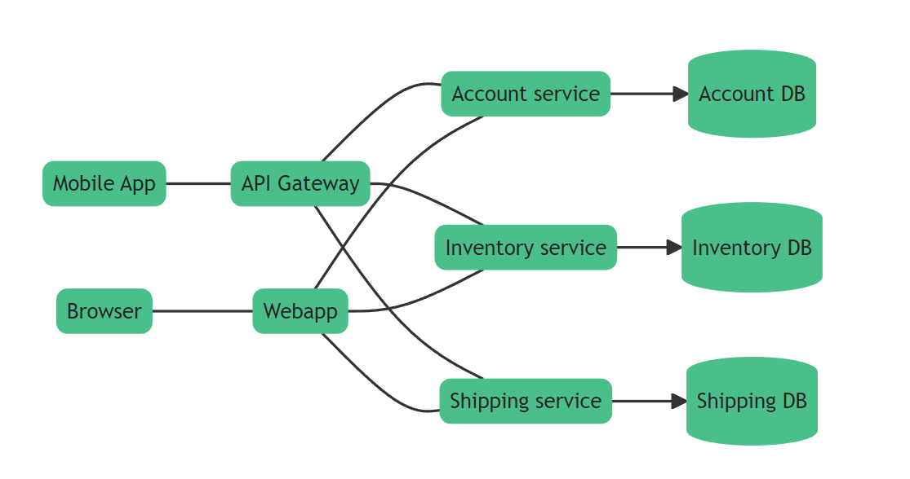

# 监控链路追踪

## 1. 分布式配置中心

> 在前面的工程实现中，我们做了大量的配置，这些配置在线上都是有可能去更改的，如果我们更新了配置文件，重新上传，然后重启服务，那么整个过程会变得繁琐（可能涉及到上千台机器），这时候我们需要引入分布式（远程）配置中心

### 1.1 nacos

nacos是java体系中应用较广的一个组件，常见于spring cloud alibaba微服务架构中。

Nacos即可以作为注册中心，也可以作为分布式配置中心。

这里，我们使用nacos做为分布式配置中心。

地址：https://nacos.io/zh-cn/

下载：https://github.com/alibaba/nacos/releases，下载最新的稳定版即可。

运行：

~~~powershell
startup.cmd -m standalone
~~~

docker方式：

~~~shell
docker run --name nacos-standalone -e MODE=standalone -e JVM_XMS=512m -e JVM_MAX=512m -e JVM_XMN=256m -p 8848:8848 -d nacos/nacos-server:latest
~~~

用户名密码：nacos/nacos

docker-compose：

~~~yaml
  Nacos:
    container_name: nacos-standalone
    image: nacos/nacos-server:v2.2.0
    restart: always
    environment:
      - MODE=standalone
      - JVM_XMS=512m
      - JVM_MAX=512m
      - JVM_XMN=256m
    privileged: true
    volumes:
        - ${NACOS_DIR}/data:/home/nacos/data
    ports:
      - 8848:8848
      - 9848:9848
      - 9849:9849
~~~

访问：http://localhost:8848/nacos/index.html

### 1.2 实现

我们把project和user这两个服务的配置文件都放在nacos上。

导入nacos go sdk：

~~~shell
go get github.com/nacos-group/nacos-sdk-go/v2
~~~

~~~go
package config

import (
	"github.com/spf13/viper"
	"log"
	"os"
)

var BC = InitBootstrap()

type BootConf struct {
	viper       *viper.Viper
	NacosConfig *NacosConfig
}

func (c *BootConf) ReadNacosConfig() {
	nc := &NacosConfig{}
	c.viper.UnmarshalKey("nacos", nc)
	c.NacosConfig = nc
}

type NacosConfig struct {
	Namespace   string
	Group       string
	IpAddr      string
	Port        int
	ContextPath string
	Scheme      string
}

func InitBootstrap() *BootConf {
	conf := &BootConf{viper: viper.New()}
	workDir, _ := os.Getwd()
	conf.viper.SetConfigName("bootstrap")
	conf.viper.SetConfigType("yaml")
	conf.viper.AddConfigPath(workDir + "/config")
	conf.viper.AddConfigPath("D:/go/project/test_project/project-project/config")
	err := conf.viper.ReadInConfig()
	if err != nil {
		log.Fatalln(err)
	}
	conf.ReadNacosConfig()
	return conf
}

~~~

~~~yaml
nacos:
  namespace: d1a5e738-d7b6-48a2-b071-b3c64123272d
  group: dev
  ipAddr: 127.0.0.1
  port: 8848
  scheme: http
  contextPath: "/nacos"
~~~

~~~go

func InitConfig() *Config {
	conf := &Config{viper: viper.New()}
	//加入nacos
	nacos := InitNacos()
	configYaml, err := nacos.ConfClient.GetConfig(vo.ConfigParam{
		DataId: "config.yaml",
		Group:  BC.NacosConfig.Group,
	})
	if err != nil {
		log.Fatalln(err)
	}
	conf.viper.SetConfigType("yaml")
	if configYaml != "" {
		err := conf.viper.ReadConfig(bytes.NewBuffer([]byte(configYaml)))
		if err != nil {
			log.Fatalln(err)
		}
		log.Println("load nacos config")
		err = nacos.ConfClient.ListenConfig(vo.ConfigParam{
			DataId: "config.yaml",
			Group:  BC.NacosConfig.Group,
			OnChange: func(namespace, group, dataId, data string) {
				log.Println("listen nacos config change", data)
				//监听变化
				err = conf.viper.ReadConfig(bytes.NewBuffer([]byte(data)))
				if err != nil {
					log.Printf("listen nacos config parse err %s \n", err.Error())
				}
				//重新载入配置
				conf.ReLoadAllConfig()
			},
		})
		if err != nil {
			log.Fatalln(err)
		}
	} else {
		workDir, _ := os.Getwd()
		conf.viper.SetConfigName("config")
		conf.viper.AddConfigPath(workDir + "/config")
		conf.viper.AddConfigPath("D:/go/project/ms_project/project-project/config")
		err := conf.viper.ReadInConfig()
		if err != nil {
			log.Fatalln(err)
		}
	}
	conf.ReLoadAllConfig()
	return conf
}

func (c *Config) ReLoadAllConfig() {
	c.ReadServerConfig()
	c.InitZapLog()
	c.ReadGrpcConfig()
	c.ReadEtcdConfig()
	c.InitMysqlConfig()
	c.InitJwtConfig()
	c.InitDbConfig()
	//重新创建相关的客户端
	c.ReConnRedis()
	c.ReConnMysql()
}
~~~

~~~go
package config

import (
	"github.com/go-redis/redis/v8"
	"test.com/project-project/internal/dao"
)

func (c *Config) ReConnRedis() {
	rdb := redis.NewClient(c.ReadRedisConfig())
	rc := &dao.RedisCache{
		Rdb: rdb,
	}
	dao.Rc = rc
}

~~~

~~~go
package config

import (
	"fmt"
	"gorm.io/driver/mysql"
	"gorm.io/gorm"
	"gorm.io/gorm/logger"
	"gorm.io/plugin/dbresolver"
	"test.com/project-project/internal/database/gorms"
)

var _db *gorm.DB

func (c *Config) ReConnMysql() {
	if c.DbConfig.Separation {
		//读写分离配置
		username := c.DbConfig.Master.Username //账号
		password := c.DbConfig.Master.Password //密码
		host := c.DbConfig.Master.Host         //数据库地址，可以是Ip或者域名
		port := c.DbConfig.Master.Port         //数据库端口
		Dbname := c.DbConfig.Master.Db         //数据库名
		dsn := fmt.Sprintf("%s:%s@tcp(%s:%d)/%s?charset=utf8&parseTime=True&loc=Local", username, password, host, port, Dbname)
		var err error
		_db, err = gorm.Open(mysql.Open(dsn), &gorm.Config{
			Logger: logger.Default.LogMode(logger.Info),
		})
		if err != nil {
			panic("连接数据库失败, error=" + err.Error())
		}
		replicas := []gorm.Dialector{}
		for _, v := range c.DbConfig.Slave {
			username := v.Username //账号
			password := v.Password //密码
			host := v.Host         //数据库地址，可以是Ip或者域名
			port := v.Port         //数据库端口
			Dbname := v.Db         //数据库名
			dsn := fmt.Sprintf("%s:%s@tcp(%s:%d)/%s?charset=utf8&parseTime=True&loc=Local", username, password, host, port, Dbname)
			cfg := mysql.Config{
				DSN: dsn,
			}
			replicas = append(replicas, mysql.New(cfg))
		}
		_db.Use(dbresolver.Register(dbresolver.Config{
			Sources: []gorm.Dialector{mysql.New(mysql.Config{
				DSN: dsn,
			})},
			Replicas: replicas,
			Policy:   dbresolver.RandomPolicy{},
		}).
			SetMaxIdleConns(10).
			SetMaxOpenConns(200))
	} else {
		//配置MySQL连接参数
		username := c.MysqlConfig.Username //账号
		password := c.MysqlConfig.Password //密码
		host := c.MysqlConfig.Host         //数据库地址，可以是Ip或者域名
		port := c.MysqlConfig.Port         //数据库端口
		Dbname := c.MysqlConfig.Db         //数据库名
		dsn := fmt.Sprintf("%s:%s@tcp(%s:%d)/%s?charset=utf8&parseTime=True&loc=Local", username, password, host, port, Dbname)
		var err error
		_db, err = gorm.Open(mysql.Open(dsn), &gorm.Config{
			Logger: logger.Default.LogMode(logger.Info),
		})
		if err != nil {
			panic("连接数据库失败, error=" + err.Error())
		}
	}
	gorms.SetDB(_db)
}

~~~

## 2. 链路追踪

### 2.1 什么是链路追踪

分布式链路追踪就是将一次分布式请求还原成调用链路，将一次分布式请求的调用情况集中展示，比如各个服务节点上的耗时、请求具体到达哪台机器上、每个服务节点的请求状态等等。

**链路跟踪主要功能：**

- **故障快速定位**：可以通过调用链结合业务日志快速定位错误信息。
- **链路性能可视化**：各个阶段链路耗时、服务依赖关系可以通过可视化界面展现出来。
- **链路分析**：通过分析链路耗时、服务依赖关系可以得到用户的行为路径，汇总分析应用在很多业务场景。

> 常用的链路追踪工具有：zipkin，Jaeger ，SkyWalking等，Jaeger用go语言编写，在go项目中应用最多

### 2.2 Jaeger

Jaeger 是受到 [Dapper](https://research.google/pubs/pub36356/) 和 [OpenZipkin](https://zipkin.io/) 启发的由 [Uber Technologies](https://uber.github.io/) 作为开源发布的分布式跟踪系统。

Jaeger 用于监视和诊断基于微服务的分布式系统，包括：

- 分布式上下文传播
- 分布式传输监控
- 根本原因分析
- 服务依赖性分析
- 性能/延迟优化

Uber 发表了一篇博客文章 [Evolving Distributed Tracing at Uber](https://eng.uber.com/distributed-tracing/)，文中解释了 Jaeger 在**架构选择**方面的历史和原因。Jaeger 的创建者 [Yuri Shkuro](https://www.shkuro.com/) 还出版了一本书 [Mastering Distributed Tracing](https://www.shkuro.com/books/2019-mastering-distributed-tracing/)，该书深入介绍了 Jaeger 设计和操作的许多方面，以及一般的分布式跟踪。

**特性**

- 兼容 OpenTracing的数据模型和工具库
  - 包括 **Go，Java，Node，Python， C++ 和 C＃**
- 现代化的UI界面
- 多种存储后端支持：Cassandra，Elasticsearch，内存。
- 系统拓扑图
- 支持云原生部署
- 向后兼容zipkin

#### 2.2.1 Span

一个 Span 表示 Jaeger 的逻辑工作单元，Span 具有**操作名称，操作的开始时间，和持续时间**。Span 可以嵌套并排序以建立因果关系模型。

Span 由以下信息组成：

- An operation name：操作名称，必有；
- A start timestamp：开始时间戳，必有；
- A finish timestamp：结束时间戳，必有；
- Span Tags.：Key-Value 形式表示请求的标签，可选；
- Span Logs：Key-Value 形式表示，记录简单的、结构化的日志，必须是字符串类型，可选；
- SpanContext ：Span上下文，在不同的 span 中传递，建立关系；
- References：引用的其它 Span；

span 之间如果是父子关系，则可以使用 SpanContext 绑定这种关系。父子关系有 **`ChildOf`**、**`FollowsFrom`** 两种表示，**`ChildOf`** 表示 父 Span 在一定程度上依赖子 Span，而 **`FollowsFrom`** 表示父 Span 完全不依赖其子Span 的结果。

例如：

~~~json
{
    "traceID": "790e003e22209ca4",
    "spanID": "4b73f8e8e77fe9dc",
    "flags": 1,
    "operationName": "print-hello",
    "references": [],
    "startTime": 1611318628515966,
    "duration": 259,
    "tags": [
        {
            "key": "internal.span.format",
            "type": "string",
            "value": "proto"
        }
    ],
    "logs": [
        {
            "timestamp": 1611318628516206,
            "fields": [
                {
                    "key": "event",
                    "type": "string",
                    "value": "WriteLine"
                }
            ]
        }
    ]
}
~~~

#### 2.2.2 Trace

一个 Trace 标识通过系统的数据或执行路径，Trace 可被认为是由**一组 Span 定义的有向无环图(DAG)**。

在OpenTracing 模型中，有三个主要的对象：

- Tracer
- Span
- SpanContext

`Tracer`可以创建`Spans`并了解如何跨流程边界对它们的元数据进行`Inject`（序列化）和`Extract`（反序列化）。它具有以下功能：

- 开始一个新的 `Span`
- `Inject`一个`SpanContext`到一个载体
- `Extract`一个`SpanContext`从载体

> 在Jaeger中，由起点进程创建一个 Tracer，然后启动进程发起请求，每个动作产生一个 Span，如果有父子关系，Tracer 可以将它们关联起来。当请求完成后， Tracer 将跟踪信息推送到 Jaeger-Collector中。

#### 2.2.3 组件

Jaeger 可以使用 **all-in-one** 二进制（其中所有 Jaeger 后端组件都在单个进程中运行）进行部署，也可以作为可扩展的分布式系统进行部署，如下所述。有两个主要的部署选项：

* 收集器直接写入存储。

  

* 收集器写入 Kafka 作为中间缓冲。

  

##### 2.2.3.1 代理（Agent）

Jaeger **代理** 是一个**网络守护程序**，它侦听通过 UDP 发送的 span，然后将其分批发送给**收集器（Collector）**。它旨在**作为基础组件部署到所有主机**。该代理为客户端**抽象了收集器的路由和发现**。

##### 2.2.3.2 收集器（Collector）

Jaeger 收集器从 Jaeger代理或者SDK接收Trace，通过a processing pipeline对Trace做验证，清理，压缩等，并最终存储它们。

Jaeger 的存储是一个可插拔组件，支持 Cassandra，Elasticsearch 和 Kafka等。

##### 2.2.3.3 查询（Query）

**查询**是一项从存储中检索Trace并托管 UI 来显示Trace的服务。

##### 2.2.3.4 Ingester

**Ingester** 是一项从 Kafka topic 读取并写入另一个存储后端（Cassandra，Elasticsearch）的服务。

### 2.3 使用

#### 2.3.1 部署Jaeger

简单起见，使用all-in-one的方式部署

~~~env
MYSQL_VERSION=8.0.20
MYSQL_DIR=D:/go/project/msproject-data/mysql
MYSQL_PORT=3309
REDIS_VERSION=6.2.7
REDIS_PORT=6379
REDIS_DIR=D:/go/project/msproject-data/redis
ETCD_VERSION=3.5.6
ETCD_PORT=2379
ETCD_DIR=D:/go/project/msproject-data/etcd
NACOS_DIR=D:/go/project/msproject-data/nacos
JAEGER_DIR=D:/go/project/msproject-data/jaeger
BADGER_EPHEMERAL=false
~~~

~~~yaml
Jaeger:
    container_name: jaeger
    image: jaegertracing/all-in-one:1.41
    restart: always
    environment:
      - COLLECTOR_ZIPKIN_HTTP_PORT=9411
      - SPAN_STORAGE_TYPE=badger
      - BADGER_EPHEMERAL=${BADGER_EPHEMERAL}
      - BADGER_DIRECTORY_VALUE=/badger/data
      - BADGER_DIRECTORY_KEY=/badger/key
    privileged: true
    volumes:
      - ${JAEGER_DIR}:/badger
    ports:
      - 5775:5775/udp
      - 6831:6831/udp
      - 6832:6832/udp
      - 5778:5778
      - 16686:16686
      - 14268:14268
      - 14269:14269
      - 9411:9411
~~~

访问：http://localhost:16686/search

#### 2.3.2 gin中间件

~~~go
go get go.opentelemetry.io/otel
go get go.opentelemetry.io/otel/sdk
go get go.opentelemetry.io/contrib/instrumentation/github.com/gin-gonic/gin/otelgin
go get go.opentelemetry.io/contrib/instrumentation/google.golang.org/grpc/otelgrpc
go get -u go.opentelemetry.io/otel/exporters/jaeger
go get github.com/grpc-ecosystem/go-grpc-middleware
~~~

~~~go
package tracing

import (
	"go.opentelemetry.io/otel/exporters/jaeger"
	"go.opentelemetry.io/otel/sdk/resource"
	sdktrace "go.opentelemetry.io/otel/sdk/trace"
	semconv "go.opentelemetry.io/otel/semconv/v1.4.0"
)

func JaegerTraceProvider() (*sdktrace.TracerProvider, error) {
	exp, err := jaeger.New(jaeger.WithCollectorEndpoint(jaeger.WithEndpoint("http://localhost:14268/api/traces")))
	if err != nil {
		return nil, err
	}
	tp := sdktrace.NewTracerProvider(
		sdktrace.WithBatcher(exp),
		sdktrace.WithResource(resource.NewWithAttributes(
			semconv.SchemaURL,
			semconv.ServiceNameKey.String("project-project"),
			semconv.DeploymentEnvironmentKey.String("dev"),
		)),
	)
	return tp, nil
}

~~~

~~~go
tp, tpErr := tracing.JaegerTraceProvider()
	if tpErr != nil {
		log.Fatal(tpErr)
	}
	otel.SetTracerProvider(tp)
	otel.SetTextMapPropagator(propagation.NewCompositeTextMapPropagator(propagation.TraceContext{}, propagation.Baggage{}))
	
~~~

gin中间件：

~~~go
r.Use(otelgin.Middleware("project-api"))
~~~

grpc：

~~~go
conn, err := grpc.Dial(
		"etcd:///user",
		grpc.WithTransportCredentials(insecure.NewCredentials()),
		grpc.WithUnaryInterceptor(otelgrpc.UnaryClientInterceptor()),
	)
~~~

~~~go
	s := grpc.NewServer(
		grpc.UnaryInterceptor(grpc_middleware.ChainUnaryServer(
			otelgrpc.UnaryServerInterceptor(),
			//interceptor.New().CacheInterceptor(),
		)),
	)
~~~

## 3. 补充

前面部署的nacos持久化有问题，每次重启docker，nacos都会报错，原因是默认使用了内嵌的derby数据库，每次启动都会重新load sql文件，导致报错。

这里，我们改用mysql数据库。

~~~yaml
Nacos:
    container_name: nacos-standalone
    image: nacos/nacos-server:v2.2.0
    restart: always
    environment:
      - MODE=standalone
      - JVM_XMS=512m
      - JVM_MAX=512m
      - JVM_XMN=256m
      - SPRING_DATASOURCE_PLATFORM=mysql
      - MYSQL_SERVICE_HOST=mysql
      - MYSQL_SERVICE_DB_NAME=nacos
      - MYSQL_SERVICE_PORT=3306
      - MYSQL_SERVICE_USER=root
      - MYSQL_SERVICE_PASSWORD=root
    privileged: true
    volumes:
      - ${NACOS_DIR}/data:/home/nacos/data
      - ${NACOS_DIR}/logs:/home/nacos/logs
      - nacos-conf:/home/nacos/conf
    ports:
      - 8848:8848
      - 9848:9848
      - 9849:9849
~~~

~~~yaml
volumes:
  nacos-conf:
    driver: local
    driver_opts:
      type: 'none'
      device: '${NACOS_DIR}/conf'
      o: 'bind'
~~~

~~~properties
### If use MySQL as datasource:
spring.datasource.platform=mysql
 
### Count of DB:
db.num=1
 
### Connect URL of DB:
db.url.0=jdbc:mysql://mysql:3306/nacos?characterEncoding=utf8&connectTimeout=1000&socketTimeout=3000&autoReconnect=true&useUnicode=true&useSSL=false&serverTimezone=UTC
db.user.0=root
db.password.0=root
~~~

